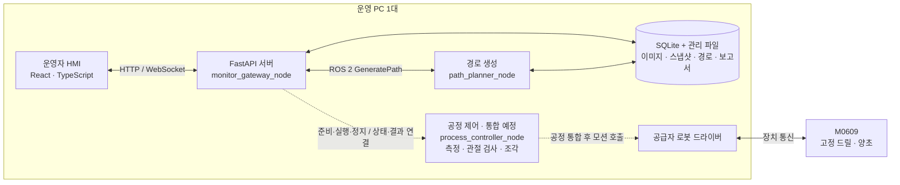

# 새김 · SAEGIM

**사용자가 고른 도안을 원통 표면의 조각 경로로 만드는 협동로봇 프로젝트**

새김은 이미지 입력, 도안 배치, 3D 경로 생성, 미리보기, 측정·조각 공정을 하나의 운영자 화면으로 연결하는 C-2 팀 프로젝트입니다. 두산로보틱스 **M0609**, **2점 그리퍼에 고정한 드릴**, **ROS 2 Jazzy**를 사용하며, **PC 한 대**에서 HMI·서버·ROS 프로그램을 함께 운용하는 구성을 기준으로 합니다.

도자기 공방의 소량 맞춤 조각 서비스를 목표로, 현재는 **양초 시제품**으로 원통 매핑·측정·조각 기능을 개발하고 있습니다. 도자기 가공 품질과 작업 시간·비용 절감 효과는 후속 검증 대상입니다.

> **2026-09-21 갱신 · 기준 main [`8c8fb5c`](https://github.com/suuuhululu/C-2/commit/8c8fb5c)**
> HMI와 실제 이미지 경로 생성의 ROS 부분 통합을 지원합니다. 양초 측정·조각 모듈도 있으나, HMI에서 측정부터 조각까지 이어지는 전체 공정은 통합 중입니다. 현재 HMI의 ROS 실행은 **SIMULATION / test_only**이며 실제 로봇 조각을 시작하지 않습니다.

## 핵심 기능

- **도안 입력·배치:** PNG/JPEG를 첨부하고 크기·위치·회전을 조절합니다. 원통 전개면과 상하 제외 구간을 확인할 수 있습니다.
- **이미지 기반 경로 생성:** 중심선 SVG 추출 → 2D 좌표·획 순서 최적화 → 원통 3D 매핑 → 접근·조각·이동·이탈 경로를 계산합니다.
- **같은 경로의 2D·3D 미리보기:** 생성 산출물을 읽어 전개면과 원기둥에 표시하고, 기하 검사 결과와 미검사 항목을 확인합니다.
- **설정·파일 추적:** 이미지, 설정 스냅샷, 경로, 미리보기, 검증 보고서를 ID·버전·SHA-256으로 연결합니다. 스냅샷은 해당 작업에 사용한 설정과 형상을 보존한 JSON입니다.
- **양초 측정·공정 모듈:** 윗면·옆면 접촉 측정, 원통 중심·반지름 계산, 도구 기준 확인, 관절 검사, 조각 모듈을 개발합니다. 실제 공정 연결 범위는 아래 현황을 따릅니다.
- **운영자 HMI:** 생성 진행·취소, 모의 공정 관제·정지, 이벤트·실행 이력·검사 기록, SIM 스냅샷과 파일 교환 시험을 제공합니다.

## 시스템 구성 · PC 한 대



실선의 HMI↔경로 생성은 현재 부분 통합 경로이며, 점선은 공정 노드에 연결할 부분입니다. 개별 측정·조각 실험과 이 전체 연결의 완료는 구분합니다.

| 구성 | 역할 | 주요 위치 |
| --- | --- | --- |
| HMI·`monitor_gateway_node` | 입력·미리보기·저장, ROS 요청과 상태를 화면에 연결 | `frontend/src/monitor/`, `backend/app/` |
| `path_planner_node` | 이미지·설정으로 경로와 검증 산출물 생성 | `ws_cobot1/src/c2_path/` |
| `process_controller_node` | 준비·측정·검사·조각 순서와 로봇 모션 소유 | `ws_cobot1/src/c2_process/` — 내부 모듈 존재, 운영 노드 통합 예정 |
| `c2_interfaces` | Action 2개·Service 1개·Message 2개의 공통 ROS 타입 | `ws_cobot1/src/c2_interfaces/` |

위 경로는 `ws_cobot_pjt/` 기준입니다. 화면은 로봇을 직접 제어하지 않습니다. 서버의 `RosBridge`는 **Python `rclpy` 기반 ROS 2 클라이언트**이며, 브라우저가 `rosbridge_suite`의 9090 포트로 접속하는 구조가 아닙니다. 이미지와 결과는 같은 PC의 관리 저장소에서 공유합니다.

### 연결할 전체 작업 흐름

**도안 입력·배치 → 준비 요청·양초 측정 → 측정 스냅샷 등록 → 3D 경로 생성 → 미리보기 확인 → 최종 관절 검사·드릴 ON 확인 → 조각·이탈 → 결과 기록**

측정값으로 처음부터 경로를 만들고, 미리보기·검사·실행에서 같은 경로를 참조하는 것이 목표입니다. 경로 생성 전 준비 요청, 측정 결과 전달, 드릴 확인 입력은 공정·HMI의 계약과 구현을 함께 연결해야 합니다.

## 현재 구현·검증 범위

| 영역 | main에 반영된 내용 | 남은 범위 |
| --- | --- | --- |
| HMI·서버 | React·FastAPI·SQLite, 도안 배치, 생성 취소, 2D/3D 미리보기, 모의 공정·이력 | 실제 공정의 준비·측정·상태·정지 연결 |
| ROS 경로 통합 | 실제 PNG/JPEG 변환, GeneratePath Action, 관리 파일 로더·해시 검사 | `SIMULATION/test_only` 유지. 경로 생성 성공은 로봇 실행 승인이 아님 |
| 요청별 원통 형상 | `c2_path` 스냅샷 `/2`에서 반지름·높이·축 원점·작업 범위를 요청별로 적용 | 수직 원통 기준. 실제 측정 결과의 등록·선택·전달과 REAL 유효성 검증 |
| 경로 검증 | 옆면·이음매·자세 등 기하 검사와 실행 사전 점검(`execution_readiness`) 분리 | 잠정 작업 범위 통과와 실제 IK·관절·충돌 검사는 별개 |
| 파일 교환 | HMI의 SIM 스냅샷/ZIP 등록·조회, `c2_path`의 폴더 묶음 생성·검증 | HMI `c2-hmi-bundle/1`과 경로 측 `c2-path-bundle/1`은 서로 다른 제안 형식. 공통 규격 또는 변환 연결 필요 |
| 양초 측정 | `workpiece_calibration.py`, 측정 어댑터·공정 내부 호출용 어댑터, 단독 시험 수신부 | 준비 Action·HMI 연결, 추정값과 실측값 구분, 측정 정확도 검증 |
| 조각·공정 | `robot_adapter.py`, `tool_calibration.py`, `joint_check.py`, `engraving.py` | 운영 공정 노드·상태 기계·패키지/launch 통합, 최종 경로 검사와 실행의 동일성 검증 |

**실기 기록:** 별도 하트 조각 시험과 양초 측정·정상 복귀 완료 기록이 있습니다. 다만 HMI 전체 공정 완료나 실제 홈 깊이·반복 정밀도의 검증을 뜻하지 않습니다. 최신 측정 결과의 `ESTIMATED`와 `absolute_top_verified=false`는 추정·미검증 상태로 유지합니다. 근거와 시험 버전은 [공정 README](ws_cobot_pjt/ws_cobot1/src/c2_process/README.md)와 [양초 측정 기록](ws_cobot_pjt/ws_cobot1/src/c2_process/WORKPIECE_CALIBRATION.md)을 확인하세요.

## 빠른 시작

### 1. 저장소와 개발 환경 준비

HMI는 **Python 3.12, Node.js 22 이상, pnpm 11**을 기준으로 합니다. 아래는 새 clone에서 MOCK 화면을 준비하는 명령입니다. 기존 작업 폴더는 변경 사항을 보존한 뒤 [Git 가이드](docs/GIT_GUIDE.md)에 따라 최신 main을 받습니다.

```bash
git clone https://github.com/suuuhululu/C-2.git
cd C-2
sh tools/setup-git-hooks.sh

python3 -m venv ws_cobot_pjt/backend/.venv
ws_cobot_pjt/backend/.venv/bin/python -m pip install \
  -r ws_cobot_pjt/backend/requirements.lock.txt
pnpm --dir ws_cobot_pjt/frontend install --frozen-lockfile
```

### 2. MOCK으로 화면·공정 흐름 확인

저장소 루트에서 실행합니다.

```bash
python3 ws_cobot_pjt/run_monitor.py --transport mock
```

- HMI: **http://127.0.0.1:5174/operator**
- API 문서: http://127.0.0.1:8010/docs
- 종료: 실행 터미널에서 `Ctrl+C`

MOCK은 고정 샘플 경로와 모의 공정 응답을 사용합니다. 첨부한 이미지의 실제 변환은 아래 ROS 모드로 확인합니다. 로컬 한 운영자용 개발 화면이며 외부 공개·다중 사용자 인증은 구현 범위 밖입니다.

### 3. ROS로 실제 이미지 경로 생성

**ROS 2 Jazzy, 같은 checkout의 `c2_interfaces`·`c2_path` 빌드, ROS Python과 호환되는 backend 가상환경**을 먼저 준비합니다. [한 PC ROS 통합 설치 안내](ws_cobot_pjt/docs/HMI_PATH_INTEGRATION.md#한-pc에서-준비실행)의 의존성·빌드 절차를 따른 뒤, 저장소 루트의 Bash 터미널에서 실행합니다.

```bash
source /opt/ros/jazzy/setup.bash
source ws_cobot_pjt/ws_cobot1/install/local_setup.bash
python3 ws_cobot_pjt/run_monitor.py --transport ros
```

실행기가 관리 저장소를 초기화하고 **HMI·서버·경로 노드를 함께 시작**합니다. 화면에서 경로 노드 연결을 확인한 뒤 이미지를 첨부하고 경로를 생성합니다. 현재 통합 범위에서는 공정 상태 미수신이 예상되며, 실제 공정·로봇 드라이버는 이 명령으로 시작하지 않습니다.

| 실행 방식 | 이미지 처리 | 공정 실행 |
| --- | --- | --- |
| `--transport mock` 또는 기본 실행 | 고정 샘플 응답 | 모의 공정만 지원 |
| `--transport ros` | 첨부 이미지를 `c2_path`가 실제 계산 | HMI 실행 차단 · `SIMULATION/test_only` |
| 파일 통합 시험 화면 | 스냅샷·입력 ZIP 전달, 형식에 맞는 결과 ZIP 검증·미리보기 | 가져온 경로 실행 차단 |

ROS 통합 안내의 9/20 고정 높이·실패 예시는 당시 시험 기록입니다. 9/21에는 원통 옆면의 생성 조건과 잠정 실행 범위 검사를 분리했습니다. 최신 동작·스냅샷 조건은 [c2_path README](ws_cobot_pjt/ws_cobot1/src/c2_path/README.md)와 [BUNDLE_SPEC](ws_cobot_pjt/ws_cobot1/src/c2_path/BUNDLE_SPEC.md)을 따릅니다.

## 저장소 구조

```text
C-2/
├── ws_cobot_pjt/
│   ├── run_monitor.py             # 한 PC HMI·서버·경로 노드 실행기
│   ├── frontend/                  # React · TypeScript · Vite
│   ├── backend/                   # FastAPI · SQLite · ROS 게이트웨이
│   ├── ws_cobot1/
│   │   ├── src/c2_interfaces/     # 공통 ROS 타입
│   │   ├── src/c2_path/           # 이미지·경로 계산과 Action 서버
│   │   ├── src/c2_process/        # 측정·관절 검사·조각 모듈
│   │   └── doc/                   # ROS 실행 안내
│   ├── ws_dsr/                    # 외부 로봇 실행환경 (src는 Git 제외)
│   └── docs/                      # 설계·통합·검증·개발 일지
├── docs/                          # 팀 운영·환경·Git 협업
├── .github/                       # Issue·PR 양식과 자동 검사
└── tools/                         # 저장소 검사·Git hook 설치
```

외부 드라이버는 각 실행 PC에 준비하며 C-2를 clone하는 것만으로 설치되지 않습니다. 출처·버전은 [의존성 기록](docs/DEPENDENCIES.md), 워크스페이스 구성은 [환경 가이드](docs/WORKSPACES.md)를 따릅니다. 관리 DB·업로드 파일, ROS `build/install/log`, `node_modules`는 Git에 올리지 않습니다.

## 팀 역할

| 담당 | 주요 책임 |
| --- | --- |
| 이수현 | HMI·서버, 입력·미리보기·파일 등록, 요청·상태·이력 표시 |
| 노홍동 | 이미지 처리, 스냅샷 기반 원통 매핑, 경로 생성·기하 검증 |
| 김세은 | 공정·통신·상태 전이, 준비 조건, 관절 검사와 함수 호출 순서 |
| 이시율 | 로봇 어댑터, 도구 기준·양초 측정, 조각·센서·실기 검증 |

## 운영 범위와 다음 통합

현재 드릴 `engraving_drill`은 그리퍼에 철사로 고정합니다. **고정 중에는 초기화·측정·오류·종료를 포함해 그리퍼를 열지 않습니다.** 자동 집기·청소·반납은 현재 공정에서 제외합니다. [고정 드릴 운영 기준](ws_cobot_pjt/docs/C2_FIXED_DRILL_20260919.md)을 따릅니다.

다음 통합은 준비·측정 요청과 결과 스냅샷 연결 → 파일 교환 규격 정합 → 미리보기한 최종 경로의 관절 검사·조각 연결 → 정상·실패·취소·통신 단절 시험 순서로 진행합니다. 생성 성공, 기하 검사 통과, 로봇 실행 가능, 실제 가공 품질은 각각 따로 검증합니다.

## 상세 문서·기여

| 목적 | 문서 |
| --- | --- |
| 설계·통신 계약 | [역할·전체 흐름](ws_cobot_pjt/docs/SYSTEM_STRUCTURE.md) · [기존 v2와 새 준비 흐름의 차이](ws_cobot_pjt/docs/INTERFACE_GUIDE.md) · [공통 타입](ws_cobot_pjt/ws_cobot1/src/c2_interfaces/README.md) |
| HMI 설치·사용 | [서버](ws_cobot_pjt/backend/README.md) · [화면](ws_cobot_pjt/frontend/README.md) · [ROS 부분 통합](ws_cobot_pjt/docs/HMI_PATH_INTEGRATION.md) |
| 파일 교환 | [HMI ZIP 규격](ws_cobot_pjt/docs/HMI_FILE_INTEGRATION.md) · [경로 측 묶음 제안](ws_cobot_pjt/ws_cobot1/src/c2_path/BUNDLE_SPEC.md) |
| 측정·공정 연결 | [공정 모듈과 담당](ws_cobot_pjt/ws_cobot1/src/c2_process/README.md) · [측정 함수](ws_cobot_pjt/ws_cobot1/src/c2_process/WORKPIECE_CALIBRATION.md) · [공정 내부 어댑터 연결](ws_cobot_pjt/ws_cobot1/src/c2_process/PROCESS_MEASUREMENT_INTEGRATION.md) |
| 근거·검증 | [HMI↔ROS 경로 시험](ws_cobot_pjt/docs/validation/2026-09-20-hmi-path-integration.md) · [HMI 파일 교환 시험](ws_cobot_pjt/docs/validation/2026-09-21-hmi-file-integration.md) · [실기 시행착오](ws_cobot_pjt/docs/LESSONS_ROBOT.md) |
| 팀 개발 | [공통 AI 지침](AGENTS.md) · [Git·PR](docs/GIT_GUIDE.md) · [팀원 시작](docs/TEAM_ONBOARDING.md) · [기술 참고 자료](docs/REFERENCES.md) |

상세 문서의 날짜·기준 커밋을 확인하세요. 과거 실험 수치와 미구현 표기는 해당 시점의 기록이며, 최신 코드의 구현 상태와 구분합니다.

변경은 **작업 브랜치 → 검사 → PR → 동료 리뷰 → main 병합**으로 진행합니다. 저장소 루트에서 기본 검사를 실행하고, 코드 변경에는 해당 영역의 시험 결과를 함께 기록합니다.

```bash
python3 tools/check_repository.py
git diff --check
```

저장소 검사·CI 통과는 ROS 빌드나 실제 로봇 시험을 대신하지 않습니다. 실행한 검사와 미검증 범위를 [PR 양식](.github/PULL_REQUEST_TEMPLATE.md)에 남깁니다.
