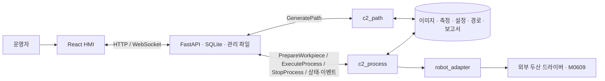

# 새김 · C-2 시스템

두산 M0609와 2점 그리퍼에 철사로 고정한 `engraving_drill`을 사용하는 양초 원통 조각 프로젝트다. ROS 2 기준은 Jazzy다. 운영자 화면에서 **양초 준비·측정 → 실측 스냅샷 연결 → 이미지 경로 생성·미리보기 → 별도 실행 요청 → 검사·조각·결과 기록** 순서로 작업한다. 그리퍼 열기, 자동 집기·반납·청소는 현재 공정에 없다.

> **현재 코드 기준:** 2026-09-23 원격 `main` `6536a29`(PR #75). 문서의 날짜가 이보다 오래되면 당시의 작업·시험 기록으로 읽는다. 최신 원격과 설치 PC의 빌드·설정은 실제 작업 전에 다시 확인한다. [현황](docs/REVIEW_STATUS.md) · [21일 일지](ws_cobot_pjt/docs/daily/2026-09-21.md) · [22일 일지](ws_cobot_pjt/docs/daily/2026-09-22.md)

## 구성



| 위치 | 하는 일 |
| --- | --- |
| `ws_cobot_pjt/frontend/src/monitor/` | 작업자 입력, 미리보기, 진행·정지·이력 표시. 화면은 로봇 모션을 직접 지시하지 않는다. |
| `ws_cobot_pjt/backend/app/` | HTTP/WebSocket, ROS 게이트웨이, 준비·실행 조건, SQLite와 자산 ID/SHA-256 관리. |
| `ws_cobot_pjt/ws_cobot1/src/c2_interfaces/` | Action 3개·Service 1개·Message 2개의 팀 ROS 타입. |
| `ws_cobot_pjt/ws_cobot1/src/c2_path/` | PNG/JPEG를 도구 끝의 원통 3D 경로·미리보기·기하 보고서로 변환. 모션은 실행하지 않는다. |
| `ws_cobot_pjt/ws_cobot1/src/c2_process/` | 준비 측정, BIND, 실행 전 검사, 조각, 정지·상태 발행. 로봇 모션의 단일 소유자. |
| `ws_cobot_pjt/ws_dsr/src/` | 실행 PC가 별도로 설치하는 외부 로봇·그리퍼 소스. 디렉터리는 Git 제외 대상이지만 제어권 관측 패치 4개 파일은 이 저장소에서 추적한다. [의존성 기록](docs/DEPENDENCIES.md) 참조. |

[상세 구조](ws_cobot_pjt/docs/SYSTEM_STRUCTURE.md) · [현재 호출 흐름](ws_cobot_pjt/docs/INTERFACE_GUIDE.md) · [공통 인터페이스](ws_cobot_pjt/docs/INTERFACE_RECOMMENDATION.md)

## 실행 모드와 확인 범위

| 모드 | 동작 | 한계 |
| --- | --- | --- |
| 기본 `SIMULATION/MOCK` | HMI·서버·모의 상대를 실행한다. 기본 이미지 워크플로는 같은 `c2_path` 계산 코드를 사용한다. | 실제 로봇·현장 측정이 아니다. |
| ROS `SIMULATION` | HMI와 경로 노드 연결. `--process-integration` 및 별도 공정 노드로 가상 장치 공정을 연결할 수 있다. | 가상 IK·모션·접촉 성공을 실기 결과로 취급하지 않는다. |
| ROS `REAL` | 현장 준비 설정과 실행 프로파일·드라이버가 준비되면 측정, REAL 실행 후보 경로, 별도 공정 실행 요청 경로를 제공한다. | 코드 존재와 로컬 시험은 M0609 연속 조각·실제 충돌/깊이/품질 검증이 아니다. 설정이 부족하면 미리보기까지만 허용한다. |

운영 화면의 수동 드릴 ON 체크는 화면 확인이다. 드릴 전원 센서·공정 인터록·실제 회전 확인을 대신하지 않는다. `GeneratePath`의 성공은 경로 파일 생성·기하 검사 결과이며, `ExecuteProcess`의 수락·실제 이동 완료·가공 품질도 각각 구분한다. [인터페이스 안내](ws_cobot_pjt/docs/INTERFACE_GUIDE.md)

### 기본 MOCK 화면 시작

새 PC에서는 [백엔드 설치](ws_cobot_pjt/backend/README.md)와 [프런트엔드 설치](ws_cobot_pjt/frontend/README.md)를 먼저 완료한다. 저장소 루트에서 다음을 실행한다.

```bash
python3 ws_cobot_pjt/run_monitor.py
```

화면은 `http://127.0.0.1:5174/operator`, API는 `http://127.0.0.1:8010`이다. ROS·REAL·가상 장치 시험의 선행 환경과 기동 범위는 [ROS 실행 안내](ws_cobot_pjt/ws_cobot1/doc/README.md)와 [가상 장치 안내](ws_cobot_pjt/docs/VIRTUAL_CELL_20260922.md)를 따른다. `run_monitor.py`는 공정 노드나 로봇 드라이버를 자동 기동하지 않는다.

## 문서 사용 순서

1. [현재 현황](docs/REVIEW_STATUS.md) — 코드로 확인되는 기능과 남은 현장 검증.
2. [문서 길잡이](ws_cobot_pjt/docs/README.md), [시스템 구조](ws_cobot_pjt/docs/SYSTEM_STRUCTURE.md), [작업 흐름](ws_cobot_pjt/docs/INTERFACE_GUIDE.md), [인터페이스](ws_cobot_pjt/docs/INTERFACE_RECOMMENDATION.md) — 팀 간 경계.
3. 각 패키지 README와 [ROS 실행 안내](ws_cobot_pjt/ws_cobot1/doc/README.md) — 코드·설정·실행 진입점.
4. `ws_cobot_pjt/docs/daily/`, `validation/`, `evidence/`와 날짜가 붙은 시험 문서 — **그 날짜·커밋의 근거**. 현재 운영값이나 구현 상태의 우선 출처로 사용하지 않는다.

문서와 코드가 다르면 기준 커밋의 실제 타입·진입점·설정 검사를 확인한다. 팀 규칙은 [AGENTS.md](AGENTS.md), 외부 실행환경은 [의존성 기록](docs/DEPENDENCIES.md)을 따른다.
