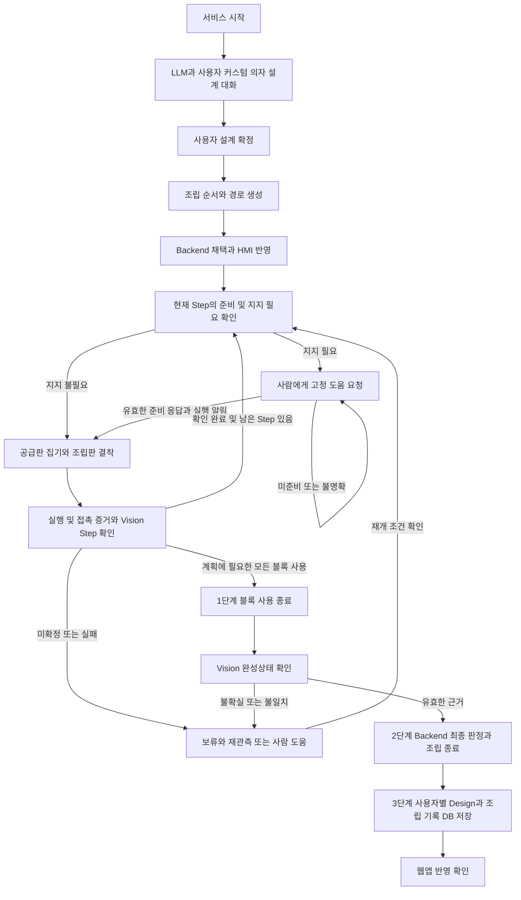

# 최종 MVP — 커스텀 의자 협동 조립

갱신: 2026-10-07. **사용자가 요청한 제품 목표이며 개발 과정에서 수정할 수 있습니다.** 이 문서는 기존 전달형 Day4 흐름에서 최종 MVP로 변경되는 범위를 정의합니다. 문서 반영은 코드·Schema 반영, 실제 연결 또는 실물 조립 검증 완료를 뜻하지 않습니다.

근거는 2026-10-07 사용자의 최종 MVP 요청과 첨부 [수현 개별 연구 설계](suhyun_individual_research_topic.md)입니다. 첨부 문서의 연구 목표·초안·제안은 그 성격을 유지하며 사용자 요청과 구분합니다. 과거 운영·시험 근거는 [Day4 계약](06_CONTRACT_DRAFT.md), [기본 실행 버전](D_RUNTIME_BASELINE.md), [DB 구현 안내](D_DB_HISTORY.md)에 보존합니다.

## 1. 서비스 시작과 설계 확정

1. 서비스 시작 시 LLM과 사용자가 대화하며 커스텀 의자의 형태와 요구를 구체화합니다.
2. 사용자가 디자인 설계를 확정합니다. 최초 키워드로 후보를 생성한 것만으로 설계 확정·조립 시작으로 처리하지 않습니다.
3. 확정한 Design으로 조립 순서와 로봇 경로 생성을 시작합니다.
4. 생성 결과를 Backend로 넘겨 채택·실행 준비를 검사하고 HMI에 전체 설계·현재 Step·진행과 준비 상태를 반영합니다.
5. 유효한 계획·경로와 실행 전제가 준비되면 첫 Step을 바로 실행합니다. 정상 Step마다 별도 완료·다음 실행 버튼을 요구하지 않습니다.

사용자별 저장을 위해 사용자 식별과 Job의 연결이 필요합니다. 로그인 방식·세션과 설계 대화의 화면 배치·확정 입력 형식은 아직 정하지 않았습니다. 문서가 로그인 화면·새 API를 이미 구현한 것으로 해석되지 않도록 합니다.

## 2. 조립 시작과 반복 흐름

첫 물리 조립은 **로봇이 첫 Step의 블록을 supply board에서 집어 assembly board의 목표에 결착시키는 것**입니다. 이후 Step도 같은 방식으로 수행합니다. 기존 place board로의 전달과 사람의 배치·체결은 최종 MVP의 정상 조립 흐름을 대체하지 않습니다.

‘바로 시작’은 계획 채택 뒤 불필요한 수동 Step 승인을 추가하지 않는다는 의미입니다. 미확정 설계·무효 경로·지지 미준비·안전 정지 상태에서 실행한다는 의미는 아닙니다. 첫 Step이 지지를 요구하면 해당 준비 응답을 기다립니다.

경로 생성은 작업공간·좌표 변환·실제 로봇 조건을 반영할 모듈의 책임입니다. LLM이 joint/TCP/속도/힘이나 저수준 궤적을 생성하지 않습니다. 기존 고정 전달 좌표를 조립판 결착 좌표로 재사용하지 않습니다.

## 3. 사람의 고정 도움과 연구 설계의 적용

최종 MVP에는 디자인에 따라 지지가 필요한 부분에 사람의 고정 도움을 요청하는 흐름을 포함합니다. 상세 근거는 [연구 설계 §9](suhyun_individual_research_topic.md#9-human-physical-assistance와-perceptual-assistance)입니다.

| 항목 | 적용할 설계 방향 | 구현·합의가 필요한 부분 |
|---|---|---|
| 지지 필요 판단 | 구조·삽입 기하학과 규칙으로 LOW/HIGH 판단 | 규칙·임계값과 실제 구조물 보정 |
| 도움 위치 | 대상 블록·영역·방향을 표시 | brick_id 대응과 방향 좌표계; Day4 여섯 필드에 ID를 임의 추가하지 않음 |
| 준비 긍정 | 엄지만 올리는 THUMBS_UP | 제스처 모델·시각·신뢰도·응답 구간 |
| 준비 부정 | 엄지와 검지를 함께 올리는 THUMB_INDEX_UP | 미인식·중복·지연 응답 처리 |
| 보조 입력 | HMI 긍정/부정 입력; 제스처 실패·디버깅용 | 화면과 동일 응답 계약 연결 |
| 실행 허가 | Backend/State Manager가 활성 요청의 응답과 실행 전제를 검사하고 실행 전 알림 | 제어권 인계·알림 완료 확인 |
| 지지 유지 | 준비 후 사람이 해당 Step의 삽입·검증과 지지 위치가 유지되는 국소 복구 동안 지지한다고 가정 | support_maintained_assumed로 가정을 표시; Step 완료·지원 종료 때 해제 안내 |
| 제외 | 지속 hand-presence 검증과 자동 지지 이탈 감지 | 지지 응답은 안전 기능을 대체하지 않음 |

무응답·부정·불명확 응답은 실행 승인으로 처리하지 않습니다. 이전 Step의 준비 응답도 재사용하지 않습니다. 사람이 손을 옮기는 수정·확인으로 전환하면 움직임을 멈추고 기존 지원을 종료한 뒤 재개 조건을 확인합니다.

첨부 연구는 F/T 기반 접촉 추정, Vision 검증, 불확실할 때 사람 확인, 실패 원인별 복구·재개도 설계합니다. 이들은 **구현 전 연구 방향**이며 이번 문서 PR에서 실기 기능이나 메시지 계약을 확정·구현하지 않습니다. 자동 복구를 개발할 경우 첨부의 자율 경계는 RETRACT / RE_OBSERVE / MICRO_SEARCH / RE_APPROACH이며, 자동 재파지·구조 수정·제거를 포함하지 않습니다. 실제 운영 한계와 정지 후 이동 허가는 장치 검증으로 정합니다.

사람의 국소 Step 확인은 Vision의 원본 UNKNOWN을 PASS로 덮어쓰지 않습니다. 연구 문서의 Step 확인 경로만으로 아래의 최종 Vision 확인 요건을 생략할 수 없습니다.

## 4. 종료의 세 단계

| 순서 | 의미 | 완료 근거 | 단독으로 최종 완료가 아닌 경우 |
|---|---|---|---|
| 1 | 채택 계획의 Step에 필요한 모든 블록 사용 종료 | 필요한 블록별 집기·결착 시도·Step 기록과 남은 계획 | 공급판 전체가 비었거나 마지막 motion이 끝난 것만으로 정상 조립 판정 금지 |
| 2 | Vision 노드가 완성상태를 확인하고 Backend가 최종 조립 상태를 판정하여 종료 | 최종 채택 Design과 누적 확인 기록·최신 유효 Vision 결과, 실행/접촉 실패·미확정 여부 | Vision 결과 누락·불확실·불일치이면 보류; Controller 또는 HMI 단독 완료 선언 금지 |
| 3 | 현재 설계와 조립 기록을 사용자별 DB에 저장하고 웹앱에 반영 | 사용자–Job–채택 Design·Plan·실제 조립 기록의 연결, 적재 결과와 해당 사용자 웹앱 조회 | JSONL 기록만 있거나 DB 저장만 확인되고 웹앱에 보이지 않으면 서비스 전체 완료로 표시하지 않음 |

‘모든 블록 소진’은 **해당 채택 계획에 필요한 블록을 모두 사용한 상태**로 해석합니다. 공급판 전체 재고 소진이나 재고 수량 검사 도입을 뜻하지 않습니다. 실패 시도에서 블록을 사용했어도 조립 확인이 없으면 2단계를 통과할 수 없습니다. 계획이 변경되면 채택한 새 계획을 기준으로 남은 작업과 최종 Design을 대조합니다.

확인 완료 아래층의 가림만으로 전체 Current를 지우지 않습니다. 이번 확인 대상이 관측 불가이면 Current를 유지하고 완료·다음 실행을 보류합니다. 유효한 불일치는 실제 관측값과 의도를 기록하며 목표 기준을 실제 오배치로 자동 변경하지 않습니다. Expected는 채택 시 고정 기준과 계획 효과로 계산하는 기존 원칙을 유지합니다.

조립 종료, DB 저장 완료, 웹앱 반영 완료를 따로 표시·기록합니다. DB 또는 웹 반영 실패가 이미 판정한 물리 조립을 다시 실행시키지 않습니다. 실패 사유와 미반영 상태를 보존하며 저장 재처리·중복 방지 정책은 별도 계약으로 정합니다.

## 5. 현재 구현과 필요한 이행

확인 기준은 GitHub main `95259bd`와 해당 소스·문서입니다. 아래 ‘구현 있음’은 이번 작업의 실행 검사 결과가 아닙니다. 과거 검사 증거는 [STATUS](STATUS.md)에 남아 있습니다.

| 영역 | 현재 게시 구현 | 최종 MVP에서 필요한 변화 |
|---|---|---|
| Design 대화 | app/c_design의 Initial/Revised·텍스트·음성 함수 | 커스텀 의자 요구 구체화·명시적 설계 확정과 실행 시작의 연결 검증 |
| 조립 순서 | planning_trial의 PLACE 순서·기하·Remaining/Replan | 확정 Design과 순서·경로의 함께 채택, 로봇 직접 결착에 맞는 실행 전제 |
| Robot | supply→고정 place board 전달·슬롯·STOP 연결 | supply→assembly board 직접 결착, 좌표 변환·접촉·삽입·제어권 인계의 신규 계약과 실측 |
| Vision/Backend | Day4 관측 소비·Current/Expected·완료 비교, 합성 callback 검사 | 실제 Vision 생산자 연결과 최종 완성상태 요청/결과·판정 계약 |
| HMI | PyQt5/Qt 단일 창·계획/상태/질문 표시 | 지지 요청·응답과 세 단계 종료·저장/반영 상태 표시 |
| DB | history의 PostgreSQL JSONL 적재·조회, 별도 users 표 | 사용자–Job 소유자 연결, 현재 설계·조립 기록 저장의 완료 연결 |
| 웹앱 | 사용자별 설계/이력 웹 화면·로그인 세션 미구현 | 해당 사용자 조회·권한·반영 경로와 검증 |

현재 jobs에는 job_id만 있고 users와 소유자 연결이 없습니다([schema.sql](../history/schema.sql)). 계정 비밀번호 확인이 웹 로그인 세션·개인 도안 접근 권한을 제공하지는 않습니다. 별도 DB 적재가 있다는 이유로 사용자별 저장·웹 반영 완료를 주장하지 않습니다.

**Qt 공정 HMI와 웹앱의 관계는 미확정**입니다. 현재 Qt는 게시 구현이며 웹앱 반영은 새 제품 요구입니다. Qt를 즉시 폐기하거나 공정 Backend를 웹 서버로 교체한다고 결정하지 않습니다. HMI와 웹앱의 기능 분담, 웹 기술·API·세션·사용자 소유자 계약은 이행 작업에서 정합니다.

4점·6점 × 노랑·파랑, 24×24 stud, 최대 5층·PLACE 좌표는 공통 소프트웨어 지원 범위입니다(2026-10-07 사용자 요청). C Design은 1~30블록을 허용하고 A/D/Qt도 30블록을 수신·계획·표시합니다. REAL 수동 시험의 24슬롯 제한은 유지합니다. 블록 종류·색상·크기는 확대하지 않습니다. 커스텀 의자의 최종 생성 범위·지지 가능한 구조·경로 가능 범위는 팀 합의와 장치 검증이 필요합니다.

## 6. 책임과 아직 확정하지 않는 계약

기존 분담(C 시율 Design/HRI, A 세은 조립 Plan, B 홍동 Vision, D 수현 Backend/Robot/HMI/DB·통합)은 이행의 기준입니다. 첨부 아키텍처의 시율 Assembly Planner·세은 Motion Planner 표기는 **최종 역할 재배정의 제안**으로 구분하며 이번 요청만으로 기존 전체 분담을 바꾸지 않습니다. 수현의 지지 판단·접촉 실행·상태 관리 연구 방향은 첨부를 참조합니다.

구현 전에 합의할 항목:

- 설계 확정 이벤트·버전, 순서/경로 생산자와 인계 형태, 경로 무효 반환.
- assembly grid→robot/tool frame 변환·보정·pre-contact/삽입·정지·파지 확인 및 단일 제어권.
- 지원 대상 ID·요청/응답 연결·지지 방향·제스처 품질·알림·재개 조건.
- Step 및 최종 Vision 확인 문맥, PASS/FAIL/UNKNOWN과 기존 OK/UNOBSERVABLE의 관계.
- 사용자 식별–Job 소유자·Design/조립 기록 저장 시점·저장 실패와 웹 반영 확인.
- Qt/웹 분담·웹앱 담당·조회 권한과 세션·수정 설계 이후의 기록 연결.

첨부의 run_id/brick_id/plan_version 등은 논리 초안입니다. 기존 job_id/design_version/plan_id/current_revision과의 대응을 합의하기 전 Schema에 새 필드나 새 ROS 타입을 강제하지 않습니다. Day4의 두 stud 기하 검사는 Human Support 위험 판정이나 실제 결착/힘 검증을 대신하지 않습니다.

## 7. 최종 MVP의 수용 검증

아래는 앞으로 실행할 검사이며 이번 문서 수정에서 통과했다고 보고하지 않습니다.

| 대상 | 확인할 정상·실패 경로와 증거 |
|---|---|
| 설계·계획·HMI | 대화→명시적 확정→순서/경로 생성→Backend 채택→HMI 동일 설계/Step 표시; 미확정·무효 경로는 실행 차단 |
| 첫 Step·반복 | 실제 공급판 집기→조립판 결착; 이전 전달판 성공을 결착 증거로 재사용하지 않음 |
| Human Support | LOW 정상 실행, HIGH 요청/긍정/알림 후 실행; 부정·미인식·무응답·옛 응답으로 실행하지 않음 |
| Step 증거 | 명령 완료만으로 조립 완료 금지; 불확실·명확한 실패·사람 수정 후 재관측/재개 분리 |
| 종료 1→2 | 마지막 블록 사용 뒤 Vision 확인 누락/UNKNOWN/불일치이면 종료 보류; 최종 Design과 확인 기록 일치 후 Backend 종료 |
| 종료 2→3 | 두 사용자 각각 Design/조립 기록 연결·DB 적재·웹앱 표시 및 권한; 저장/반영 실패가 Robot 재실행을 유발하지 않음 |
| 증거 수준 | 독립 Fixture, 모의 연결, 실제 DB/웹 연결, 실제 Camera/Robot 조립을 각각 보고; 실험 원자료와 실패 사례 보존 |

개발 중 목표 변경은 날짜·이유·영향 계약·구현/검증 상태를 이 문서와 직접 관련 문서에 갱신합니다. 최초 생성 이후의 자동 목표 변경이나 새 복구 동작을 임의로 추가하지 않습니다.
