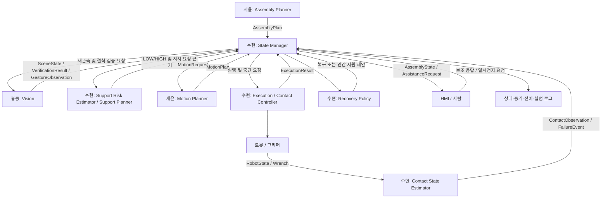
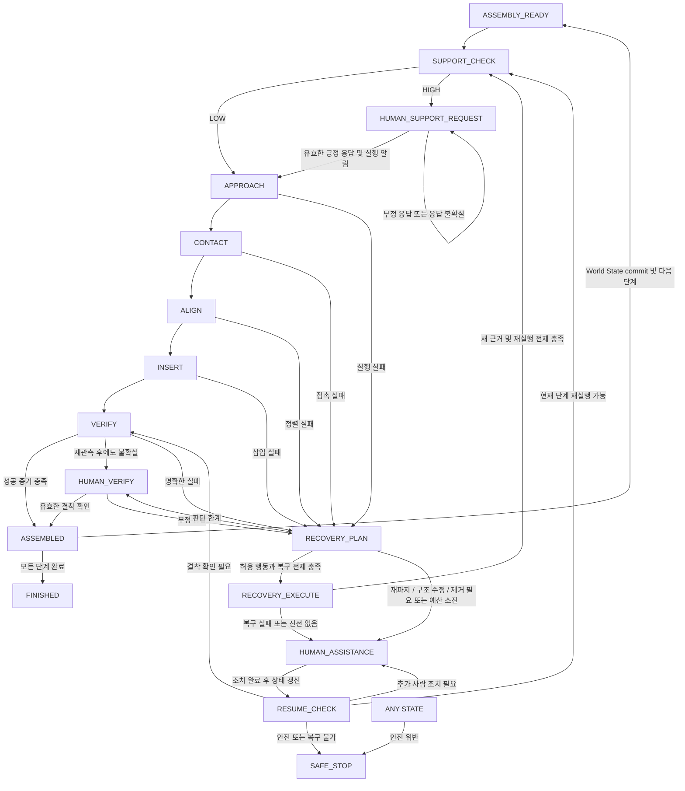

# 수현의 개별 연구 주제: LEGO Human-Robot Co-Assembly를 위한 접촉 기반 실행 및 협업 상태 관리

> 저장소 적용 안내 (2026-10-07): 아래는 사용자가 제공한 **구현 전 연구 설계 원문**입니다. 문서 내부의 D1~D13 ‘확정’은 해당 설계 논의의 상태이며 전체 팀의 Schema·역할 재배정·실물 검증 완료를 뜻하지 않습니다. 이번 제품 요구와 적용 범위는 [최종 MVP](10_FINAL_MVP.md)를 우선합니다. 지지 도움 프로토콜은 최종 MVP에 반영하고, 접촉·복구·메시지 필드·팀 역할의 상세는 연구 방향/합의 대상으로 구분합니다. 원문의 FINISHED·사람 확인 경로만으로 제품의 최종 Vision 확인·사용자별 DB 저장·웹앱 반영을 생략하지 않습니다.

- 작성일: 2026-10-07
- 문서 버전: Design v1.0
- 문서 성격: 구현 전 연구·시스템 설계 문서
- 제안 파일명: `docs/suhyun_individual_research_topic.md`
- 설계 근거: [레고 조립 제어 최신기술](chatgpt-conversation://6ac5a5a5-13fc-83ec-9798-4636ec184639)의 설계 논의와 현재 요청에서 확정한 조건
- 적용 원칙: 현재 요청의 확정사항을 우선하며, 이전 대화의 초기 제안은 최종 결정으로 대체한다.

이 문서는 수현의 연구 문제, 담당 모듈, 상태 전이, 팀원 간 계약, 검증 방법을 정의한다. D1~D13은 확정된 설계 방향이며, 메시지 필드·전이 세부 조건·실험 구성은 이를 구현하기 위한 초안이다. 수치 임계값, 로봇 API, ROS2 메시지 타입과 통신 주기는 실제 장비 보정 및 팀 합의 후 고정한다. 아직 구현하거나 실험으로 입증한 결과를 기술하는 문서는 아니다.

## 1. 연구 배경

LEGO 조립은 목표 좌표에 블록을 이동하는 것만으로 완료되지 않는다. 스터드와 블록의 상대 정렬, 삽입 중 접촉, 결착 여부, 기존 구조물의 지지 조건을 함께 고려해야 한다. 특히 지지되지 않은 돌출부에 삽입력을 가하는 단계에서는 사람이 구조물을 잡아주는 협업이 필요할 수 있다.

이 프로젝트는 계획 생성, Vision, Motion Planning, 접촉 기반 실행을 연결해 LEGO를 조립하는 시스템을 목표로 한다. 수현의 연구는 이 가운데 **접촉 이후의 실행과 성공 판정, 사람의 물리적·인지적 지원 요청, 실패 후 복구 및 재개**를 담당한다.

핵심 연구 관점은 인간 개입을 작업 종료로 취급하지 않는 것이다. 로봇의 물리적 능력이 부족하면 지지 또는 수정을 요청하고, 센서가 확신하지 못하면 결착 확인을 요청한다. 이후 State Manager가 관측과 사람의 응답을 통합해 다음 실행을 결정한다.

## 2. 문제 정의

### 2.1 해결할 문제

| 문제 | 기존의 단순 처리에서 생기는 한계 | 본 연구의 처리 방향 |
|---|---|---|
| 이동 명령 완료와 실제 결착의 차이 | 궤적이 끝났다는 이유로 미결착 블록을 완료 처리 | Execution, F/T, Vision 증거를 구분해 최종 판정 |
| 구조물 지지 부족 | 삽입 중 구조물이 움직이거나 정렬이 깨짐 | 기하학·규칙으로 지원 필요 여부와 지지 위치 산출 |
| 센서 판단 불확실·충돌 | 즉시 종료하거나 근거 없이 성공 처리 | `UNCERTAIN`에서 재관측 및 Human Verification 수행 |
| 동일 동작 재시도 | 원인이 바뀌지 않아 같은 실패 반복 | 실패 원인과 새 정보에 따른 Recovery 선택 |
| 인간 개입 이후의 재개 | 사람이 수정해도 계획과 실제 상태가 불일치 | World State 갱신과 실행 전제 재검사 후 재개 |
| 모듈별 상충 판단 | Vision·Controller·HMI가 각각 완료를 선언 | State Manager만 최종 조립 상태를 확정 |

### 2.2 연구 목표와 성공 조건

연구 목표는 **F/T 기반 접촉 상태 추정과 실패 원인별 Recovery를 인간 지원 프로토콜에 연결하여, 불확실성과 실패가 발생해도 상태를 확인하고 조립을 재개할 수 있는 실행 체계**를 만드는 것이다.

성공 조건은 다음과 같다.

1. 접촉·정렬·삽입·결착 후보를 구분하고, 명령 완료를 조립 완료로 오인하지 않는다.
2. Support Risk가 `HIGH`인 단계는 사람의 준비 응답을 받은 후 실행한다.
3. 불확실한 결착은 사람에게 확인을 요청하고, 확인 결과에 따라 완료 또는 Recovery로 분기한다.
4. 자동 Recovery는 허용된 행동만 실행하며, 물리적 수정이 필요하면 Human Assistance로 전환한다.
5. 인간 개입 뒤에도 단계·블록·증거의 일관성을 유지하고 실행을 재개한다.
6. 최종 판단의 근거와 Recovery 이력이 기록되어 실험 후 재구성할 수 있다.

## 3. 연구 질문

| ID | 연구 질문 | 검증 관점 |
|---|---|---|
| RQ1 | F/T와 로봇 위치 변화로 접촉, 정렬 불량, 끼임, 결착을 얼마나 구분할 수 있는가? | 상태별 혼동행렬, 감지 지연, 미결착의 성공 오판 |
| RQ2 | 기하학·규칙 기반 `LOW/HIGH` 분류로 필요한 Human Support를 선택할 수 있는가? | 지지 유무에 따른 구조물 변위, 결착률, 불필요 요청 |
| RQ3 | 실패 원인별 Recovery가 동일 조건 재시도보다 복구 성과를 개선하는가? | 복구 성공률, 추가 시간, 반복 실패, 최대 힘 |
| RQ4 | 센서 불확실성에 대한 Perceptual Assistance가 잘못된 완료 판정을 줄이고 재개를 가능하게 하는가? | 성공 오판율, 확인 정확도, 개입 후 재개율 |
| RQ5 | 요청 문맥에 연결된 두 제스처가 준비·확인 응답을 안정적으로 전달하는가? | 제스처 혼동, 잘못된 승인, 요청 처리 시간 |

각 질문의 효과는 실험으로 평가한다. 연구 기여를 알고리즘의 신규성이나 성능 향상으로 미리 확정하지 않는다.

## 4. 시스템 범위와 전제

### 4.1 대상 시스템

설계 논의의 로봇 플랫폼은 M0609이며, 실제 제어·F/T 취득 가능 방식은 장비 연결 시 확인한다. LEGO 블록, 그리퍼, 카메라, F/T 측정값 또는 사용 가능한 동등한 힘·모멘트 입력, 로봇 상태 입력을 사용한다. 노트북 HMI는 상태 표시와 보조 입력에 사용한다.

MVP는 제한된 블록 종류와 조립 구조, 보정된 작업 영역에서 단계별 조립을 수행한다. 각 접촉 실행의 시작 전제는 대상 블록이 파지되어 있고 접근 계획이 유효하다는 것이다. 공급·초기 파지 전 과정의 개발 책임은 이 문서에서 새로 배정하지 않으며, 해당 전제의 확인 인터페이스를 팀과 합의한다.

### 4.2 확정된 운영 조건

| 항목 | 확정 조건 |
|---|---|
| Support Risk | `LOW`와 `HIGH`만 사용한다. `MEDIUM`은 제거한다. |
| 긍정 응답 | 엄지만 올리는 엄지척(`THUMBS_UP`) |
| 부정 응답 | 엄지와 검지를 함께 올리는 별도 제스처(`THUMB_INDEX_UP`) |
| 지지 유지 | Human Support가 시작되면 사람이 조립 중 지지를 유지한다고 가정한다. |
| MVP 제외 | 지속 hand-presence 검증 및 이를 이용한 자동 지지 이탈 감지 |
| 자동 Recovery | `RETRACT`, `RE_OBSERVE`, `MICRO_SEARCH`, `RE_APPROACH`까지만 허용 |
| Human Assistance 전환 | 블록 재파지, 구조물 수정, 블록 제거가 필요한 경우 |

지지 유지 가정은 연속적인 손 감지의 결과가 아니다. HMI와 로그에서는 `support_maintained_assumed`로 표시해 측정된 사실과 구분한다. 지지 응답이 로봇의 안전 기능을 대신하지도 않는다. 로봇의 안전 정지와 힘·이동 한계는 별도의 실행 전제로 유지한다.

### 4.3 포함·제외 경계

수현의 범위에는 State Manager, Support Decision, Contact Controller/Estimator, Failure-aware Recovery, Human Assistance 전이, HMI용 상태·로그 계약이 포함된다. LLM 조립 계획 생성, Vision 인식 모델 자체, 전역 Motion Planning은 팀원 모듈을 입력으로 이용한다.

MVP에서는 범용 블록 재파지·제거, 구조물 자동 수정, 학습 기반 지원 판단, RL 또는 가변 임피던스 제어를 개발 목표에 포함하지 않는다. 요청한 네 종류의 자동 Recovery 이후 재실행은 기존 조립 실행으로 복귀하는 것이며, 새로운 자동 물체 조작 기능을 추가하는 것이 아니다.

## 5. 수현의 담당 범위와 산출물

| 담당 영역 | 책임 | 구현·연구 산출물 |
|---|---|---|
| Assembly State Manager | 단계 선택, 전이, 최종 판정, World State 갱신 | 상태 전이 명세, 이벤트 처리 모듈, 전이 로그 |
| Support Risk Estimator | 구조·삽입 기하학에 따른 `LOW/HIGH` 판단 | 규칙표, 근거 코드, 보정·평가 결과 |
| Support Planner | `brick_id + region + direction` 산출 | 지원 요청 데이터와 표시용 설명 |
| Execution / Contact Controller | 접근 계획 실행 연결, 접촉 이후 미세 동작 | 제어 인계 계약, 접촉·정렬·삽입 실행 모듈 |
| Contact State Estimator | F/T·위치 기반 상태 추정 | 특징 정의, 보정 파라미터, 라벨 데이터와 평가 |
| Recovery Policy | 원인 분류, 허용 행동 선택, 인간 전환, 재개 조건 | 복구 정책표, 이력·예산 관리, 실험 결과 |
| Human Assistance Protocol | 준비·확인·수정 요청과 응답 처리 | 요청 ID, 응답 문맥, 재검사 규칙 |
| HMI / Observability 계약 | 통합 상태, 판단 근거, 실패·복구 이력 제공 | 상태 스키마, 최소 모니터 화면 요구사항, 재현 로그 |

HMI 구현의 최종 분담은 팀과 합의하되, State Manager가 제공할 데이터와 로직 경계는 수현이 정의한다. 제스처 인식 모델 개발은 Vision 담당과 협의하고, 인식된 응답의 유효성 판단과 상태 전이는 수현이 담당한다.

## 6. 상위 아키텍처



모듈은 자신의 관측 또는 계획을 제공한다. State Manager는 이를 종합해 작업의 의미와 다음 행동을 결정한다. Support/Recovery 모듈의 출력도 실행 명령이 아니라 State Manager가 검증할 결정 근거 또는 행동 제안이다.

Motion Planner는 전역 접근과 pre-contact pose까지의 경로 및 제한 조건을 제공한다. Contact Controller는 pre-contact 도달 확인과 제어권 인계 후 접촉·정렬·삽입을 실행한다. 같은 시점에 두 모듈이 로봇에 움직임 명령을 내리지 않도록 실행 계층에서 제어권을 단일화한다.

## 7. State Manager의 역할

### 7.1 관리할 상태

세 종류의 상태를 구분한다.

| 구분 | 예시 | 의미 |
|---|---|---|
| 실행 상태 `machine_state` | `APPROACH`, `INSERT`, `HUMAN_VERIFY` | 현재 수행하거나 기다리는 작업 |
| 단계 최종 상태 `step_status` | `NOT_STARTED`, `IN_PROGRESS`, `UNCERTAIN`, `ASSEMBLED`, `FAILED` | 해당 조립 단계에 대한 최종 해석 |
| 모듈 증거 | Execution `COMPLETE`, Contact `SEATED`, Vision `UNKNOWN` | 원본 모듈이 보고한 결과 |

`UNCERTAIN`은 정상적으로 다룰 수 있는 미확정 상태다. `FAILED`도 원인과 복구 가능성을 기록하는 단계 상태이며, 항상 시스템 종료를 뜻하지 않는다.

State Manager가 관리할 데이터는 계획·단계·블록 ID, World State revision, 현재 관측의 시각·유효성, Support Risk와 근거, 지원 요청과 응답, Contact/Execution/Vision 증거, 복구 이력·예산, 최종 판정과 이유다.

### 7.2 핵심 불변 조건

1. 다음 단계의 dependencies가 `ASSEMBLED`가 되기 전에는 실행하지 않는다.
2. `ExecutionResult=COMPLETE`만으로 `ASSEMBLED`를 선언하지 않는다.
3. 사람의 긍정 응답은 해당 지원 요청에만 적용한다. 이전 단계의 승인을 재사용하지 않는다.
4. 명확한 실패와 단순 관측 불가를 구분한다. `UNKNOWN`을 `FAIL`이나 `PASS`로 임의 변환하지 않는다.
5. 사람의 확인이 Vision의 원본 `UNKNOWN`을 `PASS`로 덮어쓰지 않는다. 최종 근거를 `HUMAN_VERIFIED`로 별도 기록한다.
6. 동일한 원인·관련 상태·행동 파라미터 조합의 반복 실행을 제한한다.
7. 인간이 구조를 수정하면 기존 MotionPlan과 지원 준비 응답의 유효성을 다시 검사한다.
8. 안전 정지 중에는 일반 긍정 제스처로 실행을 재개하지 않는다.

### 7.3 완료 판정 정책 초안

| Contact 증거 | Vision 검증 | 처리 |
|---|---|---|
| `SEATED` | `PASS` | `ASSEMBLED`, 근거 `SENSOR_VERIFIED` |
| `SEATED` | `UNKNOWN` 또는 관측 불가 | `UNCERTAIN` → 재관측 → 필요 시 `HUMAN_VERIFY` |
| `SEATED` | 명확한 `FAIL` | `RECOVERY_PLAN`; 충돌 원인 및 현재 구조 재확인 |
| `UNKNOWN` | `PASS` | 센서 충돌로 `UNCERTAIN`; 접촉 증거 재평가 및 사람에게 상태 확인 |
| 명확한 접촉 실패 | 어느 결과든 | `RECOVERY_PLAN`; 단순 확인 응답으로 실패를 덮어쓰지 않음 |

`HUMAN_VERIFY`에서 유효한 긍정 응답을 받으면, 활성 안전·명확한 실패가 없고 해당 요청이 결착 확인 문맥일 때 `ASSEMBLED/HUMAN_VERIFIED`로 처리한다. 명확한 실패가 남아 있으면 사람 응답을 진단 증거로 기록하고 먼저 상태를 재평가한다. 부정 응답은 `RECOVERY_PLAN`으로 전환한다. 이 정책은 D2의 자동 완료 기준에 D6의 인간 확인 경로를 추가한 것이다.

## 8. 상태머신

### 8.1 최상위 흐름



`ANY STATE → SAFE_STOP`은 모든 상태에 적용되는 우선 전이다. 다이어그램의 `ANY STATE`는 실제 실행 상태가 아니다. `RE_EXECUTE`는 별도 범용 retry 상태를 만들지 않고, 복구 후 전제 검사와 `SUPPORT_CHECK`를 거쳐 필요한 접근·접촉 단계로 복귀하는 의미로 사용한다.

### 8.2 상태별 계약

| 상태 | 진입·실행 | 정상 종료 조건 및 다음 상태 | 실패·대기 처리 |
|---|---|---|---|
| `ASSEMBLY_READY` | 유효한 계획과 World State에서 다음 단계 선택 | dependencies 및 블록 준비 확인 → `SUPPORT_CHECK` | 입력 불충족 시 대기 또는 계획 갱신 요청 |
| `SUPPORT_CHECK` | 기하학·연결 관계로 이진 위험 평가 | `LOW` → `APPROACH`; `HIGH` → `HUMAN_SUPPORT_REQUEST` | 데이터 무효면 실행 보류·재관측; 제3의 위험 등급을 만들지 않음 |
| `HUMAN_SUPPORT_REQUEST` | 대상·영역·방향 제시, 새 요청 ID 발행 | 긍정 응답, 계획 유효성, 실행 전 알림 완료 → `APPROACH` | 부정/미인식/기한 초과는 미승인 유지; 요청 설명 또는 위치 재검토 |
| `APPROACH` | 유효 MotionPlan의 pre-contact 경로 실행 | 도달 및 제어권 인계 확인 → `CONTACT` | 계획·실행 실패 → `RECOVERY_PLAN` |
| `CONTACT` | 제한된 속도·거리로 접근하며 F/T 확인 | 접촉 감지 → `ALIGN` | 최대 접근 거리·시간 초과 → `RECOVERY_PLAN` |
| `ALIGN` | 횡방향 힘·모멘트와 제한된 XY 탐색 평가 | 정렬 조건 충족 → `INSERT` | 탐색 한계 또는 끼임 → `RECOVERY_PLAN` |
| `INSERT` | 힘·변위 한계 내 삽입, 결착 상태 추정 | `SEATED` 증거 확보 → `VERIFY` | 끼임·정렬 불량·운영 한계 초과 → `RECOVERY_PLAN` |
| `VERIFY` | 파지 해제·관측 자세 전제 확인 후 Vision 검증 | 완료 정책 충족 → `ASSEMBLED` | 불확실 → `HUMAN_VERIFY`; 명확한 실패 → `RECOVERY_PLAN` |
| `HUMAN_VERIFY` | 안전한 정지 상태에서 결착 확인 요청 | 유효 긍정 및 판정 조건 충족 → `ASSEMBLED` | 부정 → `RECOVERY_PLAN`; 응답 없으면 대기·재안내 |
| `RECOVERY_PLAN` | 원인·증거·예산·자율 경계 평가 | 허용 복구 → `RECOVERY_EXECUTE` | 판단 한계 → `HUMAN_VERIFY`; 물리 조치 필요 → `HUMAN_ASSISTANCE` |
| `RECOVERY_EXECUTE` | 허용된 복구 행동과 결과 기록 | 유효 변화 및 파지 유지 확인 → `SUPPORT_CHECK` | 진전 없음·예산 소진·파지 손실 → `HUMAN_ASSISTANCE` |
| `HUMAN_ASSISTANCE` | 움직임 중단·제어 인계 후 사람에게 수정 요청 | 조치 완료 응답 → `RESUME_CHECK` | 추가 조치 요청 또는 안전 정지 |
| `RESUME_CHECK` | 재관측, World State 갱신, 계획·파지·지원 전제 검사 | 재실행 → `SUPPORT_CHECK`; 사람 조립 완료 주장 → `VERIFY` | dependencies 변화 시 계획 갱신; 추가 조치 또는 `SAFE_STOP` |
| `ASSEMBLED` | 증거와 완료 revision 기록, 지지 해제 시점 안내 | 다음 단계 → `ASSEMBLY_READY`; 종료 → `FINISHED` | World State commit 실패 시 다음 단계 진행 보류 |
| `SAFE_STOP` | 안전 정지 사유 기록, 움직임 차단 | 원인 해소와 명시적 리셋 후 `RESUME_CHECK` | 제스처 승인·일반 Recovery로 자동 해제하지 않음 |
| `FINISHED` | 전체 단계 완료와 실험 로그 확정 | 새 작업은 별도 시작 절차 | 이전 지원·승인 정보 초기화 |

`WAITING_HUMAN`, `HUMAN_READY`는 지원 상태의 표시·이벤트로 사용하며, 중복된 최상위 상태를 만들지 않는다. 시간 초과나 무응답은 동의로 해석하지 않는다. 각 상태의 제한 시간·거리·힘은 파라미터로 정의한다.

## 9. Human Physical Assistance와 Perceptual Assistance

### 9.1 Physical Assistance

Physical Assistance는 로봇의 물리적 한계를 보완한다. 정상 조립 중 지지 요청과 Recovery 중 수정 요청을 구분한다.

| 요청 종류 | 예시 | 사람 응답 후 처리 |
|---|---|---|
| `PHYSICAL_SUPPORT` | “빨간 2×4 블록의 왼쪽을 아래 방향으로 지지해주세요.” | 준비 확인 → 실행 알림 → 조립 실행 |
| `PHYSICAL_CORRECTION` | “블록 B07의 재파지가 필요합니다. 로봇 정지 확인 후 조치해주세요.” | 조치 완료 → 재관측·파지 전제 확인 → 재개 검사 |
| `STRUCTURE_CORRECTION` | “기준 블록 B03의 위치를 복원해주세요.” | 구조 관측 갱신 → 계획·지원 조건 재평가 |
| `BRICK_REMOVAL` | “잘못 결착된 B07을 제거해주세요.” | 제거 확인 → dependencies 및 단계 상태 갱신 |

지지 요청은 geometry/rule engine이 `brick_id`, `region`, `direction`을 산출한다. 돌출 길이, 삽입점과 지지영역의 관계, 연결부 배치 등을 규칙 입력으로 사용한다. 규칙 및 임계값은 제한된 MVP 구조에 대해 보정한다. LLM은 선택적으로 구조화된 요청의 자연어 표현만 담당하며, 지지 위치나 실행 허가를 결정하지 않는다. MVP 안내는 고정 템플릿으로도 구현할 수 있다.

지지 준비 응답 후에는 사람이 해당 조립 단계의 삽입·검증 및 지지 위치가 유지되는 국소 Recovery 동안 지지를 유지한다고 가정한다. 단계 완료 또는 명시적 지원 종료 안내 시 해제한다. 사람이 손을 옮겨야 하는 수정·검증으로 전환하면 먼저 움직임을 멈추고 지원 세션을 종료한다. 이후 `HIGH` 단계 실행에는 새 지지 준비 응답을 요청한다.

지속 hand-presence 검증과 이에 기반한 `SUPPORT_LOST` 자동 이벤트는 MVP 요구사항에 포함하지 않는다. 사용자 중단 요청이나 이미 존재하는 로봇 이상 신호는 별도로 처리한다.

### 9.2 Perceptual Assistance

Perceptual Assistance는 관측만으로 결착 상태를 확정할 수 없을 때 사람의 판단을 이용한다.

예: “B07의 결착 상태를 확인해주세요. 완전히 결착되었으면 엄지척, 문제가 있으면 엄지와 검지를 함께 올려주세요.”

긍정 응답은 해당 블록의 확인 결과로 기록하며, 부정 응답은 실패 원인 평가와 Recovery로 연결한다. 확인을 위해 사람이 블록을 누르거나 옮겨야 한다면 이는 물리적 수정이므로 `HUMAN_ASSISTANCE`로 전환하고 수정 후 다시 검증한다.

### 9.3 제스처 프로토콜

| 인식 코드 | 손 모양 | 지원 요청에서의 의미 | 검증 요청에서의 의미 |
|---|---|---|---|
| `THUMBS_UP` | 엄지 하나를 올리고 나머지 손가락은 접음 | 요청한 준비·조치를 완료했다 | 요청한 결착 상태가 정상이다 |
| `THUMB_INDEX_UP` | 엄지와 검지를 함께 올리고 나머지는 접음 | 준비되지 않았거나 요청 수행에 문제가 있다 | 결착에 문제가 있다 |
| `UNKNOWN` | 미인식·낮은 신뢰도·두 종류 경합 | 응답 미확정 | 응답 미확정 |

긍정·부정의 구분은 엄지 방향 변화가 아니라 펴진 손가락 구성으로 한다. 부정 응답에 엄지 아래 방향 제스처를 사용하지 않는다. 제스처의 공통 의미는 **현재 요청에 대한 긍정 또는 부정 응답**이며, 작업 문맥에 따라 준비와 확인의 대상이 달라진다.

요청이 활성화된 구간에서만 응답을 수락하고, 인식 시각·신뢰도·유지 시간·중복 응답 방지 조건을 검사한다. 구체적인 인식 임계값과 유지 시간은 보정 대상이다. 지지하는 손과 응답하는 손의 사용 방식은 참여자 안내 및 카메라 배치 실험에서 확인한다.

노트북 HMI의 긍정·부정 버튼은 인식 실패 시 fallback 및 디버깅용으로 제공한다. 제스처와 버튼은 동일한 `HumanResponse` 계약을 사용한다. 응급 정지는 이 응답 프로토콜과 별도의 입력이다.

## 10. Contact State Estimation과 접촉 제어

### 10.1 입력과 전처리

입력은 `Fx, Fy, Fz, Mx, My, Mz`, TCP pose/속도, 명령 변위, 파지 상태, 시각이다. 실제 제공 가능한 파지 상태 신호는 장비 인터페이스 합의 대상이다.

F/T 영점, 공구 하중 보정, 노이즈 필터링, 로봇 상태와의 시간 정렬을 수행한다. 접촉 좌표계의 삽입축과 힘 부호를 명시적으로 정해 로봇 base의 Z축과 혼동하지 않는다. 모멘트의 기준점도 기록한다.

### 10.2 상태와 특징 초안

| Contact 상태 | 판단에 사용하는 특징 | 제어·상태 관리 의미 |
|---|---|---|
| `FREE` | 유효 입력에서 접촉 기준 이하의 힘 | 제한된 접근 계속 |
| `CONTACT` | 삽입축 접촉력의 지속적 상승 | 정렬 판단 시작 |
| `ALIGNING` | 횡방향 힘·모멘트와 XY 보정 반응 | 제한된 micro-search |
| `INSERTING` | 삽입 변위 증가와 허용 힘 패턴 | 삽입 진행 감시 |
| `SNAP_CANDIDATE` | 힘 변화·변위 변화에서 결착 후보 특징 | 후보 증거 기록; 단독 성공 판정 금지 |
| `SEATED` | 보정된 힘·변위·안정 구간 조건 충족 | Vision 검증 요청 가능 |
| `JAMMED` | 힘은 증가하지만 기대 변위가 없거나 비정상 모멘트 지속 | 삽입 중단, 실패 원인 평가 |
| `UNKNOWN` | 입력 무효, 특징 경합, 판단 근거 부족 | 실행 보류 또는 안전한 진단 절차 |

`MISALIGNMENT`, `OVER_FORCE`는 실패 이유로 별도 기록한다. 임계값을 넘었다는 사실과 원인 추정의 신뢰도를 구분한다. 모든 블록에서 뚜렷한 snap 패턴이 나타난다고 가정하지 않으며, 실제 데이터에 따라 `SNAP_CANDIDATE` 사용 여부를 조정한다.

### 10.3 Controller의 MVP 동작

1. pre-contact 도달·제어권 인계 확인.
2. 제한 속도·최대 거리 내 접근과 접촉 감지.
3. 횡방향 힘·모멘트 평가 및 제한된 XY micro-search.
4. 힘·이동량 한계 내 삽입.
5. 결착 후보·seated 증거 생성 또는 실패 이벤트 전달.
6. 파지·결착 조건에 맞는 해제 및 관측 자세 이동.

`F_contact`, `F_operational_limit`, `F_safety_limit`, 모멘트 한계, 최대 삽입 깊이, 탐색 범위·간격·속도, 판정 유지 시간은 장비·블록·그리퍼별 보정 파라미터다. 이전 논의의 예시 거리나 힘을 확정 수치로 사용하지 않는다.

결착된 블록을 파지한 채 retract하면 블록을 들어 올릴 수 있으므로, `VERIFY`의 정상 후퇴에는 결착 증거와 파지 해제 완료 조건을 명시해야 한다. 실패 Recovery의 retract는 블록 파지 유지와 접촉 해제 가능성을 확인한다. 이미 놓은 블록을 재삽입하려면 재파지가 필요하므로 Human Assistance 대상이다. 그리퍼 해제·인계 절차의 장비별 세부 구현은 팀 계약에서 확정한다.

## 11. Failure-aware Recovery

### 11.1 정책 원칙

Recovery는 `recover(failure_reason, evidence, world_state)`의 정책으로 정의한다. 실패 후 같은 동작을 같은 조건으로 반복하는 범용 retry는 사용하지 않는다.

자동 복구 행동 집합은 다음 네 종류로 제한한다.

| 행동 | 의미 | 실행 전제 |
|---|---|---|
| `RETRACT` | 허용 경로로 접촉을 완화하고 후퇴 | 파지·접촉 상태와 후퇴 경로가 확인됨 |
| `RE_OBSERVE` | 현재 블록·기준 구조·결착 상태 재관측 | 로봇이 안전하게 정지하거나 관측 자세에 있음 |
| `MICRO_SEARCH` | 제한된 XY 보정으로 정렬 탐색 | 블록 파지 유지, 힘·탐색 경계 유효 |
| `RE_APPROACH` | 갱신된 관측·계획으로 다시 접근 | 새 MotionPlan, 구조·파지·지원 전제 유효 |

여러 허용 행동을 순서대로 조합할 수 있다. 블록 재파지, 구조물 수정, 블록 제거는 자동 복구 행동에 포함하지 않는다. 필요하다고 판단한 시점에 로봇을 정지시키고 Human Assistance를 요청한다.

### 11.2 실패 원인별 정책 초안

| 원인 | 근거 예시 | 자동 대응 | 사람에게 넘기는 조건 |
|---|---|---|---|
| `MISALIGNMENT` | 횡방향 힘·모멘트 불균형, 정렬 조건 미충족 | 접촉 완화 → 탐색 중심·방향 변경 → micro-search → 재접근 | 탐색 범위·예산 초과, 구조 이동, 재파지 필요 |
| `JAMMED` | 삽입 진행 정체와 힘 증가 | 동작 중단 → 조건 충족 시 retract → re-observe → 새 접근 | 억지 후퇴가 필요하거나 제거·수정이 필요 |
| `VISION_MISMATCH` | 계획과 관측된 위치·방향·결착 상태 차이 | re-observe, 실제 실패와 관측 오류 구분 | 명확한 잘못된 결착은 수정 요청; 판단 불가는 Human Verify |
| `SENSOR_CONFLICT` | F/T와 Vision의 결론 불일치 | 정지 상태에서 증거 재확인 및 re-observe | 불확실성 지속 → Perceptual Assistance |
| `OVER_FORCE` | 운영 한계 초과, 안전 한계 미만 | 삽입 중단 → 후퇴 가능성 평가 → retract/re-observe | 원인 불명, 구조 변형, 자동 후퇴 불가 |
| `GRASP_LOST` | 파지 상태 불충족 또는 블록 낙하 관측 | 실행 중단 및 re-observe | 재파지가 필요하므로 Human Assistance |
| `STRUCTURE_CHANGED` | 기준 블록 이동·연결 변경 | re-observe, 기존 계획 무효화 | 구조 복원 필요 → Human Assistance; 계획 변경 필요 → Planner |
| `SAFETY_VIOLATION` | 안전 한계 초과 또는 로봇 안전 신호 | 즉시 `SAFE_STOP` | 원인 해소·명시적 리셋 이후 재개 검사 |

안전 한계를 넘은 경우에는 후퇴도 새로운 움직임이므로 자동 retract를 보장하지 않는다. 안전 정지와 운영 실패를 분리해, 정지 조건을 Recovery가 우회하지 않도록 한다.

### 11.3 재실행과 escalation 조건

재실행 전에는 실패와 관련된 변화가 있어야 한다. 예를 들면 재관측으로 목표 pose가 갱신되거나, 탐색 파라미터가 바뀌거나, 사람의 수정으로 구조가 복원되어야 한다. 단순히 timestamp 또는 revision 번호가 증가한 것만으로는 진전으로 인정하지 않는다.

`recovery_count`, `last_failure_reason`, `last_recovery_action`, 행동 파라미터, 전후 증거, World State revision, 소요 시간을 기록한다. 총 횟수·시간·힘·탐색 범위 예산도 파라미터로 제한한다. 예산이 남아 있어도 관련 변화가 없으면 같은 실행을 반복하지 않고 사람에게 전환한다.

인간 개입 뒤에는 긍정 응답만으로 즉시 삽입하지 않는다. `RESUME_CHECK`에서 재관측, 구조 갱신, dependencies, 파지, MotionPlan, Support Risk를 검사한다. 사람이 제거한 블록이나 이동한 기준 블록에 대한 과거 `ASSEMBLED` 상태는 영향을 받는 후속 단계와 함께 재평가한다. 계획 변경이 필요한 경우 시율의 Planner에 갱신을 요청한다.

물리적 수정 전후의 관측은 서로 다른 `attempt_id`와 구조 revision에 연결한다. 과거 F/T 실패·결착 증거는 이력으로 보존하고 수정 이후 상태의 현재 증거로 재사용하지 않는다. 사람이 직접 결착을 완료한 경우에도 조치 완료 응답만으로 완료 처리하지 않고, 새 Vision 검증 및 필요 시 별도의 결착 확인 요청을 거친다. 이 경우 최종 완료 근거를 `HUMAN_VERIFIED_AFTER_CORRECTION`으로 기록해 로봇 삽입의 센서 검증 경로와 구분한다.

## 12. HMI / Observability 역할

HMI는 State Manager의 상태와 요청을 표시하고 보조 응답을 전달한다. 자체적으로 지원 필요 여부, 조립 완료, Recovery 행동을 결정하지 않는다.

노트북을 조작하기 어려운 협업 상황을 고려해 제스처를 기본 응답 경로로 둔다. 실행 전에는 사람이 인지할 수 있는 명시적 알림을 제공한다. MVP에서는 표시와 짧은 음성·소리 중 실험 환경에서 인지 가능한 방식을 정하며, 알림 완료를 실행 전제로 기록한다.

최소 표시 항목은 다음과 같다.

- 현재 계획·단계·블록, 실행 상태 및 단계 최종 상태.
- Support Risk와 판단 근거, 지지할 블록·영역·방향, 지지 유지 가정 표시.
- 현재 요청과 긍정·부정 응답 방법, 인식 상태와 응답 대기 여부.
- Execution, Contact, Vision, Human의 원본 증거와 최종 판정 이유.
- 실패 이유, 선택한 복구 행동, 변경 파라미터, 복구 횟수·예산.
- 일시정지·안전 정지 사유 및 재개 검사 결과.

Observability는 상태 전이, 요청·응답, 제어 명령·결과, F/T·pose 시계열, Vision 결과, 파라미터 버전을 같은 실행 ID로 기록한다. HMI용 요약과 실험용 원본 데이터를 구분하되 모두 State Manager의 최종 판단과 연결한다. 로그만으로 “무엇을 보고 왜 사람을 불렀고 어떤 조건으로 재개했는가”를 재구성할 수 있어야 한다.

## 13. 팀원 인터페이스 계약 초안

### 13.1 공통 규칙

이 절의 타입명·필드는 논리 계약이다. ROS2 msg/srv/action 파일명, topic명, QoS, 발행 주기는 구현 착수 전에 합의한다.

| 계약 항목 | 초안 |
|---|---|
| 식별자 | 실행 `run_id`, 계획 `plan_id/plan_version`, `step_id`, `brick_id`, `attempt_id`, `request_id` 사용 |
| 시각·최신성 | 생성·관측 시각 구분; 허용 지연과 입력 만료 정책 합의 |
| 좌표·단위 | 로봇 pose는 `frame_id`와 SI 단위; 회전은 quaternion; wrench는 N 및 N·m와 기준점 명시 |
| LEGO 상대 위치 | `stud_x/stud_y/layer/rotation_deg`는 조립 격자 값임을 명시; 로봇 좌표 변환 책임 분리 |
| 상태 버전 | 계획 및 World State revision과 결과를 연결; 변경 시 관련 계획 유효성 검사 |
| 결과 구분 | 성공·실패·취소·시간 초과·관측 불가를 서로 다른 코드로 보고 |
| 실행 권한 | State Manager의 허가를 받은 단일 실행 계층만 움직임을 명령 |
| 중복·지연 응답 | 이미 처리한 request ID의 중복, 이전 단계 응답, 취소된 요청의 결과를 전이에 사용하지 않음 |
| 데이터 무효 | invalid 입력을 정상 기본값으로 대체하지 않고 재관측·대기로 처리 |

### 13.2 모듈별 입출력

| 제공자 → 수신자 | 계약 | 필수 정보 및 책임 |
|---|---|---|
| 시율 → 수현 | `AssemblyPlan` | 계획 버전, steps, brick spec, reference bricks, 상대 pose, dependencies; 무엇을 어디에 조립할지 정의 |
| 수현 → 시율 | `PlanUpdateRequest` | 구조 변경과 영향 단계, 최신 World State, 변경 이유; 새 계획 요청 |
| 홍동 → 수현 | `SceneState` | 관측 시각, frame, brick ID/spec/pose, 신뢰도, 가림·검출 유효성; 관측 사실 제공 |
| 수현 → 홍동 | `VerificationRequest` / `ReobserveRequest` | 대상 블록·기준 구조, 기대 관계, request ID, 필요한 관측 |
| 홍동 → 수현 | `VerificationResult` | `PASS/FAIL/UNKNOWN`, 관측 근거와 시각, request ID; 시스템 전체 완료는 선언하지 않음 |
| 홍동 → 수현 | `GestureObservation` | 긍정·부정·미확정 코드, 신뢰도, 인식 시각·유지 구간; 요청 연결은 수현이 검사 |
| 수현 → 세은 | `MotionRequest` | 목표 상대 pose, 현재 구조 revision, 접근 방향, contact 예상, 지지 영역과 동작 제한 |
| 세은 → 수현 | `MotionPlan` | request ID, 기준 revision, 접근 경로, pre-contact pose, 삽입축·깊이 한계, 후퇴 가능 경로·계획 유효성 |
| 실행 계층 → State Manager | `ExecutionResult` | 명령 ID, 완료·실패·취소, 실제 도달 pose, 실패 이유, 제어권 인계 상태 |
| 로봇 입력 → 수현 | `RobotState` / `Wrench` | 시각·frame·단위, pose/속도, 힘·모멘트, 안전 상태, 제공 가능한 파지 정보 |
| Contact Estimator → State Manager | `ContactObservation` | 상태, 특징·원본 참조, 유효성·신뢰도, 실패 이유 |
| State Manager → HMI | `AssemblyState` / `AssistanceRequest` | 통합 상태, 증거·판정 근거, 요청 문맥, 지지 영역, 복구 이력 |
| 응답 처리 → State Manager | `HumanResponse` | request ID, positive/negative, gesture/HMI 출처, 응답 시각; 상태를 직접 수정하지 않음 |

### 13.3 핵심 스키마 예시

아래 JSON은 필드 의미를 보여주는 예시이며 실제 관측값이나 확정 제어 파라미터가 아니다.

```json
{
  "request_id": "support_step_007_a",
  "plan_id": "assembly_001",
  "plan_version": 1,
  "step_id": 7,
  "type": "PHYSICAL_SUPPORT",
  "support_risk": "HIGH",
  "target": {
    "brick_id": "B03",
    "region": "LEFT_EDGE",
    "direction": "DOWN",
    "direction_frame": "assembly_frame"
  },
  "reason_code": "INSERTION_OUTSIDE_SUPPORT_REGION",
  "positive_gesture": "THUMBS_UP",
  "negative_gesture": "THUMB_INDEX_UP",
  "support_maintained_assumed": true
}
```

```json
{
  "run_id": "run_001",
  "plan_id": "assembly_001",
  "plan_version": 1,
  "world_revision": 12,
  "step_id": 7,
  "brick_id": "B07",
  "machine_state": "HUMAN_VERIFY",
  "step_status": "UNCERTAIN",
  "support": {
    "risk": "HIGH",
    "required": true,
    "human_ready": true,
    "support_maintained_assumed": true
  },
  "evidence": {
    "execution": "COMPLETE",
    "contact": "SEATED",
    "vision": "UNKNOWN",
    "human": "PENDING"
  },
  "assistance_request_id": "verify_step_007_a",
  "failure": {
    "reason": "VERIFICATION_UNCERTAIN",
    "last_recovery_action": "RE_OBSERVE",
    "recovery_count": 1
  },
  "decision_reason": "SEATED_BUT_VISUAL_EVIDENCE_UNAVAILABLE"
}
```

### 13.4 구현 착수 전에 합의할 사항

1. LEGO grid, assembly frame, camera frame, robot base, tool frame의 변환 책임과 보정 절차.
2. pre-contact 도달, 제어권 인계, 정지·취소, 파지 해제 완료의 확인 방식.
3. Vision의 `FAIL`과 `UNKNOWN` 구분, brick ID 대응, 검증 시 관측 자세.
4. 파지 상태의 취득 가능 여부, 초기 블록 공급·파지 및 사람의 재파지 시 인계 책임.
5. MotionPlan과 구조 revision의 유효성, 관측 갱신 시 재계획 조건.
6. 응답 수락 구간, 메시지 주기·시간 초과, 로그 동기화, 상태 복원 대상 범위.

## 14. 결정사항 D1~D13 요약

| 결정 | 최종 확정안 | 구현상 의미 |
|---|---|---|
| D1 — 최종 의사결정권 | State Manager가 관리 | LLM·Vision·HMI가 로봇의 다음 행동이나 최종 조립 상태를 직접 확정하지 않음 |
| D2 — 조립 완료 기준 | Execution 완료와 Assembly 완료를 구분 | 자동 완료는 F/T 결착 증거와 Vision 검증; D6의 인간 확인 경로를 별도 적용 |
| D3 — Support 필요 판단 | rule-based Support Risk Estimator | 입력은 구조·삽입 기하학; 출력은 `LOW/HIGH`만 사용, `MEDIUM` 제거 |
| D4 — Support 위치 | geometry/rule 기반 `brick_id + region + direction` | LLM은 선택적 자연어 변환만 담당 |
| D5 — Human Ready | 엄지척 기본, HMI fallback/debug | 요청별 준비 확인 및 실행 전 명시적 알림 |
| D6 — 결착 검증과 재개 | F/T primary → Vision verification → 불확실하면 Human Verification | 미확정 상태에서 사람 확인 후 완료 또는 Recovery로 분기하며 재개 가능 |
| D7 — Recovery 방식 | 단순 동일 retry 폐기, 원인별 Recovery | 실패 분류·관련 변화·예산을 검사한 뒤 재실행 |
| D8 — Contact Controller MVP | F/T 접촉 감지 + XY micro-search + 삽입·결착 감지 | 고급 compliance/admittance 제어는 확장 |
| D9 — World State 소유 | State Manager가 Single Source of Truth | 모듈 원본 증거 보존, 최종 상태와 판정 근거 별도 관리 |
| D10 — Human Intervention Policy | 물리 한계는 Physical Assistance, 판단 한계는 Perceptual Assistance | 인간 개입은 회복 가능한 협업 상태; 안전·복구 불가는 Safe Stop |
| D11 — 부정 응답 | 엄지와 검지를 함께 올리는 별도 제스처 | 긍정 엄지척과 손가락 구성으로 구분; HMI 부정 버튼 fallback |
| D12 — 지지 유지 | Human Support 시작 후 조립 중 유지한다고 가정 | 지속 hand-presence 검증은 MVP 제외; 가정임을 상태·로그에 표시 |
| D13 — Recovery 자율 경계 | retract / re-observe / micro-search / re-approach만 자동 | 재파지·구조물 수정·블록 제거 필요 시 Human Assistance |

## 15. MVP와 확장 범위

| 영역 | MVP | 확장 후보 |
|---|---|---|
| 조립 대상 | 제한된 블록·구조 및 보정된 작업 영역 | 다양한 블록·복잡한 구조·조건 변화 |
| Support Decision | 기하학·규칙, `LOW/HIGH` | 물리 모델 또는 데이터 기반 판단; 위험 등급 변경은 별도 결정 |
| Contact Estimation | 보정된 F/T·변위 특징과 규칙 | 학습 기반 분류 및 불확실성 추정 |
| Contact Control | 제한된 접근·XY 탐색·삽입 | compliance/admittance 등 접촉 제어 고도화 |
| Human Ready/Confirm | 두 제스처, HMI 보조 입력 | 다양한 시점·가림 대응, 추가 입력 방식 |
| Support 유지 | 사람의 지속 지지 가정 | 연속 hand/support presence 검증; MVP 완료 요건에 포함하지 않음 |
| Verification | F/T → Vision → 필요 시 사람 확인 | 센서 융합·능동 관측 개선 |
| Recovery | 네 행동의 원인별 조합, 예산·진전 검사 | 데이터 기반 정책 선택; 자동 재파지·제거·수정은 별도 연구·승인 범위 |
| Observability | 상태 화면·동기화 로그·전이 재현 | 실험 분석 화면 및 자동 보고 |

MVP 완료 기준은 정상 조립, HIGH 지지 요청, 불확실성 확인, 국소 복구, 자율 경계 초과 시 사람 수정, 수정 후 재개를 하나의 시스템에서 재현하는 것이다. 고급 제어 기법 추가보다 위 경로의 일관된 동작과 평가를 우선한다.

## 16. 검증 실험 계획

### 16.1 단계별 실험

| 실험 | 구성 | 관측·평가 | 연결 질문 |
|---|---|---|---|
| E1 — 센서·제어 보정 | free/contact/seated의 F/T·pose 수집; 안전한 범위에서 정렬 오차·끼임 조건 구성 | 특징 분포, 상태 라벨, 감지 지연, 운영 한계 선정 | RQ1 |
| E2 — Support 효과 | 안정 구조와 지지 취약 구조에서 동일 단계의 지지 유무 비교 | 결착률, 구조물 변위, 최대 힘, 요청 적절성 | RQ2 |
| E3 — 제스처 응답 | 엄지척·엄지+검지, 실제 지지 자세, 시점·조명·부분 가림 변화 | 클래스 혼동행렬, 미인식, 잘못된 승인, 응답 시간 | RQ5 |
| E4 — 완료 판정 | 정상 결착·부분 결착·오결착·가림·센서 충돌 조건 | false success, 사람 확인 정확도, 검증 시간 | RQ1/RQ4 |
| E5 — Recovery 비교 | 알려진 XY 오차, 허용 범위 끼임, 관측 불확실성; 동일 조건 retry와 원인별 정책 비교 | 복구 성공률, 시간, 반복 실패, 최대 힘, 사람 호출 수 | RQ3 |
| E6 — Human Assistance 후 재개 | 재파지·구조 수정·블록 제거가 필요한 상황 구성 | 금지 자동행동 여부, 상태 갱신, 재계획, 재개 성공 | RQ3/RQ4 |
| E7 — 통합·이벤트 검증 | 여러 단계의 LOW/HIGH·불확실·실패 혼합; 지연·중복·무응답·오래된 결과 주입 | 잘못된 전이, 다음 단계 조기 실행, 로그 재현성 | 전체 |

E2의 무지지 조건과 E5의 동일 retry 기준선은 정한 힘·이동 경계 안에서만 수행한다. 위험한 조건은 로그 재생 또는 모의 입력으로 평가하며, 실제 손상을 유도하지 않는다. 기준선은 평가용 비교 조건이고 MVP의 운영 정책이 아니다.

### 16.2 비교군과 정답

완료 판정은 위치/명령 완료만 사용하는 기준선, F/T+Vision, F/T+Vision+Human Verification을 비교한다. Recovery는 동일 조건 재시도와 Failure-aware 정책을 비교한다. 개입 빈도와 소요 시간을 함께 제시해 사람이 더 많이 개입한 결과를 자동화 성능으로 오해하지 않도록 한다.

결착 정답은 시스템의 성공 선언과 독립적으로 획득한다. 실험 후 육안 검사, 블록 간 틈·높이 확인, 별도 시점 영상 등 합의한 검사 기준으로 라벨링한다. Human Verification 응답도 정답으로 그대로 사용하지 않고 독립 검사 결과와 비교한다. 접촉 상태 라벨은 동기화된 영상·변위·실험 조건으로 작성한다.

### 16.3 지표 정의

| 지표 | 정의 |
|---|---|
| 조립 성공률 | 독립 검사에서 정상 결착된 단계 / 시도한 전체 단계 |
| 성공 오판율 | 정상 결착이 아닌데 `ASSEMBLED`로 선언한 단계 / `ASSEMBLED` 선언 단계; 건수도 함께 보고 |
| 자동 복구 성공률 | 사람 개입 없이 정상 결착으로 복귀한 사례 / 자동 복구를 시작한 사례 |
| 개입 후 재개율 | 사람 개입 후 정상 실행으로 복귀한 사례 / 재개 가능한 개입 사례; 전체 개입 건수도 보고 |
| 제스처 오류 | 긍정·부정·미확정 혼동행렬, 부정을 긍정으로 수락한 비율 |
| 지원 요청 부담 | 단계당 물리·인지 요청 횟수 및 응답 대기 시간 |
| 반복 실패 | 관련 변화 없이 같은 실패·행동이 반복된 횟수 |
| 실행 비용 | 단계 시간, Recovery 추가 시간, 힘·모멘트 최대값, 구조물 변위 |
| 상태 일관성 | dependencies 위반, 오래된 응답 수락, 잘못된 완료 commit 건수 |
| 경계 준수 | 자동 재파지·구조 수정·제거 실행 및 안전 정지 우회 건수 |

### 16.4 실험 운영과 판정

각 조건은 반복 수행하고 순서를 교차 또는 무작위 배치한다. 블록 종류, 사용 이력, 그리퍼·센서 보정, 구조, 지원 위치, 오차 크기, 파라미터 버전, 참여자를 기록한다. 제스처와 사람 확인 실험은 가능하면 여러 참여자로 수행하고 참여자 수와 조건별 횟수를 명시한다.

탐색 실험으로 반복 수·분산·가능한 조건을 파악한 뒤 본 평가의 반복 수와 성능 목표를 정한다. 평균뿐 아니라 분산 또는 신뢰구간, 실패 사례를 제시한다. 현재 문서에는 달성하지 않은 목표 수치나 실험 결과를 기입하지 않는다.

구현 수용 조건은 다음 경로의 재현과 계약 준수다.

1. `LOW` 정상 조립과 `HIGH` 지원 승인 후 조립.
2. F/T `SEATED`·Vision `UNKNOWN`에서 사람 긍정 확인 후 완료, 부정 확인 후 Recovery.
3. 정렬 실패에서 파라미터를 변경한 micro-search 후 재실행.
4. 재파지·수정·제거 필요 시 자동 조작 없이 사람 요청 및 상태 갱신 후 재개.
5. 무응답·미인식·중복·지연 응답으로 잘못된 실행이 발생하지 않음.
6. 안전 정지가 일반 제스처나 Recovery에 의해 해제되지 않음.
7. 전이 근거와 원본 관측이 로그에 남고, 최종 완료 상태를 재구성할 수 있음.

## 17. 구현 전 상세 설계 순서

1. **인터페이스 합의:** 팀원별 입력·출력, 좌표·시각, 계획 revision, 파지 전제, 제어권 인계·정지 계약을 고정한다.
2. **상태·이벤트 명세:** 각 상태의 entry/exit, guard, timeout, failure event 및 완료 정책을 표로 확정한다.
3. **모의 연동:** 실제 로봇 없이 정상·실패·사람 응답·지연 이벤트로 상태 전이와 자율 경계를 확인한다.
4. **센서 보정 및 단일 블록 실험:** F/T 특징과 제한값을 정하고 contact/align/insert/verify를 연결한다.
5. **지원·제스처 연동:** LOW/HIGH 판단, 지지 위치, 요청별 응답, 실행 알림을 통합한다.
6. **Recovery·재개 연동:** 실패 원인별 행동, 진전 검사, 인간 수정, World State·계획 갱신을 구현한다.
7. **통합 평가:** E1~E7을 수행하고 실패 분석·기여 범위·한계를 정리한다.

이 순서는 구현 준비를 위한 제안이다. 이미 확정된 D1~D13을 다시 선택하는 절차가 아니라, 실행 가능한 계약과 보정값으로 구체화하는 절차다.

## 18. 포트폴리오용 한 문장 요약

**LEGO Human-Robot Co-Assembly에서 F/T 기반 접촉 상태 추정, 실패 원인별 제한적 자동 복구, 제스처를 통한 물리적·인지적 인간 지원을 통합하고, 개입 이후 조립을 재개하는 State Manager 중심 실행 시스템을 설계한다.**

현재는 설계 단계이므로 “설계한다”로 표현한다. 구현·검증 완료 후에는 실제 담당 구현과 측정 결과를 근거로 문구를 갱신한다.
