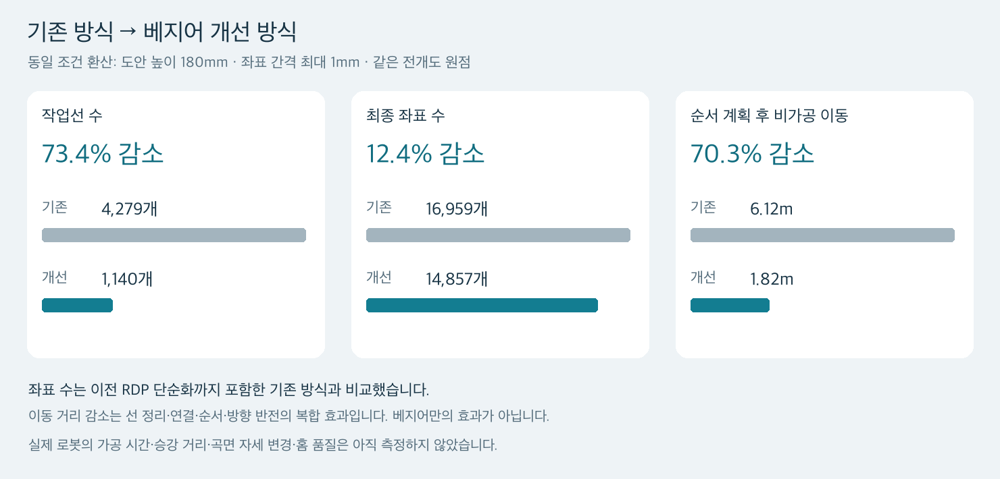

# 이미지 기반 음각 경로 생성: 3차 검증 및 효율 개선 보고서

작성일: 2026-09-17
대상: M0609 기반 음각 프로젝트, 지름 70~80mm·높이 약 200mm 원기둥, 송곳처럼 가는 끝의 헤라
범위: **저해상도 도안 처리와 경로 생성에 관한 오프라인 수치 검증**

이 문서는 기존 중심선·가공 경로 실험 기록이다. 같은 날 추가된 [PNG·JPEG → SVG 비교 검증](SVG_VECTORIZATION_VALIDATION.md)은 원본 굵기·채움을 영역으로 보존하는 독립 실험이며, 네 도안에 대해 Potrace를 기본 변환기로 선택했다. 아래 경로 감축률을 Potrace의 성능으로 해석하거나 두 실험이 로봇 실행까지 통합됐다고 표현하지 않는다.

## 1. 핵심 결과

같은 장식 도안을 대상으로, 기존 처리 방식과 개선 방식을 같은 크기·좌표 간격으로 비교했다. **작업선 수는 73.4%, 최종 좌표 수는 12.4%, 순서 계획 후 비가공 이동 거리는 70.3% 감소했다.**

| 지표 | 기존 방식 | 개선 방식 | 감소량 | 감축률 |
|---|---:|---:|---:|---:|
| 작업선 수 | 4,279개 | **1,140개** | 3,139개 | **73.36%** |
| 최종 좌표 수 | 16,959개 | **14,857개** | 2,102개 | **12.39%** |
| 순서 계획 후 비가공 이동 | 6,118.64mm | **1,817.54mm** | 4,301.11mm | **70.30%** |



이 수치는 **분기 정리·선 연결·곡선 근사·작업 순서 계획을 조합한 결과**다. 베지어 곡선 하나만의 효과가 아니다. 비가공 이동은 전개도에서 계산한 값이며 실제 로봇의 가공 시간 감소율로 바꾸어 말할 수 없다. 개선 계획에는 일부 선의 방향 반전도 포함됐다.

## 2. 세 차례 검증의 구분

이 보고서는 동일한 저해상도 장식 사진에 대한 진행을 아래 세 차례로 구분한다. 앞서 진행한 꽃 SVG 시험은 입력 도안이 다르고 사람이 정리한 벡터이므로 사전 검증으로 따로 다룬다.

| 차수 | 검증 목적 | 적용 방식 | 확인된 결과 |
|---|---|---|---|
| **1차: 이미지 → 가공 경로** | 사진으로부터 좌표와 작업 순서를 만들 수 있는가? | 이진화·세선화·연결망 추적 → RDP 단순화 → SVG 파싱 → 자체 최근접 정렬·순서 재배치 | 사진을 4,279개 작업선으로 변환. 당시 조건에서 비가공 이동 83.63% 감소. 짧은 분기가 많다는 문제 확인 |
| **2차: 실제 원기둥 크기 적용** | 도안이 재료에 들어가며 세부 표현이 가능한가? | 비율 유지 배치 → 지름별 둘레·감김 각도 계산 → 가정한 홈 폭으로 영역 비교 | 도안 100.37×180mm 배치 확인. 작업선은 4,279개 그대로, **감축률 0%** |
| **3차: 분기 정리·베지어 개선** | 끊긴 작업선과 픽셀 굴곡을 줄일 수 있는가? | 제한적 분기 정리 → 접선 방향 연결 → 교차점 고정 베지어 근사 → 좌표 생성 → 실제 vpype 정렬 | 1,140개 작업선, 14,857개 좌표. 동일 조건에서 기존 대비 작업선 73.36%, 좌표 12.39% 감소 |

**2차는 효율 개선 알고리즘을 추가한 시험이 아니라, 물리 크기와 표현 한계를 확인한 시험이다.** 세 차례를 각각 일정 비율씩 개선한 것으로 표현하지 않는다.

사전 꽃 SVG 시험에서는 작업선 50개, 좌표 1,077개를 생성하고 비가공 이동을 939.92mm에서 464.45mm로 줄였다. 서로 다른 그림인 꽃과 장식 도안의 작업선·좌표 수를 직접 비교해 개선율을 계산하지 않았다.

## 3. 알고리즘을 적용한 방식

모든 이미지 처리와 경로 계획은 **PC의 전처리 프로그램**에서 수행한다. 로봇이 사진을 해석하는 구조가 아니다.

```text
고객 이미지
 → 밝기 분리·중심선 추출
 → 작은 분기 정리·연속선 연결
 → 교차점을 통과하는 베지어 곡선 근사
 → SVG 해석·mm 좌표 생성
 → 작업선 순서·진행 방향 계획
 → 미리보기와 좌표 데이터
 → 현장 좌표계·공구 자세·깊이·여유 이동 설정 [후속 작업]
 → DRL 변환·제어기 검증·가공 [후속 작업]
```

| 기능 | 실제 적용 알고리즘·도구 | 이번 프로젝트에서 수행한 일 | 적용 차수 |
|---|---|---|---|
| 사진의 선 추출 | OpenCV Otsu 이진화, Zhang–Suen 세선화 | 배경과 검은 선을 분리하고 선을 1픽셀 중심선으로 만듦 | 1·3차 |
| 중심선 추적 | 자체 픽셀 연결망 추적 | 끝점·분기점 사이를 따라 연속된 점열 생성 | 1·3차 |
| 기존 점열 단순화 | Ramer–Douglas–Peucker, RDP | 허용 오차 안에서 중간 점 제거. 1차 허용값은 0.2px | 1차 |
| 작은 구조 정리 | 자체 제한적 연결망 정리 | 1px 크기의 닫힌 구멍 메우기, 지름 2px 이하 분기점 묶음 축약, 길이 2px 이하 끝 가지 정리 | 3차 |
| 연속선 복원 | 접선 방향·후보 모호성 검사 | 같은 위치에서 만나는 선 중 방향이 자연스러운 조합을 연결. 떨어진 선 사이의 임의 연결은 하지 않음 | 3차 |
| 매끄러운 곡선 생성 | Schneider 방식의 최소제곱 맞춤·재귀 분할을 자체 구현 | 점열을 3차 베지어로 근사. 교차점은 고정하고 접선 방향을 이어 줌 | 3차 |
| SVG 해석 | **svgpathtools** | SVG의 경로·곡선 정보를 읽음. 이미지 추출 도구 역할은 아님 | 1·3차 |
| 곡선에서 좌표 생성 | **de Casteljau** | 허용 오차와 최대 구간 길이를 만족할 때까지 베지어를 나눠 이동 좌표 생성 | 장식 도안은 3차에서 실제 곡선에 적용 |
| 기존 작업 순서 | 자체 최근접 선택 + 단일 선 순서 재배치 | 현재 끝에서 가까운 다음 선을 고르고, 순서를 옮겨 이동 거리 개선. 선 방향 유지 | 1차 |
| 개선 작업 순서 | **vpype linesort + 2-opt** | 선 순서와 필요 시 진행 방향을 바꾸어 비가공 이동을 줄임 | 3차 |
| 원기둥 적용 검토 | 전개도 치수 계산, Shapely 일정 폭 확장 | 도안 크기·각도와 가정한 홈 폭을 비교. 3차에는 이상적 원기둥 표면 좌표·법선도 산출 | 2·3차 |

**도구 사용 구분:** Inkscape는 사용하지 않았다. 1차 장식 SVG에는 직선 명령만 들어 있었으므로 당시 베지어 복원까지 완료한 것은 아니었다. 3차 SVG에는 실제 `C` 곡선 명령 5,015개가 있으며, svgpathtools·de Casteljau·vpype를 각각 해당 단계에서 실행했다. RDP를 베지어 복원 알고리즘으로 설명해서는 안 된다.

적용 결과의 비교 수치는 [이전 검증 기록 사본](evidence/comparison_metrics.json)에 보관했다. 전체 구현 코드는 개인 작업 폴더에 있으며 이번 문서 PR의 실행 패키지에는 포함하지 않았다. 곡선 맞춤은 [Graphics Gems의 Schneider 원본](https://github.com/erich666/GraphicsGems/blob/master/gems/FitCurves.c), 순서 계획은 [vpype 공식 linesort 문서](https://vpype.readthedocs.io/en/latest/reference.html#linesort)를 참고했다. 프로젝트별 분기 정리 규칙과 검사 항목은 자체 구현이다.

## 4. 차수별 실제 수치

### 1차: 좌표 단순화와 순서 개선

당시 조건은 100×100mm 도안 상자, 최대 좌표 구간 2mm였다. 종횡비를 유지하므로 사진과 실제 문양의 바깥 여백도 포함된다.

| 항목 | 적용 전 | 적용 후 | 감축률 |
|---|---:|---:|---:|
| RDP 전후의 원본 픽셀 좌표 수 | 20,825개 | 15,330개 | **26.39%** |
| 기록 순서 → 최종 작업 순서의 비가공 이동 | 19,971.07mm | 3,269.49mm | **83.63%** |
| 작업선 수 | 4,279개 | 4,279개 | **0%** |

좌표를 줄이는 것과 작업선을 연결하는 것은 다른 문제였다. RDP는 중간 점을 줄였지만 분리된 선을 연결하지 않아 작업선 수가 그대로였다. 4,279개 중 2,179개, 약 50.9%가 원본 기준 길이 2px 이하였고, 승강 횟수 감소를 위해 분기 정리·연속선 복원이 필요하다는 결론을 얻었다. 물리 간격을 적용한 당시 최종 좌표는 15,346개로, 위의 RDP 직후 15,330개와 구분한다.

### 2차: 크기 검토와 문제 규모 확인

원기둥 높이 200mm에 위아래 여백 10mm를 두어 문양 높이를 180mm로 정했다. 문양 폭은 원기둥 표면을 따라 약 100.37mm였고, 감김 각도는 지름 70~80mm에서 약 164.31~143.77°였다.

| 확인 항목 | 결과 |
|---|---:|
| 작업선 수 | 4,279개, 변화 없음 |
| 작업선 감축률 | **0%** |
| 실제 크기로 환산한 가공선 길이 | 약 7,241.03mm |
| 원본 1px의 물리 크기 | 약 0.415mm |
| 원본 2px 이하인 짧은 작업선 길이 | 약 0.829mm 이하 |

1차의 가공선 3,828.71mm가 2차에서 7,241.03mm로 늘어난 것은 **도안을 크게 배치한 결과**다. 알고리즘 성능이 나빠진 것이 아니다. 가정한 홈 폭 0.3/0.5/1.0mm를 비교했지만 실제 헤라의 홈 폭은 측정하지 않았다.

### 3차: 어떤 처리에서 작업선이 줄었는가?

| 적용 순서 | 남은 작업선 | 직전 단계 대비 감소 | 최초 4,279개 대비 누적 감축률 |
|---|---:|---:|---:|
| 최초 중심선 추적 | 4,279개 | — | 0% |
| 1px 구멍 정리 | 2,572개 | 1,707개 | **39.89%** |
| 작은 분기점 묶음 정리 | 2,329개 | 243개 | **45.57%** |
| 짧은 끝 가지 정리 | 2,285개 | 44개 | **46.60%** |
| 접선 방향에 따른 연속선 연결 | **1,140개** | **1,145개** | **73.36%** |
| 베지어 근사·작업 순서 계획 | **1,140개** | 0개 | **73.36%** |

작업선 감소는 주로 **작은 픽셀 구조 정리와 연속선 연결**에서 발생했다. 삭제한 끝 가지는 22개지만 이 과정에서 분기점이 사라져 인접 선도 이어지므로 작업선 수는 44개 감소했다. 선 개수의 감소량을 삭제한 장식 개수와 동일하게 보면 안 된다.

베지어는 정리된 작업선을 더 매끄럽게 표현하는 단계다. 베지어 생성 자체가 path 수를 4,279개에서 1,140개로 줄인 것은 아니다.

## 5. 공정한 조건으로 비교한 추가 감축 효과

1차 결과의 15,346개와 3차 결과의 14,857개를 그대로 비교하면 도안 크기와 좌표 간격이 달라 부정확하다. 이번 보고서에서는 기존 SVG를 **3차와 동일한 도안 높이 180mm·최대 좌표 구간 1mm·분할 오차 설정 0.05mm**로 다시 읽었다. 작업 좌표 원점도 동일하게 두었다. 기존 작업 순서는 1차에서 저장된 순서를 유지했으며 다시 최적화하지 않았다.

감축률은 `(기존값 − 개선값) ÷ 기존값 × 100`으로 계산했다.

| 비교 기준 | 이전 | 최종 | 감축률 | 해석 |
|---|---:|---:|---:|---|
| **기존 RDP 처리 방식 대비 최종 좌표** | 16,959개 | 14,857개 | **12.39%** | 이전 구현과 비교할 때 대표값 |
| 단순화 전 픽셀 연결망 대비 최종 좌표 | 20,825개 | 14,857개 | **28.66%** | 더 이른 처리 단계를 기준으로 한 값 |
| 정리·연결된 꺾은선 → 베지어를 분할한 좌표 | 15,697개 | 14,857개 | **5.35%** | 연결 결과가 같은 상태에서 곡선 근사·좌표 생성으로 840개 추가 감소 |
| **기존 계획 완료 경로 대비 새 계획 완료 경로의 비가공 이동** | 6,118.64mm | 1,817.54mm | **70.30%** | 분기 정리·선 연결·정렬·방향 반전의 복합 효과 |
| 새 도안의 순서 계획 전 → 후 비가공 이동 | 22,097.15mm | 1,817.54mm | **91.77%** | 동일한 개선 작업선에서 순서·방향을 결정한 효과 |

**12.39%와 28.66%는 모순이 아니라 비교 기준이 다른 값이다.** 발표의 주 비교에는 기존 RDP 구현까지 포함한 **12.39%**를 쓰는 것이 적절하다. 앞서 제시한 91.77%는 개선 도안의 정렬 전후 비교이고, 기존 완성 경로와 새 완성 경로를 비교한 값은 **70.30%**다. 서로 다른 분모의 감축률을 합산하지 않는다.

최종 vpype 계획에서는 591개 선의 진행 방향이 바뀌었다. 따라서 70.30% 감소를 순서 알고리즘 단독의 우월성으로 해석하지 않는다. 실제 헤라가 양방향으로 같은 품질을 낼 수 있는지는 별도 확인해야 한다.

가공 중심선의 총길이도 7,241.03mm에서 6,144.76mm로 **15.14%** 줄었다. 하지만 작은 장식 구조의 변경·삭제가 포함되므로 이를 모두 유효한 효율 향상으로 주장하지 않고 참고값으로 둔다.

## 6. 감축하면서 유지한 것과 달라진 것

| 검증 항목 | 결과 | 의미 |
|---|---|---|
| 연속선 연결 단계의 선 보존 | 정리된 연결망의 모든 간선 유지 | 연결 과정에서 선 누락·중복 없음. 앞 단계 삭제는 별도 기록 |
| 베지어 근사 이탈 | 정리된 선 기준 최대 약 **0.241mm** | 곡선 맞춤 단계의 오차 |
| 베지어 → 최종 좌표 이탈 | 최대 약 **0.037mm** | 0.05mm 분할 설정 이내 |
| 선 사이 접촉·교차 관계 | **2,204쌍 → 2,204쌍** | 0.01px 근사로 확인한 선 쌍의 관계에 추가·누락 없음 |
| 단순한 입력 선의 새 자기 교차 | 0개 | 입력부터 복잡하게 겹쳤던 선은 별도 한계 |
| 베지어 연결부 접선 | 검사한 3,885곳의 방향 일치 | 기하학적인 매끄러움. 속도·곡률 연속성이나 실물 가공 품질과는 구분 |
| 자동 시험 | 최근 실행에서 **28개 통과** | 코드·수치 검사. 제어기에서 실행한 실기 시험은 아님 |
| 초기 추출선 → 최종선 거리 | 일부 지점에서 최대 약 **2.075mm** | 작은 장식이 바뀌거나 제거된 곳이 있어 검토 필요 |

**0.241mm는 원본 전체 복원 정확도가 아니다.** 분기 정리로 생긴 변경까지 포함하면 차이가 더 크다. 또 원본의 정답 벡터가 없으므로 정확한 예술적 복원율·인식 정확도·가공 성공률은 산출할 수 없다.

실물 음각에서는 각 작업선을 한 번씩 가공하고 작업선마다 한 번 내려갔다 올라오는 방식을 가정할 경우, 승강 주기는 4,279회에서 1,140회로 **3,139회 감소할 가능성**이 있다. 이는 실행 구조에 따른 계산이며 실제 승강 횟수·가공 시간의 측정값은 아니다. 여러 번 깊이를 나누어 가공하거나 선을 추가 분할하면 달라진다.

## 7. 연구 결과로 설명할 수 있는 성과

> 저해상도 도안에서 추출된 픽셀 연결망에 제한적인 분기 정리와 접선 기반 연속선 복원을 적용하고, 교차점을 보존하는 베지어 근사와 작업 순서 계획을 결합했다. 동일 도안·동일 크기·동일 최대 좌표 간격으로 기존 방식과 비교한 결과, 작업선 수는 73.36%, 최종 좌표 수는 12.39%, 전개도상의 비가공 이동 거리는 70.30% 감소했다. 단, 작은 장식의 변경과 일부 선의 방향 반전이 포함되어 있으며 실제 음각 품질과 작업 시간은 후속 실험으로 검증해야 한다.

연구의 핵심은 단순히 점을 적게 만드는 것이 아니라 **도안의 연결 관계를 확인하면서 작업선과 이동 부담을 줄이고, 각 단계의 형상 변화를 함께 기록하는 것**이다. 기존 알고리즘을 조합한 프로젝트 구현이며, 새로운 수학 알고리즘을 발명했다고 주장하지 않는다.

다음 검증은 실제 홈 폭·깊이 측정, 방향별 가공 품질, 도구 승강을 포함한 작업 시간, 원기둥 자세·간섭, 고객이 허용하는 장식 변경 범위를 대상으로 한다. 실제 가공 시간 감축률은 동일 소재·동일 도안 크기·동일 깊이 조건에서 비교해야 한다.

## 8. 저장소에 공유한 근거와 재현 범위

- [동일 조건 비교 수치](evidence/comparison_metrics.json)
- [효율 비교 그림](evidence/efficiency_summary.png)
- [자료 출처와 SHA-256](evidence/provenance.json)
- [평면용 DRL 초안의 비실기 확인 요약](evidence/planar_draft_validation_summary.json)
- [후속 실험 계획](EXPERIMENT_PLAN.md)

이번 GitHub 업데이트는 앞서 저장한 오프라인 결과를 문서로 공유한 작업이다. 이 보고서의 28개 알고리즘 시험 통과는 이전 실행 기록이며 이번 문서 검사와 구분한다. 원본 이미지, 전체 알고리즘 소스, SVG·좌표 원본과 실행 초안은 이번 PR에 포함하지 않았으므로 이 문서만 clone해서 전체 실험이나 로봇 동작을 재현할 수는 없다. 소스 통합은 별도 검토 대상으로 둔다.

현재 원기둥 목표는 지름 70mm·높이 200mm다. 과거 생성한 3D 표면 좌표 파일에는 지름 75mm 조건이 사용되었으며, 70mm용 실행 자세·충돌·가공 깊이 검증이 완료된 것이 아니다. 실제 가공 시간·홈 품질·360도 접근 가능성은 미검증이다.
