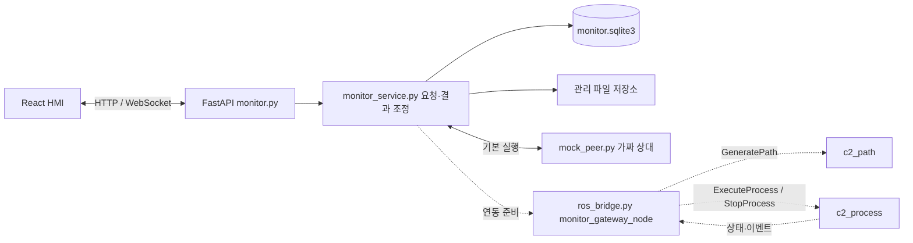

# 새 모니터 구현·인계 안내

2026-09-18. 기준 Git: `main c414821` (PR #13 포함). 작업 브랜치: `codex/hmi-monitor-simulation`.

사용자의 ‘개발 시작’ 요청과 좌표 담당자의 미리보기 답변을 반영한 **모의 데이터 기반 HMI·서버·DB**다. 이전 고객 웹앱·주문 DB와 분리했다. [팀 계약](INTERFACE_RECOMMENDATION.md)을 유지하고, 아직 합의되지 않은 파일 형식은 `mock-*` 계약으로 명시했다. 이 문서의 모의 JSON을 팀 확정 인터페이스로 취급하지 않는다.

## 1. 현재 구현 범위

| 계층 | 구현·확인한 내용 | 남은 내용 |
|---|---|---|
| HMI | 1920×1080, 첨부, 숫자·마우스 배치, 전개면, 원기둥 회전 관찰, 공정 관제, 이력·검사·알람 | 실제 좌표 산출물에 대한 어댑터 |
| HTTP 서버 | 운영자 API, WebSocket, 입력 검사, 불변 파일, 요청 중복 방지, 새 SQLite | 여러 운영자 인증·배포 운영 |
| 모의 상대 | 정상·생성 실패·도구 확인 실패·정지 미확인·상태 통신 단절 | 실제 변환·로봇 실행 알고리즘은 구현하지 않음 |
| ROS 게이트웨이 | Jazzy Action/Service 클라이언트, Topic 구독, 별도 executor, 시간 제한, 늦은 접수 취소 처리 | 실제 `c2_interfaces` 타입 빌드, 파일 해석 어댑터, ROS 상대 노드 통합 시험 |
| 실기 | 명령 발행 없음. REAL 기동 거절 | 현장 설정·센서·장비 검증 전부 별도 |

기본 실행기는 `MOCK`만 기동한다. React 화면의 역할은 관제 HMI이며 고객 웹앱이나 모바일 앱을 추가한 것이 아니다. 기존 PyQt `clay_hmi`와 이전 React 소스는 보존했다.

## 2. 구조와 파일 소유



```text
ws_cobot_pjt/
├── run_monitor.py                 # 로컬 SIMULATION 실행기
├── frontend/src/monitor/
│   ├── Monitor.tsx                # 다섯 관제 화면, 요청·확인 흐름
│   ├── LivePathPreview.tsx        # 모의 구간 판정의 실시간 색상 표시
│   ├── Previews.tsx               # 표시·배치 편집, 실행 경로 생성 책임 없음
│   ├── api.ts                     # HTTP 모델과 요청 처리
│   └── monitor.css                # 목업 기반 화면
├── backend/app/
│   ├── monitor.py                 # 새 API 진입점·업로드·WS
│   ├── monitor_contract.py        # API 입력 스키마
│   ├── monitor_service.py         # 명령 중복·활성 실행·저장 조정
│   ├── storage.py                 # SQLite 스키마 v1·파일 무결성
│   ├── mock_peer.py               # 화면 시험용 고정 중심선·가짜 공정
│   └── ros_bridge.py              # 실제 Jazzy 클라이언트 연결부
├── backend/monitor_data/          # 실행 시 생성, Git 제외
│   ├── monitor.sqlite3
│   └── assets/<UUID>.bin
└── backend/tests/test_monitor.py  # 임시 DB와 모의 상대를 사용하는 시험
```

프런트엔드는 요청·표시를 담당한다. DB는 실행 이력의 저장소이며 로봇 제어 주기나 센서 원본 버스가 아니다. ROS 콜백은 비동기 이벤트 루프로 전달하고 DB 쓰기를 기다리지 않는다. 정상 시작은 DB 예약 성공 뒤 전달하며, 정지는 저장보다 전달이 먼저다.

## 3. 새 DB

SQLite WAL, foreign key, `user_version=1`, 단일 서버 파일 잠금을 사용한다. 스키마는 `storage.py`에서 초기화한다. 별도 DB 서버를 설치하지 않아도 한 대의 모의 관제 PC에서 사용 가능하다.

| 테이블 | 보관 내용·관계 |
|---|---|
| `assets` | 파일 UUID, SHA-256, 종류, MIME, 서버 내부 저장 키, 크기·메타데이터 |
| `profile_snapshots` | assets 참조, 사용한 설정 JSON과 해시. 동일 내용은 재사용 |
| `path_generations` | request_id, 원래 요청, 상태, 생성 결과. 같은 ID의 다른 입력 거절 |
| `path_versions` | `(path_id, version)` 복합키, 전체 경로 파일, 생성 요청, 해시·의존 참조 |
| `command_requests` | 시작·정지 request_id, 요청·접수 응답. 시작 예약과 run 생성은 한 트랜잭션 |
| `runs` | run_id, 요청·경로 버전, 상태·결과·시간·고정 확인·운영자 |
| `events` | event_id 중복 제거, 실행별 단계·오류·명령 이력 |
| `alarms` | ALARM_RAISED 이벤트. 알람 해제·현장 복구 처리는 아직 구현하지 않음 |
| `inspections` | run_id별 PASS/HOLD/REJECT, 근거, 작성자·시각. 공정 완료와 검사 합격은 별도 |

큰 이미지·SVG·경로·미리보기는 DB BLOB 대신 관리 파일로 저장한다. 원래 파일명은 표시용이며 파일 경로로 사용하지 않는다. 파일을 덮어쓰지 않고 읽을 때 등록 해시를 검사한다. 전체 경로 파일 내부에는 자기 자신의 해시를 넣지 않는다.

기존 `backend/data/saegim.sqlite3`는 사용하지 않는다. 새 DB의 운영자는 로컬 단일 사용자 `local-operator`다. 목록 API는 최근 100개를 조회하며 보관 만료·페이지 조회·여러 사용자 권한·정식 마이그레이션 도구는 후속 범위다. 백업은 서버 종료 후 `monitor_data` 전체를 복사한다.

서버 재시작 시 진행 중 실행은 UNKNOWN으로 복구하며 자동 재실행하지 않는다. 정지 기록은 전달 후 비동기 저장이므로 디스크 장애 직전의 정지 기록까지 영속성을 보장한다고 주장하지 않는다. 저장 오류는 화면에 표시하고 새 시작을 차단한다.

## 4. HTTP와 ROS 경계

기본 주소는 `http://127.0.0.1:8010/api/operator`다. 변경 요청은 `x-c2-monitor: 1` 헤더를 사용한다. 이는 로컬 호출 구분 장치이며 인증 키가 아니다. 외부 공개 서버로 배포하지 않는다.

| API | 기능 |
|---|---|
| POST `/assets` | PNG/JPEG 첨부. 10 MiB, 16 MP, 한 변 6000 px, 실제 이미지 디코딩 검사 |
| POST/GET `/path-generations` / `/{request_id}` | GeneratePath 요청·진행·결과 |
| GET `/paths/{path_id}/versions/{version}` | 고정 경로·미리보기 참조 |
| GET `/assets/{asset_id}/content` | 등록 파일의 해시 확인 후 읽기 |
| POST/GET `/runs`, GET `/runs/{run_id}` | ExecuteProcess 요청, 기록·결과 조회 |
| POST `/runs/{run_id}/stop` | StopProcess 요청. DB 잠금을 기다리지 않음 |
| GET `/snapshot`, WS `/stream` | 메모리 상태 스냅샷·이벤트 |
| GET `/alarms`, POST `/inspections` | 알람 및 별도 검사 기록 |
| POST `/simulation/scenario`, `/simulation/reset` | MOCK 전용 시험 기능. 실제 복구·비상정지가 아님 |

ROS 이름은 팀 문서 그대로 사용한다. 공통 타입은 `c2_interfaces` 설치본만 import한다.

- `/c2/generate_path` → `GeneratePath`
- `/c2/execute_process` → `ExecuteProcess`
- `/c2/stop_process` → `StopProcess`
- `/c2/process_state` → `ProcessState`
- `/c2/process_events` → `ProcessEvent`

`ros_bridge.py`가 하나의 `monitor_gateway_node`와 별도 2-thread executor를 만든다. 접수 대기 3초, 생성 결과 120초, 모의 공정용 실행 결과 상한 3600초, 정지 접수 1초·접수 후 정지 확인 3초는 개발 설정이며 현장 확정 제한 시간이 아니다. 정지 서비스 응답은 접수 결과로만 취급한다. 타입·필드가 다르면 숨겨서 대체하지 않고 오류를 낸다.

현재 `artifact_loader`는 미연결이다. 이 상태에서는 ROS GeneratePath 통합을 완료했다고 할 수 없으며, 저장된 MOCK 경로의 ROS 실행도 차단한다. MOCK의 고정 샘플 변환은 `c2_path` 구현을 대신하지 않는다.

## 5. 좌표 담당 답변 반영

| 항목 | 적용 방식 |
|---|---|
| 배치 전 SVG | 고정 모의 SVG와 최종 배치 U/V 데이터를 분리. 브라우저 편집은 렌더링용이며 변경 후 재생성 필요 |
| 중심선 | 샘플 선은 가공 중심선 역할의 polyline. 업로드 이미지 윤곽 추출·스켈레톤화를 수행하지 않음 |
| 전개면 | r=34mm, U=±34π, 앞면 U=0, 이음매 ±180°. H150 및 유효 V10~140은 명시적인 모의 값 |
| 표면 정보 | 미리보기는 `profile_snapshot_id` 참조. 수치 원본은 스냅샷에서 조회 |
| 자세 | 전체 샘플 경로는 m / quaternion xyzw / `pose_reference=tool_tip`. identity 자세는 모의 값이며 칼 자세 검증 아님 |
| TCP | `GripperDA_v1` = 그리퍼 끝점. 칼끝→TCP 변환은 robot_adapter 책임 |
| 같은 결과 | path ID·버전·해시, 이미지 ID·해시, 프로파일 ID·해시로 연결 |
| 3D | 전체 파일 참조와 렌더용 점 분리. 현재는 축소 없음(`decimation=none`); 뷰어는 점만 투영 |
| 획 | stroke_id·segment_id 유지, 서로 다른 획을 연결해 그리지 않음 |
| 검증 실패 | 진단 SVG는 `diagnostic_svg` 자산. path_versions 미등록, path_id 없음, ‘실행 불가’ 표시 |

`mock-preview/1`, `mock-profile/1`, `mock-diagnostic/1`은 로컬 테스트 형식이다. 모의 `validation_passed`는 화면 시험용 범위 검사만 의미하며 결과와 파일에 SIMULATION_ONLY·실기 불가를 표시한다. 실기 도달성·충돌·공구 자세 검사는 미수행이다.

아직 구현하지 않은 좌표 세부 사항: 실제 SVG viewBox·단위 해석, seam에서의 분할·재연결 금지 관계, CUT 외 이동 구간의 실제 샘플, 축소 점의 경계 보존 검증, 실측값/명목값 병존 규칙, 실제 프레임 변환·가공 높이. 팀 PR의 확정 정의를 받아 교체한다.

## 6. 합의 후 연결 순서

1. 공통 `c2_interfaces`의 실제 필드·타입·버전을 빌드하고 Jazzy 환경에서 확인한다.
2. 정상·이음매 분할·실패 예제의 GeneratePath Goal/Feedback/Result 및 SVG·경로·미리보기·스냅샷을 받는다.
3. 관리 ID→파일 해석 어댑터를 작성한다. 확정된 허용 경로/전달 수단·최대 바이트·점 개수·파일 해시를 검사한 뒤 로컬 자산으로 등록한다. 임의 URL이나 파일 경로를 그대로 신뢰하지 않는다.
4. `RosBridge.artifact_loader`에서 실제 산출물을 HMI 내부 모델에 정규화한다. `mock-preview/1` 표시기를 팀 계약용 어댑터로 바꾼다. 모의 프로파일도 실제 등록 스냅샷 저장소로 교체한다.
5. ProcessState의 신호별 quality·측정 시각을 설치 타입에 맞춰 매핑한다. 비유한 숫자는 이미 null로 정규화하며, 미지원·미확인 센서 값을 0이나 정상값으로 만들지 않는다.
6. ROS 가짜 상대부터 요청·결과·정지·재시작을 시험한다. 실기 연결과 현장 검증은 별도로 진행한다.

## 7. 검증

- 신규 API/DB 시험: `tests/test_monitor.py` 15개 통과. 정상 흐름·중복 요청·파일 위변조·통신 만료·도구 실패·DB 잠금 중 정지·UNKNOWN 유지·재시작·실행 불가 진단·비유한 JSON 값 검사.
- TypeScript 검사 및 Vite 정적 빌드 통과.
- 브라우저: 1920×1080 작업 준비 배치, 첨부→생성→확인→모의 완료→검사 저장, 입력 변경에 따른 실행 차단, 실패 진단, 구간별 색상·개수 일치 확인. 브라우저 오류 로그 없음.
- 저장소 검사 통과, Git hook 시험 8개·Issue 관리자 시험 27개 통과, Issue 설정 확인 통과(네트워크·변경 없음).
- 시험은 임시 DB와 가짜 상대를 사용했다. ROS 빌드·실제 상대 통합·하드웨어 시험은 수행하지 않았다.

실행·설치는 [서버 README](../backend/README.md), [화면 README](../frontend/README.md)를 따른다.


## 8. 실시간 경로별 진행·가공 판정

사용자의 추가 요청을 반영해 공정 관제 화면에 전개면·원기둥의 구간별 색상을 구현했다. 검정=예정, 황색=진행, 초록=가공 조건 확인, 빨강=가공 조건 실패, 회색 점선=미확인이다. **현재 값은 모두 모의 판정이며 압력 센서는 연결하지 않았다.** `engraving_progress`만으로 초록색을 만들지 않는다.

모의 전송의 `mock-execution-preview/1`은 run ID·path ID/버전/해시와 구간별 `motion_status`·`verdict`·점 범위·시각·근거를 별도로 전달한다. SQLite `runs.payload.execution_preview`에 마지막 구간별 판정을 보존한다. 기존 ROS 메시지 필드는 변경하지 않았다. 압력 숫자는 측정값이 없으므로 null이며 임의의 N 값을 넣지 않는다.

‘설정 정보 → 모의 압력 확인 실패’를 선택하고 실행하면 5개 구간 확인 후 6번째 구간은 이동 완료·가공 실패로 표시한다. 뒤의 11개 구간은 예정으로 남고 가짜 공정도 더 진행하지 않는다. 가공 중 정지된 구간은 미확인으로 남긴다. 실측 힘의 부족·미지원·통신 단절을 같은 실패 판정으로 합치지 않는다.

현재 모의 예제는 구간 전체 단위 판정이다. 실제 일부 누락 구간을 표시하려면 원본 경로 점 인덱스와 축소 미리보기의 대응 규칙이 필요하다. 정확한 팀 합의 항목은 [실시간 가공 판정 인터페이스 제안](HMI_PATH_QUALITY_PROPOSAL.md)을 참고한다. 최종 외관·품질 검사 합격은 초록 표시와 별도다.
