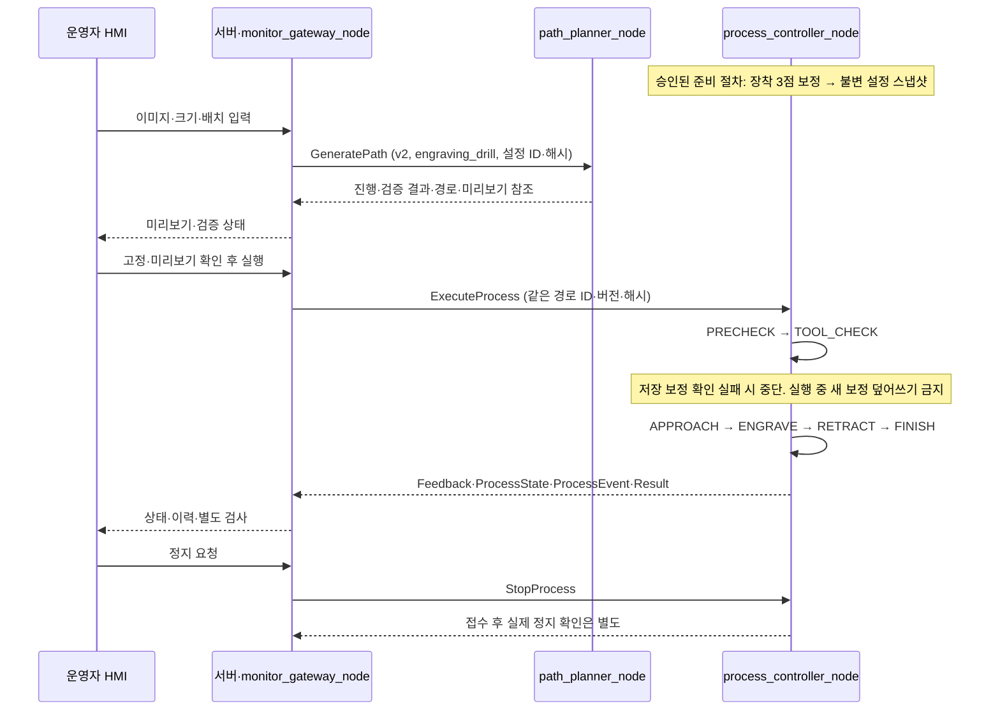

# 시스템 모니터·좌표 생성·고정 드릴 공정 인터페이스 안내

2026-09-19. main `301ea6e`를 기준으로 [고정 드릴 운영 변경](C2_FIXED_DRILL_20260919.md)을 반영했다. [디렉토리·역할](SYSTEM_STRUCTURE.md), [상세 통신 계약 v2](INTERFACE_RECOMMENDATION.md) 순으로 읽는다.

## 적용 범위와 현재 구현

운영자가 HMI에 이미지를 첨부하고 배치·미리보기를 확인한 뒤 공정을 요청한다. 고객 웹앱·주문·대기열은 없다. 등록된 고정 좌표와 원통 표면 매핑을 사용한다. 드릴은 철사로 고정되며 자동 집기·청소·반납을 제외한다. **그리퍼 열기는 초기화·종료·오류 복구·보정을 포함해 금지한다.**

공통 타입, HMI·서버·DB·가짜 상대와 ROS 클라이언트, robot_adapter 소스는 있다. 좌표·공정 노드와 실제 파일 해석 연동은 구현 대상이다. 보정 소스는 PR #27에서 개발 중이며 기준 main에는 없다. [모니터 구현 안내](HMI_MONITOR_IMPLEMENTATION.md)의 모의 시험을 실제 로봇 성공으로 취급하지 않는다.

## 세 노드의 책임

| 노드 | 위치 | 책임 |
| --- | --- | --- |
| monitor_gateway_node | backend/app/ros_bridge.py | HTTP↔ROS 요청·진행·결과·상태를 서버 저장과 HMI에 연결 |
| path_planner_node | c2_path/node.py | 이미지→중심선 SVG→2D→표면 매핑→검증된 도구 끝 경로 생성 |
| process_controller_node | c2_process/node.py | 준비·드릴 고정·보정 확인, 조각 실행, 정지·오류·로그. 모든 모션의 소유자 |

내부 모듈은 같은 노드 안의 함수로 연결한다. 별도 그리퍼·청소·보정 노드나 Topic을 만들지 않는다. node/state_machine/preconditions/robot_adapter/engraving/tool_calibration의 **6개 공정 모듈**을 목표로 한다. 각 파일의 구현 여부와 담당 제안은 구조 문서에서 구분한다.

## 흐름

도구 보정·접촉 접근에도 같은 취소·정지·제한 시간·모션 소유권을 적용한다. 장착 후 3점 전체 보정과 매 실행 전 1점 확인을 구분한다. 새로운 보정값은 새 스냅샷·경로·미리보기로 연결하며 기존 실행 경로를 조용히 변경하지 않는다.

## 함께 지킬 데이터

- ROS 이름 5개와 Action/Service/Topic 구조는 유지한다. 공정 의미 변경에 따라 schema_version=2, c2_interfaces 패키지 0.2.0을 함께 배포한다. 이전 v1 집기·반납 구현을 섞지 않는다.
- frame_id는 c2_base, 도구 ID는 engraving_drill. 그리퍼 끝점 TCP GripperDA_v1과 도구 끝 waypoint를 구분하고 어댑터에서만 변환한다.
- 2D는 mm·deg, 3D는 m·quaternion xyzw, 관절은 rad. 툴 −Y가 안쪽 법선, 툴 +Z가 원통 축 아래다. clearance_m는 m이고 어댑터 속도·가속도·위치 오차 프로파일의 mm 계열 단위를 유지한다.
- 한 획 둘레 범위 180° 이내, 이음매 통과 금지, J6 누적 회전을 줄이는 왕복 순서. 실제 전체 경로 IK·J6 한계/여유 검증은 필수이며 미확정 수치를 추정하지 않는다.
- 입력·설정·경로는 ID·버전·해시로 고정한다. 보정·지그·도구 설정이 바뀌면 새 스냅샷으로 경로를 재생성·확인한다.
- 장착·닫힘·보정 확인, 이동 완료, 실제 정지, 가공 조건 확인, 실물 검사 합격을 구분한다. 오래된 센서 값을 새 heartbeat로 정상화하지 않는다.

받침대 50 mm 변경 보고와 윗면 z≈234.4 mm 예상값, ±1 mm 보정 허용차 제안은 현장 측정·승인값과 구분한다. 담당 배정은 세은(node/state_machine/preconditions), 이시율(robot_adapter/engraving/tool_calibration) 제안이며 최종 확정은 팀장이 담당자와 한다.

## 팀 연결 순서

1. 같은 커밋의 c2_interfaces v2를 빌드·source하고 송수신 노드를 갱신한다.
2. 좌표 담당자는 미리보기·path.json·스냅샷 예제와 관리 ID 해석 규칙, 자세·획/J6 규칙을 제출한다.
3. 공정 담당자는 그리퍼 열기 없는 준비·보정 확인·조각·정지 실패 흐름을 구현하고 모의 시험한다.
4. 모니터는 실제 산출물 어댑터를 연결하고 요청·상태·오류·재연결을 시험한다. 현재 HMI의 압력/구간 색상은 가짜 판정이다.
5. 현장 설정·실기 검증은 별도 기록한다. [AGENTS](../../AGENTS.md), [실기 시행착오](LESSONS_ROBOT.md), [검증 양식](VALIDATION_TEMPLATE.md)을 따른다.
