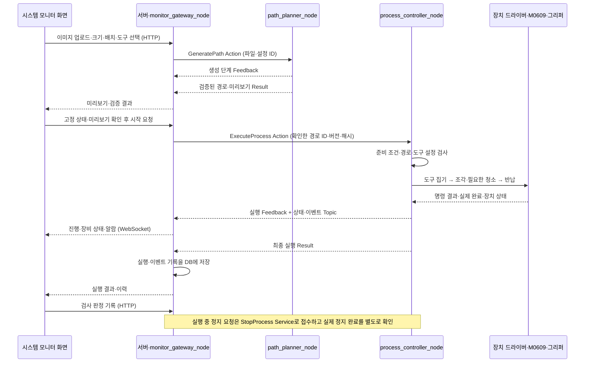

# 시스템 모니터·좌표 생성·공정 제어 인터페이스 안내

작성일: 2026-09-18. 고객용 웹앱을 제외하고 운영자 시스템 모니터를 사용하는 축소 시나리오의 **팀 개발 기준 초안**이다. 논의한 책임 분리와 통신 계약을 공유하며, 새 기능이나 별도 그리퍼 노드를 추가하지 않는다.

이 문서에서 전체 흐름을 읽고, [디렉토리·파일별 역할](SYSTEM_STRUCTURE.md), [인터페이스 상세 권장안 v1](INTERFACE_RECOMMENDATION.md) 순서로 확인한다. 아래 이름은 개발할 목표이며 이미 실행 가능한 API 목록은 아니다.

## 1. 적용 범위와 현재 구현

- 운영자가 시스템 모니터에서 이미지를 입력하고 크기·배치·도구를 선택한다. 경로를 미리 확인한 뒤 실행을 요청한다.
- 작업대·작업대상은 등록된 고정 좌표를 사용한다. 매 작업의 위치 탐색·치수 측정은 이 시나리오에 넣지 않는다.
- 그리퍼는 고정된 한 장치이며 잡는 도구가 바뀐다. 도구별 보관 위치·파지 조건·TCP·하중·가공·청소 설정을 관리한다.
- 팀 ROS 노드는 모니터 연결, 좌표·경로 생성, 전체 공정 제어의 3개다. 두산·그리퍼 공급자 드라이버의 노드는 별도다.
- 운영 PC 한 대에서 서버와 ROS가 관리된 로컬 파일 저장소를 공유한다. 시스템 모니터 화면은 브라우저를 쓰지만 고객용 웹앱은 운영하지 않는다.

초안 작성 기준은 main `7374507`이다. 2026-09-18 후속 확인 기준 main `c414821`에는 `robot_adapter.py`와 시험 소스가 추가됐다. 공통 타입·3개 노드·`/c2/*` 계약은 아직 구현 전이다. 기존 Clay 코드와 실행 안내는 사용자 요청으로 로컬 보관 후 저장소에서 제거했다. [보관·복구 기록](LEGACY_CLAY_ARCHIVE.md), [현재 draw.io 아키텍처](architecture/README.md). 기존 Topic·Service가 새 계약과 자동 호환되는 것은 아니다.

9/18 후속 반영으로 세 패키지의 [개발 폴더·역할 안내](../ws_cobot1/src/README.md)를 추가했다. 폴더 구성 이후 로봇 어댑터·시험 소스가 추가됐지만, 빌드 설정·메시지·노드 구현 완료를 뜻하지 않는다. 팀원과 AI의 공통 개발 규칙은 [AGENTS.md](../../AGENTS.md)를 따른다.

로컬 보관한 기존 코드의 기능 재사용은 이후 구현 PR에서 검토한다. Clay 코드 제거는 새 3개 노드 구현·실행 방식 전환을 뜻하지 않는다. 기존 시험 보고를 새 구조의 검증 결과로 옮겨 적지 않는다.

## 2. 세 노드의 책임

**2026-09-19 후속 구현:** main `42e8416` 기반으로 [c2_interfaces v1](../ws_cobot1/src/c2_interfaces/README.md)의 타입 5개·빌드 설정과 게이트웨이 시각/품질 변환을 추가하고 시험했다. 위의 타입 미구현 문장은 이전 시점 기록이다. HMI·서버·MOCK도 현재 존재하며, 좌표·공정 노드와 전체 ROS 공정은 아직 구현·통합 대상이다. [현재 구현 안내](HMI_MONITOR_IMPLEMENTATION.md), [검증 기록](validation/2026-09-19-c2-interfaces.md)을 함께 확인한다.

| 노드 | 구현 위치·패키지 | 담당 | 반환·전달 |
| --- | --- | --- | --- |
| `monitor_gateway_node` | 서버 `backend/app/ros_bridge.py` | 화면의 경로 생성·실행·정지 요청을 ROS로 연결하고 수신 결과를 화면·저장 기능으로 전달 | 미리보기, 공정·장비 상태, 실행·알람·검사 기록 표시 |
| `path_planner_node` | `c2_path/node.py` | 이미지 → SVG → 2D 추출 → 2D 최적화 → 표면 3D 변환 → 실행 경로 생성·검증 | 경로 ID·버전·해시, 미리보기, 검증 결과 |
| `process_controller_node` | `c2_process/node.py` | 시작 가능 여부 판단, 도구 집기·조각·청소·반납의 전체 순서, 로봇·그리퍼 호출, 정지·오류 처리 | 진행 상태, 단계 결과, 작업 로그 |

이미지 업로드·파일 저장·검사 기록 저장은 서버 기능이고, 화면 조작·표시는 프론트엔드 기능이다. 이 기능들이 모두 별도 ROS 노드가 되는 것은 아니다. 모니터는 실행을 **요청**하고 공정 제어가 실제 시작 조건과 단계 진행을 판단한다.

## 3. 공정 시나리오와 통신



작업 중에도 로그를 기록·전달하고 종료 시 결과를 확정한다. 화면에 표시한 경로와 실행하는 경로는 동일 ID·버전·해시로 묶는다. 경로 생성 완료만으로 로봇을 시작하지 않는다.

| 인터페이스 | 방향 | 방식과 선택 이유 | 완료 전달 |
| --- | --- | --- | --- |
| `/c2/generate_path` | 모니터 → 좌표 노드 | **Action**: 시간이 걸리고 진행·취소가 필요 | Feedback으로 단계, Result로 경로·검증 결과 |
| `/c2/execute_process` | 모니터 → 공정 제어 | **Action**: 전체 공정 동안 진행·최종 결과가 필요 | Feedback으로 진행, Result로 성공·실패·중단 |
| `/c2/stop_process` | 모니터 → 공정 제어 | **Service**: 정지 요청을 빠르게 접수 | 응답은 접수 여부, 실제 정지는 상태·실행 결과로 확인 |
| `/c2/process_state` | 공정 제어 → 모니터 | **Topic**: 최신 상태를 계속 표시 | 단계·진행·도구·파지·장비 상태·신선도 |
| `/c2/process_events` | 공정 제어 → 모니터 | **Topic**: 발생한 사건을 전달하고 기록 | 명령·단계 전환·알람·오류·종료 이벤트 |

화면과 서버 사이에서는 HTTP로 업로드·생성·실행·정지·조회·검사 기록을 요청하고 WebSocket으로 변화를 받는다. 서버가 ROS 통신을 연결한다. 파일 본문을 매번 ROS 메시지에 복사하지 않고 관리된 파일 ID와 해시를 전달하는 안이다. 필드·API·QoS·제한 시간은 [상세 권장안](INTERFACE_RECOMMENDATION.md)에 정의한다.

## 4. 노드와 Python 파일은 다르다

| 용어 | 의미 | 이번 구조의 예 |
| --- | --- | --- |
| 패키지 | 코드를 빌드·설치·공유하는 묶음 | `c2_process`, `c2_path`, 메시지 정의만 있는 `c2_interfaces` |
| 노드 | 실행 중 이름을 갖고 ROS 통신에 참여하는 구성요소 | `process_controller_node` |
| Python 파일·모듈 | 코드의 책임을 나눠 담는 단위 | `tool_sequence.py`, `engraving.py`, `robot_adapter.py` |

**`.py` 파일 하나마다 노드가 생기지 않는다.** `node.py`가 ROS 노드를 만들고 내부 모듈을 불러 사용하는 설계다. 한 노드가 여러 파일을 사용할 수 있고, 한 프로세스에 여러 노드를 둘 수도 있다. 개념상 관계는 [ROS 2 Jazzy 노드 설명](https://raw.githubusercontent.com/ros2/ros2_documentation/jazzy/source/Concepts/Basic/About-Nodes.rst)을 따른다.

아래는 디렉토리 구조가 아니라 **같은 공정 제어 노드 안의 함수 호출 관계**다.

```text
state_machine.py
  ├─ tool_sequence.pick_tool() / place_tool()
  │    ├─ robot_adapter: 보관대 접근·이탈, TCP·하중 적용
  │    └─ gripper_adapter: 열기·닫기, 실제 파지·해제 확인
  ├─ engraving.execute_path()
  │    └─ robot_adapter: 확정 경로의 접근·가공·이탈 이동
  └─ cleaning.clean_tool()
       └─ robot_adapter: 청소 위치 접근·뭉침 제거·복귀
```

이 파일들은 디렉토리에서 서로 나란히 놓인다. `robot_adapter.py`는 집기·조각·청소가 공통으로 호출하는 파일이다. `engraving.py`의 하위 폴더나 별도 조각 노드가 아니다.

예를 들어 도구 집기의 완료 전달은 다음 순서다.

1. `state_machine.py`가 `tool_sequence.pick_tool()`을 호출한다.
2. `tool_sequence.py`가 로봇팔 접근을 요청하고 이동 완료를 확인한다.
3. `gripper_adapter.py`를 호출해 닫기 명령과 실제 파지 확인 결과를 받는다.
4. 도구 설정 적용·이탈까지 확인한 `tool_sequence.py`가 성공 또는 실패를 **함수 결과로 반환**한다.
5. 상태 기계가 그 결과를 보고 조각으로 진행하거나 중단한다. 노드는 바뀐 공정 상태를 모니터에 Topic으로 전달한다.

따라서 “그리퍼 작업이 끝났다는 결과를 받고 다음 작업을 한다”는 이해는 맞다. 이번 설계에서는 그 결과를 내부 함수의 반환값으로 받는다. 실제 그리퍼 공급자 드라이버가 별도 ROS 노드인 경우에는 어댑터가 그 드라이버와 통신한다. 팀 내부 파일마다 Topic을 추가하지 않는다.

## 5. 고정 좌표와 하드웨어 연결 경계

| 구간 | 책임 |
| --- | --- |
| `workcell.yaml` | 로봇 base ↔ 작업대·작업대상 고정 변환, 표면 형상·유효 작업 영역·설정 버전 |
| `tools.yaml` | 도구별 보관·집기·반납 위치, 파지·해제 확인 조건, TCP·하중·가공·청소 설정 |
| `map_3d.py`·`generate_path.py` | 2D 도안을 대상 표면에 배치하고 고정 변환을 적용해 base 기준 위치·도구 자세·이동 구간을 생성 |
| `engraving.py` | 이미 생성된 경로를 순서대로 실행하고 완료·오류·진행을 보고 |
| `robot_adapter.py` | 확인된 두산 인터페이스로 이동·정지·상태·TCP·하중 요청을 전달하고 결과 확인. 경계에서 단위·회전 표현 변환 |
| `gripper_adapter.py` | 확인된 장치 연결 방식으로 열기·닫기 요청, 파지·해제·오류 피드백 확인 |

기본 연결은 `공정 제어 → robot_adapter → ws_dsr의 두산 드라이버 → 로봇 제어기 → M0609`다. 그리퍼는 실제 배선·통신 방식에 따라 확인된 공급자 드라이버 또는 장치 API를 사용한다. ROS Service 호출인지, 두산 I/O 경유인지, 별도 장치 통신인지는 설치본·현장 조건을 확인해 어댑터 안에서 확정한다. 이 문서에서 미확정 프로토콜·I/O 번호를 지정하지 않는다.

작업대상의 **위치가 고정이어도 2D→3D 변환은 필요**하다. 도안의 크기·배치에 따라 가공점이 달라지고, 표면 형상에 따라 위치·자세도 달라진다. 공정 실행 시 이미 base 기준인 경로에 고정 변환을 다시 적용하지 않는다.

명령 수락, 이동 완료, 파지 성공을 구분한다. 장치 호출 중에도 정지·상태 수신을 처리할 수 있어야 한다. 소프트웨어 정지 요청은 물리 비상정지를 대신하지 않으며, 실패·정지 미확인 시 다음 공정에 진입하지 않는다.

## 6. 팀 협업 기준

담당자 이름은 아직 배정하지 않는다. 아래 경계를 기준으로 각 Issue에 담당자와 동료 검토자를 기록한다.

| 개발 영역 | 상대 담당자에게 보장할 결과 | 함께 검토할 경계 |
| --- | --- | --- |
| 시스템 모니터·서버 | 파일·설정 ID, 생성·실행·정지 요청, 상태·기록 화면 | 좌표 입력·결과, 실행 ID, 접수와 완료 표시 |
| 좌표·경로 | SVG·최적화 2D·3D 실행 경로·검증 결과 | 단위·좌표계·표면 매핑·도구 프로파일·경로 형식 |
| 공정 제어 | 단계 실행·완료 판단·오류·정지·로그 | 경로 해석, 도구 집기·놓기, 두산·그리퍼 어댑터 |
| 공통 인터페이스 | `.action`·`.srv`·`.msg` 정의와 공유 버전 | 세 영역 담당자가 송수신 필드·필수값·오류 의미 검토 |

권장 구현 순서는 **계약 검토 → 공통 인터페이스 정의 → 각 담당 모의 입출력 연결 → 하드웨어 어댑터 검증 → 통합 시험**이다. 계약을 바꾸는 PR에는 바뀐 필드·단위·영향받는 송수신자와 함께 [상세 명세](INTERFACE_RECOMMENDATION.md)를 갱신한다. `schema_version`의 의미와 변경 기준도 상세 명세 2절에 있다.

팀 통합 시 확인할 최소 사례는 다음과 같다. 아래 항목은 시험 계획이며 수행 완료 기록이 아니다.

- 입력부터 미리보기까지 생성한 경로 ID·버전·해시가 실행 요청과 일치한다.
- 도구·좌표 설정 또는 파일 해시가 다르면 실행을 거절한다.
- 집기 실패·이동 제한 시간 초과 후 조각이나 다음 단계가 실행되지 않는다.
- 같은 시작 요청을 재전송해도 로봇 작업이 중복 시작되지 않는다.
- 도구 집기·조각 중 정지 요청을 처리하고, 접수·실제 정지·미확인을 구분한다.
- 모니터 연결이 끊기면 오래된 상태를 현재 값으로 표시하지 않고, 재연결 시 기록을 대조한다.
- 조각 진행률 100%, 공정 종료, 검사 합격을 서로 다른 결과로 표시한다.

구현·모의 시험·실기 시험은 각각 실행한 커밋과 [검증 기록](VALIDATION_TEMPLATE.md)으로 남긴다. 문서 게시나 CI 통과만으로 로봇 검증 완료를 표시하지 않는다.
