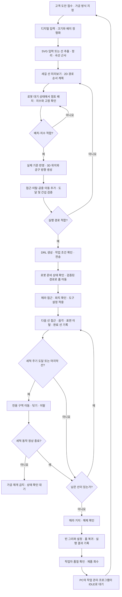

# 원기둥 맞춤 음각 서비스 — 시나리오 플로우 보완안

작성일: 2026-09-17. 이 문서는 설계 제안이다. 원기둥 가공, 자동 치수 확인, 헤라 자동 파지·반납을 실기 검증한 결과가 아니다.

PC 수, 웹앱·시스템 모니터·ROS 2의 역할과 실행 배치는 [시스템 아키텍처 제안](SYSTEM_ARCHITECTURE.md)을 따른다.

## 1. 적용 범위

- M0609, 2점 그리퍼, 헤라를 사용한다. 작업 중 카메라와 이동형 베이스를 사용하지 않는다. 고객이 제공한 이미지 파일의 전처리는 PC에서 수행한다.
- 목표 재료는 지름 70 mm, 높이 200 mm의 지점토 원기둥이다. 실제 허용 치수 오차는 가공 깊이와 시험 결과에 맞춰 별도로 정한다.
- 1차 구현은 고정 지그에 원기둥을 놓고, 로봇이 접근 가능함을 확인한 구간에서 선을 따라 홈을 내는 음각을 수행하는 것으로 제안한다. 면 전체를 파내는 가공은 별도의 영역 채움 경로가 필요하다.
- 고객 도안에 따라 바뀌는 경로 데이터와, 공구 집기·반납 등 반복되는 로봇 작업 절차를 분리한다.

## 2. 먼저 정해야 하는 작업 셀의 기준

| 항목 | 정할 내용 | 필요한 이유 |
|---|---|---|
| 원기둥 고정 | 축 방향, 밑면 위치, 회전 방향 기준 표시, 움직임을 막는 지그 | 가공 중 위치·방향 변화 방지 |
| 가공 구간 | 접근 가능한 둘레 각도, 상하 여백, 지그와 겹치는 제외 구역 | 전개도 전체가 로봇의 가공 가능 영역인 것은 아님 |
| 기준 좌표 | 지그와 로봇 베이스의 관계, 원기둥 중심축, 도안 시작 방향 | 도안의 위치를 실제 점토 위치로 변환 |
| 헤라 보관 | 접근 자세, 집는 위치, 삽입 깊이, 회전 방향을 일정하게 만드는 거치대 | 재파지 후에도 헤라 끝의 TCP 유지 |
| 헤라 세척 | 고정된 스펀지 구역의 표면 위치, 폭, 접촉 방향, 미사용 구간, 교체 기준 | 점토·비누베이스 잔여물 제거 동작과 가공 복귀 경로 확보 |
| 도구 설정 | 빈 그리퍼 상태와 헤라 장착 상태의 TCP·하중 설정 | 공구 장착 여부에 맞는 좌표·하중 사용 |
| 가공 조건 | 시험으로 정한 깊이, 홈 폭, 이동 속도, 공구 각도, 이탈 거리 | 도안과 재료에 맞는 가공 조건 확보 |

홈 관절각은 사용자에게서 전달받아 로컬 설정에 기록했다. 공개 문서에는 실행 좌표를 포함하지 않는다. 홈 목표 자세만으로 임의의 현재 위치에서 홈까지 이동하는 경로가 검증되는 것은 아니다.

`GripperDA_v3`는 현재 헤라 끝까지 보정된 TCP이다. 헤라를 다시 집을 때 기존과 동일하게 장착된다는 조건이 필요하다. 빈 그리퍼 상태의 설정은 별도 확인 대상이다.

## 3. 전체 플로우

위 도식은 정상 흐름이다. 동작 실패 시에는 아래 7절의 오류 흐름으로 전환하며, 실패를 무시하고 다음 단계로 넘어가지 않는다.

## 4. PC에서 수행할 도안 처리

| 순서 | 처리 | 결과물·진행 조건 |
|---|---|---|
| 1 | 고객 도안을 디지털 파일로 받거나 먼저 디지털화한다. 선 음각인지 면 음각인지, 크기와 방향을 정한다. | 원본, 작업 ID, 가공 요구사항 |
| 2 | 도안의 종횡비를 유지해 전개도에 배치한다. 사용할 둘레 구간과 여백을 적용한다. | mm 단위 도안 배치 |
| 3 | 이미지라면 선 추출 → 불필요한 분기 정리 → 연속선 복원 → 베지어 곡선 근사를 적용한다. SVG 입력은 파싱·정규화부터 시작한다. | 가공할 선이 정리된 SVG |
| 4 | 홈 폭보다 지나치게 가까운 선, 너무 작은 요소, 중복선을 확인하고 최종 미리보기를 확정한다. 경로 순서와 허용되는 진행 방향을 계획한다. | 승인된 도안과 2D 선 순서 |
| 5 | 점토의 실제 치수·배치 확인 결과를 반영해 원기둥 위 위치, 표면 방향, 공구 자세, 설정 깊이를 계산한다. | 로봇 기준의 3D 작업 자세 |
| 6 | 각 선의 접근·이탈과 선 사이의 공중 이동, 세척 구역 왕복 경로를 추가한다. 전체 공구·그리퍼·로봇의 도달 가능성, 관절 한계, 자세 변화와 간섭을 검토한다. 필요하면 순서·배치·가공 구간을 조정한다. | 세척을 포함한 실행 가능한 전체 경로 |
| 7 | 고정 작업 절차와 도안별 경로를 결합해 DRL을 생성한다. 작업 ID, 도안 버전, 치수, 좌표 기준, 공구 설정, 가공 조건을 함께 보관한다. | 전송할 DRL과 작업 기록 |

전개도 전체 폭은 `π × 70 ≈ 219.91 mm`, 높이는 `200 mm`이다. 실제 도안 영역은 상하 여백, 이음부, 고정 지그, 로봇 접근 가능 구간에 따라 줄어든다. 폭 219.91 mm를 사용할 수 있다는 계산이 360도 전체를 현재 장비 배치에서 가공할 수 있다는 검증을 대신하지 않는다.

알고리즘 선택 기준은 좌표 수나 이동 거리 감소만이 아니다. 원본 도안의 보존 정도, 예상 홈 사이 간격, 가공 중 자세, 공중 이동과 이탈 횟수도 함께 비교한다. 헤라가 양방향 가공에 적합한지는 시험으로 확인한 뒤 경로 반전을 허용한다.

점토 확인 후에 최종 좌표를 확정한다. 고정 좌표를 먼저 생성한 뒤 다른 위치의 점토에 그대로 실행하면 안 된다. 사전 계산한 원기둥 기준 경로는 재사용할 수 있지만, 실제 배치와의 좌표 변환 및 검증이 필요하다.

## 5. 로봇 실행 순서

| 순서 | 동작 | 다음 단계로 넘어가는 조건 |
|---|---|---|
| 1 | 작업 ID, 로봇 상태, 실행 중 작업 유무, 점토 배치 확인 결과를 확인한다. | 해당 작업의 실행 조건 충족 |
| 2 | 필요한 경우 검증된 경유 경로로 홈에 이동한다. | 홈 도달 확인 |
| 3 | 헤라 보관대의 접근점으로 이동하고, 정해진 빈 그리퍼 설정으로 집는 위치에 접근한다. | 공구와 그리퍼가 정렬됨 |
| 4 | 그리퍼를 닫고 실제 파지를 확인한다. 정지 상태에서 헤라 장착에 맞는 TCP·하중 설정을 적용하고 보관대를 이탈한다. | 파지 및 설정 확인; 피드백이 없으면 별도 작업자 확인 필요 |
| 5 | 검증된 경로로 가공 대기점에 이동한다. | 첫 선의 접근 준비 완료 |
| 6 | 접근 → 설정 깊이로 진입 → 선 가공 → 표면에서 이탈을 반복한다. 누적 가공 거리 기준으로 세척 시점이면 세척 루틴을 실행한 뒤 다음 선의 접근점으로 이동한다. | 완료한 선과 다음 선을 기록. 각 단계 완료 확인; 실패 시 다음 선으로 진행하지 않음 |
| 7 | 마지막 선이 끝나면 표면에서 이탈하고 마지막 세척을 수행한 뒤 반납 경로로 이동한다. | 세척 동작 정상 종료 및 공구 이탈 확인. 세척 불가 시 확인 대기 |
| 8 | 헤라를 거치대에 안착시키고 지지된 상태를 확인한 뒤 그리퍼를 연다. | 공구 반납·해제 확인 |
| 9 | 빈 그리퍼 상태의 설정을 적용하고, 보관대를 이탈해 검증된 경로로 홈에 복귀한다. | 홈 도달 및 공구 반납 상태 확인 |
| 10 | 정상 종료 정보를 남기고 DRL을 종료한다. | PC가 작업 결과를 판정하고 대기 상태로 전환 |

헤라를 집은 뒤 홈을 다시 거치는 단계는 필수가 아니다. 검증된 공중 이동 경로가 있으면 가공 대기점으로 이동한다.

원기둥에서 공구를 빼는 방향은 기본적으로 해당 지점의 표면 바깥 방향이다. 모든 위치에서 로봇의 Z축 방향으로 올리는 방식은 사용할 수 없다. 바깥쪽으로 이탈한 두 점도 직선으로 연결하면 원기둥을 가로지를 수 있으므로, 외부 경유 경로를 별도로 확인한다. `movel()`은 작업 공간에서 목표점까지 직선 이동하는 명령이다. [두산 V2.12 movel 문서](https://manual.doosanrobotics.com/en/programming/2.12/publish/movel)

## 6. 카메라 없이 점토를 확인하는 방법

**1차 구현 제안: 고정 지그 + 작업자의 치수·안착 확인.** 로봇이 대기한 상태에서 지름, 높이, 축 방향과 기준 방향을 확인하고 시작 조건으로 입력한다. 높이의 목표값은 200 mm이고, 합격 범위는 별도의 허용 오차로 정의한다. 지점토가 성형·고정·가공 중 변형되는지도 시험한다.

**로봇 자동 확인은 별도 측정 기능으로 개발한다.** 끝이 뭉툭한 측정 도구와 보정된 TCP를 사용해, 정해진 거리·시간·힘 범위에서 접촉 위치를 확인하는 방식을 검토할 수 있다. 연한 점토에서는 접촉 자체가 변형을 일으킬 수 있으므로 측정 오차 시험이 선행되어야 한다. 상단 한 점만 접촉해서는 중심 위치·기울기·지름까지 확인할 수 없다.

자동 측정을 채택하면 `측정용 로봇 작업 → 측정값을 PC에 전달 → 좌표 재계산·검증 → 가공 DRL 생성`으로 나눈다. 헤라를 집기 전에 측정하려면 그때 사용할 측정 부위와 TCP가 먼저 준비되어야 한다. 현재의 헤라 끝 TCP만으로 빈 그리퍼의 접촉 위치를 계산하지 않는다.

## 7. 오류·종료·품질 확인

| 상황 | 처리 원칙 |
|---|---|
| 점토 치수·배치 부적합 | 가공을 시작하지 않고 재배치·재성형 후 다시 확인 |
| 헤라 파지 실패 | 가공으로 진행하지 않고 확인 대기. 제한 없는 재시도 금지 |
| 가공 중 오류·보호정지·통신 이상 | 공정 중단과 상태 확인. 무조건 그리퍼를 열거나 홈으로 이동하지 않음. 재개는 공구·점토 상태와 복귀 경로 확인 후 결정 |
| 세척 동작 실패·스펀지 사용 구간 소진 | 가공을 자동 재개하지 않고 확인 대기. 걸림, 헤라 파지 변화, 스펀지 이탈 여부를 확인. 무조건 반복해서 누르거나 당기지 않음 |
| 반납 실패 | 안착이 확인되지 않으면 공구 해제를 진행하지 않음 |
| DRL 종료 상태만 확인됨 | 정상 완료 기록과 대조. 중단을 가공 완료로 처리하지 않음 |

IDLE은 PC의 ROS 2 작업 관리 프로그램에서 관리하도록 제안한다. DRL은 한 작업을 실행하고 종료하며, PC는 중복 실행을 막고 정상 완료·중단·오류를 구분한다. 공식 `DrlStart`는 제어기에 DRL 코드를 전달하는 서비스이고, `GetDrlState`는 PLAY/STOP/HOLD 등의 프로그램 상태를 제공한다. 이 상태만으로 공구 파지 성공이나 제품 품질을 판정할 수 없으므로 작업 단계별 완료 확인을 추가한다. [두산 ROS 2 Jazzy DRL 서비스](https://doosanrobotics.github.io/doosan-robotics-ros-manual/jazzy/services/drl_services.html)

로봇이 반납·복귀를 마친 뒤 작업자가 선 누락, 홈 폭·깊이, 재료 손상을 확인한다. 명령한 침투 깊이와 실제 만들어진 홈 깊이는 구분해 기록한다. 로봇 작업 완료와 제품 품질 합격도 별도로 기록한다.

## 8. 중간 세척 루틴 — 스펀지 구상 보완

### 8.1 설치 제안

사용자가 제안한 작업대 둘레의 두께 20 mm 스펀지를 세척 후보로 사용한다. 초기 시험에서는 둘레 중 한 구역을 지정해 고정하고, 접근·이탈·교체 절차가 검증되면 여러 구역으로 확장한다. 스펀지가 실제 점토·비누베이스 잔여물을 충분히 제거하는지는 미검증이다.

- 스펀지는 교체 가능한 고정 트레이에 넣어 닦는 힘에 밀리거나 들리지 않게 한다. 닦는 경로가 트레이 테두리나 바닥과 닿지 않도록 한다.
- 작업대와 맞출 높이는 **스펀지의 윗면**이다. 두께 20 mm를 높이 방향 치수로 사용하는 경우, 작업대 위에 단순히 올리면 윗면이 20 mm 높아진다. 주변 받침 높이 또는 매립 구조로 조정한다.
- 두께 20 mm는 눌러 들어갈 깊이가 아니다. 표면 위치, 압축량, 기울기, 이동 거리·속도는 실제 스펀지와 헤라 조합으로 정한다. 기존 작업대 높이 60 mm만으로 로봇 베이스 기준 세척 Z좌표를 정하지 않는다.
- 송곳처럼 얇은 헤라는 스펀지를 관통하거나 찢을 가능성을 확인해야 한다. 헤라 측면이 닿고 날끝이 걸리지 않는 방향으로 표면을 쓸어내는 자세를 시험 후보로 삼는다. 깊게 찌르는 동작은 기본 세척 모션으로 사용하지 않는다.
- 지점토와 비누베이스용 패드를 구분한다. 마른 상태부터 제거 효과를 확인하고, 젖은 스펀지는 잔류 수분이 가공면과 재부착에 미치는 영향을 별도 시험한 뒤 채택한다.
- 동일한 오염 구간을 계속 쓰지 않도록 닦는 구간에 번호를 붙인다. 검증된 사용 횟수·구간 수에 도달하면 교체 대기로 전환한다. 주변을 모두 두른 경우에도 가까운 지점을 즉흥적으로 고르지 않고, 검증한 세척 구역을 선택한다.

### 8.2 닦는 동작

1. 선 하나를 마치고 완료한 선 ID, 다음 선 ID, 누적 가공 거리를 기록한다.
2. 원기둥의 표면 바깥 방향으로 공구를 빼고, 검증된 외부 경로로 스펀지 접근점까지 이동한다.
3. 장애물과 충분히 떨어진 위치에서 닦는 자세로 바꾸고, 지정된 스펀지 구간에 제한된 깊이로 접근한다.
4. 시험에서 정한 방향과 거리로 한 번 쓸어낸다. 추가 닦기가 필요하면 공구를 먼저 이탈시키고 지정 위치로 옮긴 뒤 반복한다. 스펀지를 누른 채 왕복하는 모션을 기본값으로 삼지 않는다.
5. 스펀지에서 이탈하고 동작 정상 종료를 확인한다. 양면 닦기가 필요하면 공구가 스펀지 밖에 있는 상태에서 자세를 바꾼다.
6. 다음 선의 접근점으로 이동해 가공 자세를 복원하고, 정해진 진입 절차로 가공을 재개한다. 마지막 선 이후라면 공구 반납으로 이동한다.

세척 중에는 헤라를 계속 파지하므로 통상 공구 교체나 TCP 재선택은 필요하지 않다. 다만 닦는 저항으로 파지 위치가 변한 경우 기존 TCP 보정을 그대로 믿고 재개할 수 없다. 파지 유지와 공구 변형 여부도 시험한다.

### 8.3 세척 시점과 프로그램 배치

- 기본 기준은 마지막 세척 이후 **실제로 가공한 선의 누적 길이**다. 공중 이동·세척 이동은 합산하지 않는다. 선마다 길이가 다르므로 단순히 몇 개의 선을 그렸는지보다 재현성이 좋은 후보 지표다. 오염을 직접 측정하는 값은 아니다.
- 재료·깊이·속도를 고정한 시험에서 오염과 품질 저하가 나타나는 구간을 확인하고, 그 전에 닦도록 재료별 주기를 정한다. 필요하면 접촉 가공 시간도 보조 기준으로 둔다.
- 다음 선을 더하면 정한 길이 한도를 넘는 경우 그 선을 시작하기 전에 닦도록 사전 배치한다. 한 선 자체가 한도보다 길면 가공 전에 분할 위치와 재진입 흔적을 검증하거나 해당 경로를 재설계한다.
- 마지막 선 이후에도 반납 전 세척을 넣는다. 세척 중 오류·사용 구간 소진 시 확인 대기하며, 자동 재개하지 않는다.
- PC의 경로 생성기가 선 사이에 세척 루틴 호출을 삽입한다. DRL 내부에서 가공 → 이탈 → 닦기 → 복귀를 순서대로 실행한다. 실행 중인 가공 명령에 별도의 ROS 이동 명령을 끼워 넣는 방식으로 구현하지 않는다.
- `wipe_tool()` 같은 이름을 사용한다면 프로젝트에서 작성할 사용자 정의 루틴이며 두산 기본 API 이름이 아니다. 스펀지 접근점, 접촉 시작·종료점, 이탈점, 경유점과 공구 자세가 필요하다.
- 초기에는 위치·이동 범위가 제한된 모션을 검증한다. 순응 제어와 힘 조건 확인은 추가 검토 가능하지만, 힘 감시만으로 헤라의 청결·미끄러짐·스펀지 파손을 판정할 수는 없다. 힘 조건 조회 자체가 자동 정지 기능은 아니므로 중단 로직과 현장 보호 기능을 구분한다.

공식 ROS 2 Jazzy 문서는 직선 이동 `MoveLine`, 순응 제어 `TaskComplianceCtrl`, 힘 크기 조건 확인 `CheckForceCondition`을 제공한다. 실제 채택 시 제어기 버전과 실행 계층에 맞춰 확인해야 하며, 위 설계에서 접촉력·강성·속도를 확정한 것은 아니다. [Motion Services](https://doosanrobotics.github.io/doosan-robotics-ros-manual/jazzy/services/motion_services.html#moveline), [Force Services](https://doosanrobotics.github.io/doosan-robotics-ros-manual/jazzy/services/force_services.html#checkforcecondition)

### 8.4 시험과 기록

| 비교·기록 항목 | 방법 |
|---|---|
| 제거 효과 | 같은 재료·가공 거리로 오염시킨 뒤, 로봇 정지 상태에서 닦기 전후 부착물 상태를 작업자가 확인. 모션 완료와 잔여물 제거 합격을 별도로 기록 |
| 품질 유지 | 세척 없음과 주기적 세척 조건에서 동일 시험선을 가공해 홈 폭·깊이 편차, 끊김·뭉침 횟수 비교 |
| 세척 비용 | 원기둥 이탈부터 다음 선 접근까지의 왕복·닦기·복귀 시간, 작업당 세척 횟수와 총 추가 시간 |
| 공구·패드 상태 | 헤라 파지 이동·변형 여부, 스펀지 찢김·조각 전이, 사용 구간별 재부착 및 교체 횟수 |

기록 필드 예시: `job_id`, `material`, `completed_stroke_id`, `next_stroke_id`, `cut_length_since_wipe_mm`, `wipe_zone_id`, `wipe_cycle_index`, `wipe_total_time_s`, `motion_result`, `residue_inspection_result`, `pad_damage`, `grip_shift`, `notes`.

카메라 없이 정해진 주기로 닦는 단계에서는 **세척 동작 완료가 잔여물 제거 확인을 의미하지 않는다.** 초기에 작업자가 정지 상태에서 확인한 결과로 세척 조건과 패드 교체 주기를 정한다.

## 9. 현재 구현과의 구분

개인 작업 폴더의 `ornament_planar_drl_draft`는 평면용 실행 초안이며 이번 문서 반영에 실행 코드는 포함하지 않았다. 이 문서의 원기둥 전체 실행 흐름, 자동 측정, 헤라 자동 파지·반납 및 스펀지 세척 루틴이 그 초안에 구현된 것은 아니다. 이번 작업은 시나리오를 정리한 것이며 실제 로봇 동작은 실행하지 않았다.
