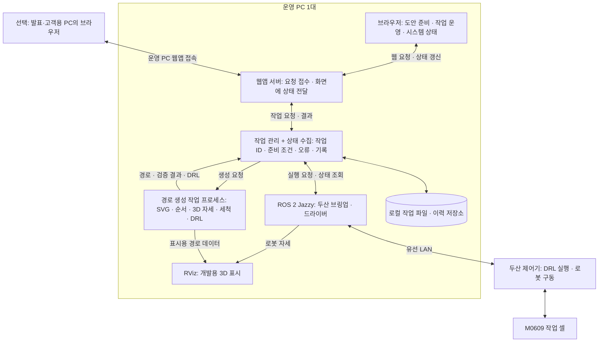

# 맞춤 원기둥 음각 서비스 — 시스템 아키텍처 제안

> 2026-09-18 범위 갱신: 고객용 웹앱을 제외하고 고정 좌표·고정 그리퍼·교체 도구를 사용하는 현재 개발 기준은 [3개 노드 인터페이스 안내](INTERFACE_GUIDE.md)와 [목표 구조](SYSTEM_STRUCTURE.md)다. 아래는 9/17의 확장 시나리오를 보존한 설계 기록이며 새 계약의 구현 완료를 뜻하지 않는다.

작성일: 2026-09-17. 기능 배치와 실행 구조를 제안하는 설계 문서이며 코드 구현·설치·로봇 실행을 수행한 문서가 아니다.

## 1. 권장 구성: 운영 PC 1대

현재 프로젝트에는 **로봇에 유선 연결한 운영 PC 1대 + 기존 로봇 제어기 + 기존 현장 조작 장치**를 기본으로 제안한다. 웹앱 서버, 경로 생성, 작업 관리, 상태 수집을 같은 PC에서 각각의 역할로 실행한다. 추가 클라우드 서버와 별도의 모니터링 PC는 기본 구성에 필요하지 않다.

| 구성품 | 수량·위치 | 역할 |
|---|---|---|
| 운영 PC | 1대, 로봇 작업 셀 근처 | 웹앱 서버, 도안 처리, 작업 관리, ROS 2, 상태 수집, 기록 저장 |
| 화면 | 1대 가능, 기존 추가 화면이 있으면 2대 활용 | 작업 화면과 상태 화면을 탭 또는 창으로 나눠 표시 |
| 두산 로봇 제어기 | 기존 장비 | 전달된 DRL 실행, 로봇 구동과 장비 보호 기능 |
| 현장 조작 장치 | 기존 장비 | 로봇 설정, 현장 상태 확인, 물리적 정지 수단 |
| 발표·고객용 PC | 선택 1대 | 운영 PC의 웹앱에 브라우저로 접속. 기본 권한은 도안 준비·조회 |

여기서 “시스템 모니터”는 상태를 보여 주는 소프트웨어 화면이다. 별도 PC나 별도 디스플레이를 뜻하지 않는다. “웹앱 서버”도 운영 PC에서 실행하는 프로그램이며 추가 컴퓨터를 뜻하지 않는다.

운영 PC는 사용자가 제시한 M0609 브링업이 실제 동작하는 PC를 사용한다. 신규 환경을 구성한다면 Ubuntu 24.04 + ROS 2 Jazzy를 기준으로 검토한다. Jazzy의 Ubuntu 패키지 제공 대상과 공식 두산 저장소의 Jazzy 기준은 확인했으나, 실행 PC의 설치본·제어기·그리퍼 드라이버 호환성을 확인한 것은 아니다. [ROS 2 Jazzy 설치 문서 원문](https://raw.githubusercontent.com/ros2/ros2_documentation/jazzy/source/Installation/Ubuntu-Install-Debs.rst), [두산 공식 Jazzy 저장소](https://github.com/DoosanRobotics/doosan-robot2/tree/jazzy)

단일 PC에서의 처리 성능은 아직 측정하지 않았다. 초기 운영은 도안 전처리를 마친 뒤 가공을 시작하고, 로봇 가공 중 무거운 추가 전처리는 대기시켜 부하를 관리한다. 별도 프로세스로 나누는 것만으로 CPU·메모리 자원이 완전히 격리되지는 않는다.

## 2. 배치와 데이터 흐름

RViz에 경로를 보여 주는 데이터 전달은 구현할 기능이다. 경로가 자동 표시되거나 충돌 검증이 완료되는 것으로 가정하지 않는다. 그리퍼 제어 연결은 실제 드라이버·배선 확인 후 확정하며 위 그림은 그리퍼의 물리적 통신 경로를 지정하지 않는다.

제어기 주소는 사용자에게서 전달받은 현장 값을 로컬 설정으로 관리한다. 공개 실행 예제에는 `<ROBOT_HOST>` 자리표시자를 사용한다. PC 주소와 서브넷 등은 현장에서 확인한다. 선택 PC는 운영 PC의 웹앱에 접속하며 로봇 제어기와 직접 통신하거나 두산 브링업을 중복 실행하지 않는다.

## 3. 프로그램은 어떻게 나누어 실행하는가

| 실행 그룹 | 실행 장소 | 기능 | 실행 시점 |
|---|---|---|---|
| ① 두산 ROS 2 브링업 | 운영 PC | 제어기 연결, 로봇 관련 서비스·상태 제공 | 운영 시작 시 1회 |
| ② 작업 관리·상태 수집 | 운영 PC, 브라우저와 독립 | 실행 조건 확인, 실행 요청 단일화, 단계·오류·연결 상태와 이력 관리 | 운영 중 유지 |
| ③ 웹앱 서버 | 운영 PC | 파일 접수, 도안·운영·상태 화면 제공, 사용자 요청 전달 | 운영 중 유지 |
| ④ 도안·경로 처리 작업 | 운영 PC, 별도 작업 프로세스 | 이미지/SVG 처리, 2D 순서, 3D 자세, 접근·이탈·세척, DRL 생성 | 도안 생성·변경 요청 시 |
| ⑤ RViz | 운영 PC, 별도 창 | 로봇 모델·좌표계·경로를 개발자가 확인 | 개발·검증 시. 기존 브링업에서 이미 실행하면 중복 실행하지 않음 |

이는 프로그램의 역할별 실행 그룹이다. ROS 2 브링업 안에는 여러 노드가 포함될 수 있다. 화면 수와 실행 그룹 수, PC 수는 서로 다르다.

작업 관리·상태 수집은 하나의 프로그램 안에서 시작하되, 경로 계산을 기다리는 동안에도 상태 확인을 계속할 수 있도록 설계한다. 웹 화면은 계산·로봇 실행의 주체가 아니라 입력과 결과를 보여 주는 창구로 둔다.

## 4. 웹앱 화면과 시스템 모니터의 구분

별도 웹앱 두 개를 만들기보다 **하나의 웹앱 안에 세 화면**을 두는 구성을 권장한다. 아래 경로 이름은 설계 예시이며 현재 실행 중인 URL이 아니다.

| 화면 | 주 사용자 | 표시·입력 내용 | 로봇 명령 권한 |
|---|---|---|---|
| 도안 준비 `/design` | 고객·설계 담당 | 도안 업로드, 재료·치수·가공 구간, SVG와 원기둥 배치 미리보기, 경로 생성 결과 | 도안 접수·생성·확정. 실제 가공 시작 권한 없음 |
| 작업 운영 `/operation` | 현장 작업자 | 점토·헤라·스펀지 준비 확인, 확정 작업 선택, 시작 요청, 현재 작업 단계, 세척·오류 안내, 품질 결과 입력 | 시작·일시정지·정지 요청, 원인 확인 후 재개 요청. 실제 적용 가능 여부는 작업 관리자가 판정 |
| 시스템 상태 `/system` | 개발자·현장 작업자 | 제어기 연결, ROS 서비스, 프로그램 상태, 마지막 데이터 시각, 오류 이력, PC 자원 | 기본 조회 전용 |

작업 운영 화면은 “어떤 제품을 만들고 어디까지 진행했는가”를 보여 준다. 시스템 상태 화면은 “어느 프로그램·장비에서 문제가 생겼는가”를 보여 준다. 운영 화면에도 필요한 오류 요약은 표시하되, 상세 진단은 시스템 상태 화면에서 확인한다.

한 화면이면 탭을 바꿔 사용한다. 화면 두 대가 있으면 첫 화면은 작업 운영, 두 번째는 시스템 상태 또는 RViz를 표시한다. 발표 PC를 쓰면 고객 화면·조회 화면을 띄우고, 실제 시작 조작은 현장 작업자가 담당하게 한다. 권한은 화면에 버튼을 숨기는 것뿐 아니라 웹 서버와 작업 관리자에서도 확인한다.

RViz는 공식적으로 ROS용 3D 시각화 도구다. 이 프로젝트에서는 관찰용으로 사용하고, 가공 중 별도의 RViz/MoveIt 실행 조작으로 로봇 명령을 동시에 보내지 않는다. RViz 종료와 브링업 종료는 구분한다. [RViz 공식 사용자 가이드 원문](https://raw.githubusercontent.com/ros2/ros2_documentation/jazzy/source/Tutorials/Intermediate/RViz/RViz-User-Guide/RViz-User-Guide.rst)

## 5. 기능 플로우를 담당 모듈에 연결

| 기능 흐름 | 주 담당 | 전달·보관할 정보 |
|---|---|---|
| 고객 도안 접수 | 웹앱 서버 | 원본, 작업 ID, 요구 치수·재료 |
| 도안 정형화·SVG 생성 | 경로 처리 프로세스 | SVG, 수정 사항, 도안 버전 |
| 선 순서·3D 자세·공중 이동·세척 삽입 | 경로 처리 프로세스 | 가공 경로, 공구 방향, 깊이, 세척 구간·주기 |
| 원기둥·공구·스펀지 준비 확인 | 작업자 → 웹앱 → 작업 관리자 | 치수, 고정 상태, 좌표 기준·TCP·세척 구역의 설정 버전 |
| 최종 경로 검증·DRL 생성 | 경로 처리 프로세스 + 작업 관리자 | 확정된 작업 묶음과 검증 결과 |
| 실행 요청·중복 실행 차단 | 작업 관리자 | 현재 작업 ID, 실행 단계, 승인된 파일 버전 |
| 홈·접근·가공·닦기·복귀 | 로봇 제어기의 DRL | 확정 경로와 고정 작업 절차, 단계 완료 정보 |
| 그리퍼 파지·해제 확인 | 작업 관리자와 확정할 그리퍼 연결부 | 파지·해제 결과. DRL 직접 제어 가능 여부에 따라 실행 연결 확정 |
| 오류 처리 | 제어기 측 동작 처리 + 작업 관리자 + 웹앱 | 오류 발생 단계, 마지막 완료 지점, 알림, 재개 조건 |
| 종료·품질 기록 | 작업 관리자 + 작업자 | 로봇 실행 결과와 제품 품질 결과를 별도로 저장 |

그리퍼가 제어기에서 직접 조작 가능한 방식이면 DRL 시퀀스에 포함한다. ROS 전용 드라이버를 사용해야 한다면 작업 관리자가 파지·해제를 별도 단계로 수행하고 완료를 확인한 뒤 다음 DRL 구간을 요청한다. 어느 경우든 로봇 동작을 요청하는 주체는 하나로 유지한다. 실제 그리퍼 연결 방식이 확인되지 않았으므로 이 연결부는 확정 전 항목이다.

제어기의 DRL 실행은 공식 `DrlStart`로 코드를 전달하는 구조이며, Python 웹 서버 자체가 제어기의 DRL 실행기가 되는 것은 아니다. [두산 ROS 2 Jazzy DRL 서비스](https://doosanrobotics.github.io/doosan-robotics-ros-manual/jazzy/services/drl_services.html)

## 6. 상태·오류 흐름

**오류 처리는 기능 플로우에 포함한다.** 세척 오류도 별도 프로그램을 추가하지 않고 같은 작업 상태 관리 안에서 처리한다.

- 정상: 대기 → 도안 처리 → 현장 준비 대기 → 실행 준비 완료 → 공구 파지 → 가공 ↔ 세척 → 공구 반납 → 복귀 → 품질 확인 → 대기.
- 실행 중 오류: 해당 단계 중단·후속 작업 차단 → 오류와 마지막 완료 단계 기록 → 화면 안내 → 작업자 확인 → 재개 조건 확인 → 재개 또는 작업 종료.
- 통신·PC 프로그램 이상: 실제 로봇 상태 미확인 → 상태 불명 표시 → 상태 재확인. 통신 복구만으로 자동 재시작하지 않는다.

| 담당 | 오류 처리 역할 |
|---|---|
| 제어기·현장 장치 | 장비 보호와 동작 정지. 세척·가공 동작의 현장 보호를 웹 화면 갱신에 의존시키지 않음 |
| 작업 관리자 | 이후 명령 차단, 상태와 이력 저장, 재개 조건 판정, 중복 실행 방지 |
| 웹앱 | 오류와 확인할 내용을 작업자에게 표시하고 확인·재개 요청 전달 |

웹의 정지 버튼은 소프트웨어 정지 요청이다. 물리적 비상정지를 대체하지 않는다. 브라우저가 닫혔다고 실행 중인 DRL이 자동 정지했다고 간주하지 않는다. 운영 PC가 꺼지거나 ROS 연결이 끊겼을 때의 제어기 동작은 현장에서 확인해야 하며, 단일 PC 구성은 장애 시 예비 PC가 자동으로 이어받는 구조가 아니다.

## 7. 상태 화면에 표시할 데이터의 근거

| 데이터 | 근거·표시 원칙 |
|---|---|
| 제어기·ROS 연결 상태 | 실제 조회 결과와 마지막 갱신 시각. 오래된 값은 현재 정상 상태로 표시하지 않음 |
| DRL 실행·정지·보류 상태 | 공식 상태 조회. STOP을 작업 성공으로 간주하지 않음 |
| 파지 중·가공 중·세척 중·반납 중 | 별도로 구현할 단계 완료·진입 정보가 필요. `GetDrlState`만으로 구분 불가 |
| 완료 선 수·세척 횟수 | 실행 측에서 확인된 단계 정보 기준. 아직 전송 통로가 없으면 ‘미확인’으로 표시 |
| 예상 소요 시간 | 경로와 시험값에서 계산한 추정치로 표시 |
| 공구 위치·힘 | 설치본에서 실제 수집 가능한 값만 표시. 단위·기준 좌표계·수집 시각 포함 |
| 홈 깊이·제품 합격 | 설정한 침투 깊이와 작업자가 측정한 홈 깊이를 구분. 카메라 없이 자동 품질 검사했다고 표시하지 않음 |

진행 정보에는 작업 ID, 단계, 선 ID, 완료 여부, 시각을 포함하는 메시지 규칙을 설계한다. 제어기에서 PC로 전달할 구체적인 통신 수단은 제어기·드라이버 지원을 확인한 뒤 결정한다. 아직 구현되지 않은 진행 정보를 대시보드에서 시간만으로 추측해 확정 상태처럼 표시하지 않는다.

작업 이력은 우선 로컬 파일과 간단한 이력 저장소로 관리한다. 원본·SVG·경로·DRL·좌표 기준·공구 설정·실행 로그를 작업 ID로 묶는다. 별도 데이터베이스 서버 PC는 기본 구성에 필요하지 않다.

## 8. 실제 운영 시 실행 순서

1. 현장 준비 후 운영 PC에서 사용자가 지정한 M0609 브링업을 실행하고 연결을 확인한다. 기존 브링업이 RViz를 열면 그 창을 사용한다.
2. 작업 관리·상태 수집 프로그램을 실행한다. 재시작한 경우 기록과 실제 로봇 상태를 맞추기 전까지 새 작업을 시작하지 않는다.
3. 웹앱 서버와 경로 처리 기능을 준비하고 브라우저로 접속한다. 이 단계까지는 로봇 가공 시작 요청을 하지 않는다.
4. 도안 준비 화면에서 원본을 입력하고 도안·경로를 생성한다. 작업자가 점토·공구·세척 구역을 확인하면 최종 경로와 실행 파일을 확정한다.
5. 작업 운영 화면에서 시작을 요청한다. 작업 관리자가 현재 상태와 준비 조건을 확인하고 확정된 작업만 실행한다.
6. 웹앱은 상태를 표시하고 시스템 모니터는 연결·오류를 관찰한다. DRL의 가공·세척 실행과 상태 기록은 브라우저 창의 생존 여부와 분리한다.
7. 정상 반납·복귀와 작업자 품질 확인을 기록한 뒤 다음 작업을 대기한다.

사용자가 제공한 `m0609_rg2_bringup` 실행 구성을 전제로 한 배치안이다. 해당 패키지가 이 문서를 작성한 Mac에서 발견되지 않았고, 실제 제어 PC의 브링업 내부 구성·서비스·그리퍼 연결은 확인 전이다. 이 문서는 실행 가능한 설치 완료 상태를 뜻하지 않는다.

## 9. 최소 구현 범위와 확인 항목

첫 구현에서는 PC 1대, 웹앱 1개와 세 화면, 작업 관리자 1개, 경로 처리 작업 1개, 로봇 브링업 1개, 로컬 기록으로 구성한다. RViz는 개발 중 활용한다. 오류 대기·재개 조건·세척 흐름은 기능 설계에 포함한다.

통합 검증에서는 다음을 확인한다.

- 같은 작업의 시작을 여러 번 눌러도 한 번만 실행되는가.
- 도안 처리 중에도 상태 화면 갱신과 작업 관리가 유지되는가.
- 화면을 새로 열었을 때 동일한 작업 ID와 실제 확인된 상태를 복원하는가.
- 세척 구간 진입·종료 및 오류가 작업 운영 화면과 이력에 동일하게 반영되는가.
- 연결이 끊기면 오래된 정상 값을 계속 보여 주지 않고 상태 불명을 표시하는가.
- 그리퍼 파지·해제 결과와 단계 진행이 실제 연결 방식에서 연동되는가.
- 로봇 작업 완료, 중단, 품질 합격을 서로 구분하는가.

기능 플로우의 세부 내용은 [시나리오 문서](SERVICE_FLOW.md)를 따른다. 이번 산출물은 시스템 설계이며 웹앱·모니터·추가 로봇 코드는 작성하지 않았다.
