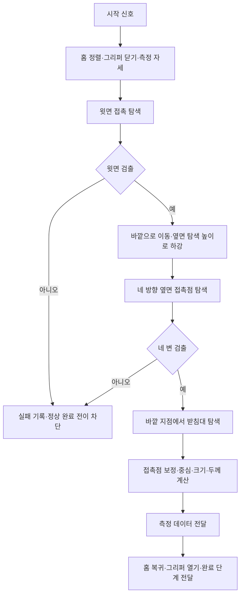

# 0917 개발 일지 — 지점토 단위기능 테스트와 알고리즘 검토

- 활동일: 2026-09-17
- 프로젝트: M0609와 2점 그리퍼를 이용한 도안 가공
- 참여: 이수현, 김세은, 노홍동, 이시율
- 현재 단계: 평면 단위 실기와 개별 기능 개발 → 곡면 경로·자세·접촉 제어 검토 준비
- 관련 문서: [프로젝트 계획](../PROJECT_PLAN.md), [알고리즘 검증](../ALGORITHM_VALIDATION.md), [현장 설정](../HARDWARE_STATUS.md), [시험 기록 양식](../VALIDATION_TEMPLATE.md)

## 1. 오늘의 결과

**지점토 평면에 선분과 정사각형·원·별을 그리는 단위 실기 수행을 기록했다.** 송곳 끝을 기준으로 작업했으며, 지점토 결을 따라 재료가 뭉치는 현상이 관찰됐다. 시율은 대상 위치·치수 측정, 사람이 송곳을 전달하는 파지 과정, 송곳 끝 길이 측정과 SVG 크기 맞춤 개발을 진행했다. 홍동·세은·수현은 경로 단순화·순서 계획, 2D→3D 변환, 저해상도 도안 전처리를 각각 검토했다.

이 일지는 Notion 본문·코드와 사용자의 당일 보고를 정리한 것이다. 문서 작성 과정에서 로봇을 직접 구동하거나 알고리즘 성능 시험을 다시 수행하지 않았다. 다음 표기를 구분한다.

| 표기 | 의미 |
|---|---|
| 실기 수행 보고 | 사용자 또는 팀 기록에 실제 수행이 명시됨. 정량 합격·반복성 검증과는 별개 |
| 코드·흐름 확인 | Notion의 구현 코드·플로우 차트를 읽음. 해당 버전의 실행 성공을 뜻하지 않음 |
| 오프라인 검토·결과 | 이미지·좌표·경로 계산이나 기존 보고서의 결과. 실물 가공 성능과 구분 |
| 보완 필요 | 측정값·로그·코드 버전 등 근거가 아직 확보되지 않음 |
| 후속 계획 | 다음에 할 일이며 오늘 완료한 결과에 포함하지 않음 |

## 2. 평면 단위기능 테스트

근거: [1차 검증 — 이동 가능?](https://app.notion.com/p/1-7e05211811398358922701bfaacfb585), 사용자의 9/17 선분·도형 구현 보고.

| ID | 시험·기능 | 당일 기록 | 확인 수준·남은 사항 |
|---|---|---|---|
| UT-0917-01 | 지점토 위 선분 그리기 | 사용자가 선분 그리기 구현을 보고 | 실기 수행 보고. 선 길이·방향·속도·오차·반복 횟수 미기록 |
| UT-0917-02 | 정사각형·원·별 그리기 | Notion에 세 도형 시연, 재료 지점토, 말단 공구 송곳으로 기록 | 실기 수행 보고. 도형별 치수·닫힘 오차·홈 폭·깊이 미기록 |
| UT-0917-03 | 공구 끝 기준 설정 | 송곳 끝으로 TCP를 설정한 뒤 진행했다고 기록 | 당시 메모에 `z축 45.5mm`가 있음. 전체 TCP·기준축·프로필·공구 장착 상태는 추가 확인 |
| UT-0917-04 | 가공 중 재료 상태 관찰 | 지점토 결을 따라 뭉침 발생 | 관찰 기록. 발생 위치·주기·가공 깊이·공구 방향과의 관계는 미측정 |

### 관찰한 문제와 논의한 대응

- 지점토 뭉침에 대해 재료를 파라핀·왁스로 바꾸는 안, 중간에 공구를 닦는 안, 드릴 방식으로 바꾸는 안이 제기됐다. 어느 안도 이 일지에서 채택·검증 완료로 기록하지 않는다.
- 단순 도형 이후에는 SVG의 벡터를 이동 좌표로 바꾸는 방법, 좌표를 얼마나 촘촘하게 생성할지, 복잡한 겹침·분기를 어떻게 처리할지가 과제로 남았다.
- 한 작업선이 원통을 360도로 감쌀 때 실행 순서를 어떻게 나눌지도 검토 항목이다. 평면 시연이 원통 전체 가공 가능성을 입증하지는 않는다.
- 하트 도안 선택·크기 검토 메모도 있지만, 하트의 실기 완료 결과는 확인한 본문에 명시되지 않아 위 수행 목록에 포함하지 않았다.

### 시험 조건의 기록 범위

로봇은 M0609, 프로젝트 ROS 기준은 Jazzy다. 이번 단위 실기에 사용한 실행 PC, 실제 패키지·제어기 버전, 코드 커밋, 모션별 속도·가속도·깊이, 전체 TCP·하중 프로필은 시험별로 연결해 보완해야 한다. Notion에 모션 명칭과 홈 명령 메모가 있지만, 그것만으로 각 도형의 실제 실행 코드나 제어 계층을 확정하지 않는다.

초기 메모의 `z축 45.5mm`, 별도 툴 `-Y` 방향 길이 메모, 측정 노드의 그리퍼 접촉점 보정은 기준·장착 상태가 확인되지 않은 서로 다른 기록이다. 하나의 실행 설정으로 합치지 않는다. 그리퍼 제조사·모델·배선·피드백도 현재 기록만으로 확정하지 않는다.

## 3. 시율 — 평면 사전 작업 자동화

근거: [평면도안 사전 작업 자동화](https://app.notion.com/p/3de521181139806b850ec21bf6e0ee3a), 사용자 제공 팀 진행표. 아래의 세부 코드 분석은 해당 페이지의 **노드1**에 한정한다. 의존 모듈 `rokey.clay_common`과 원본 실행 로그는 이번 문서 작업에서 확보하지 않았다.

| 기능 | 현재까지 진행한 내용 | 확인 범위·보완할 내용 |
|---|---|---|
| 지점토 위치·가로·세로·높이 측정 | 닫힌 그리퍼 손끝으로 윗면·옆면·받침대를 접촉 탐색하는 노드1의 흐름과 코드가 있음 | 사용자 진행표에는 크기·위치 변경 대응이 보고됨. 오차·반복성·적용 범위의 정량 검증은 필요 |
| 그리퍼 on/off와 공구 전달 | 사람이 송곳을 쥐여주는 과정 개발 보고. Notion에 작업 도구를 쥐어주는 노드2 항목이 있음 | 노드2의 상세 코드·완료 확인 근거는 확보하지 못함. 자동 공구 취출·반납과 구분 |
| 송곳 끝 길이 측정 | 송곳으로 지점토를 찍어 툴과 송곳 끝의 길이를 측정하는 기능 개발 보고 | 측정 원리·축·결과값·반복 오차·등록 TCP와의 연결 자료 보완 |
| SVG 크기 맞춤 | 입력 SVG를 지점토 크기에 맞추는 기능 개발 중 | 세부 조정이 남아 있다고 보고. 비율·여백·원점·축 방향과 실제 그리기 연결 확인 필요 |

### 노드1에서 읽은 처리 흐름

코드에는 시작 신호 `/clay/start`, 데이터 전달을 위한 `Bus.update_data(clay=...)`, 완료 단계 `scan_done`이 나타난다. `/clay/data`는 코드 주석에 적힌 전달 경로이며, 실제 토픽 동작·메시지 형식은 공통 모듈과 실행 PC에서 대조해야 한다.

출력 사전에는 중심, 가로·세로, 네 모서리, 윗면·받침대 높이, 두께, 자세, 접촉 힘과 접촉 기록 등이 포함된다. 명령에 쓰는 TCP 위치와 결과 기록에 쓰는 그리퍼 접촉점 위치를 구분하는 보정도 있다.

### 개발 중 기록된 문제와 현재 한계

다음은 Notion 코드의 9/17 주석과 로직에서 확인한 내용이며, 언급된 bag 파일을 직접 분석한 결과는 아니다.

- 윗면 탐색의 빠른 하강 구간에서 접촉 충격이 발생했다는 메모가 있어 빠른 구간 길이를 조정했다.
- 윗면 위 이동 여유가 작을 때 그리퍼 몸체가 걸린 기록이 있어 이동 높이·측정 자세·바깥 탐색 위치를 조정했다.
- 그리퍼의 기울기 때문에 방향별 접촉 위치가 달라져 네 방향 접촉점 오프셋을 별도로 두었다. 해당 보정값의 다른 크기·재질·자세에 대한 유효성은 미확인이다.
- 무른 지점토에서는 힘이 완만하게 올라 접촉 판정이 늦어지는 문제가 기록됐다. 힘 상승 시작점과 완만한 힘 증가를 이용하는 판정이 코드에 포함돼 있다.
- TCP 좌표와 패드 접촉점 좌표를 혼동해 접촉 후 추가 진입한 기록이 있다. 현재 코드는 후퇴 목표에 TCP 좌표를 사용하도록 작성돼 있으나 수정 후 재시험 근거는 별도로 필요하다.
- 코드의 치수 계산은 대상의 변이 로봇 베이스 축과 나란하다는 가정이다. 위치 변경 대응 보고를 임의 회전·임의 곡면 대응으로 확대하지 않는다.
- 받침대가 검출되지 않으면 명목 두께를 사용하는 분기가 있다. **실측 두께와 대체값을 구분하는 표시·완료 기준**을 후속 인터페이스에 명시해야 한다.
- 실패·중단 예외 분기는 읽었지만 공통 모듈을 보지 못했으므로, 모든 실패 상황에서의 실제 정지·설정 복원·후속 공정 차단까지 검증했다고 기록하지 않는다.

Notion 코드에 적힌 접촉력·속도·자세·충돌 감도 값은 개발 이력이다. 이 일지는 이를 팀 공통 실기 설정으로 승인하거나 실행 코드를 배포하지 않는다.

## 4. 팀별 알고리즘 검토

### 홍동 — 좌표 단순화와 방문 순서

[홍동 — 검증 보고서1](https://app.notion.com/p/1-3de5211811398041a335fabf828bce16)의 본문과 삽입된 비교 화면을 읽었다. 2D 말 SVG에 대해 적응형 샘플링·RDP로 좌표를 줄이고, 최근접 탐색·진입점 선택·방향 선택·2-opt로 비접촉 이동을 개선하는 역할을 정리했다.

| 항목 | 최적화 전 | 최적화 후 | 원문 결과 |
|---|---:|---:|---|
| 좌표 수 | 1,265개 | 343개 | 약 73% 감소 |
| 비접촉 이동 거리 | 1,370.3px | 947.7px | 약 31% 감소 |
| 하위 경로 수 | 12개 | 12개 | 유지 |

조건은 원문에 명시된 RDP 허용 오차 **2.0px**다. 이는 보고서의 오프라인 결과이며 이번에 재실행하지 않았다. 이동 거리 단위는 px이므로 실제 로봇 이동 거리 mm·작업 시간 감소율로 바꾸어 쓰지 않는다. 원문의 형태 유지 평가는 정성 설명이며 정량 형상 오차·동일 조건 반복 결과는 추가로 필요하다.

3D 환경 적용과 알고리즘 조합은 9/17 진행 중으로 기록돼 있다. XYZ에 곡선 보간을 적용할 때 목표 표면을 벗어날 수 있다는 검토 메모가 있어, 후속 곡면 시험에서는 최종 경로의 표면 이탈도 확인하기로 제안한다.

### 세은 — 2D 도안의 3D 배치와 자세

[2D좌표 → 3D좌표 변환](https://app.notion.com/p/2D-3D-6cb52118113982d795fb0121ba1e5c75)에서 SVG 좌표 추출·자동 크기 조정 → 최근접이웃·2-opt 방문 순서 → 작업/이동 표시 → 원통 위치·법선 → 로봇 베이스 좌표·자세 변환 흐름을 읽었다. 최적화 이름은 이 원문의 **2-opt** 표기를 기준으로 기록한다.

| 검토 항목 | Notion에 기재된 방법·결과 | 이 일지의 해석 |
|---|---|---|
| SVG 크기 조정 | `svg_reader.py`, 둘레·높이 대비 자동 스케일 확인, OK | 보고된 확인 결과. 첨부 코드를 재실행하지 않음 |
| 방문 순서 | `path_planner.py`, 2-opt 로직 리뷰, OK | 로직 검토 기록. 정량 거리·시간 비교는 별도 필요 |
| 원통 표면 위치 | `cylinder_map.py`, 반지름·높이 범위 로그 확인, OK | 좌표 계산 검토 기록. 원본 로그 미확보 |
| 베이스 좌표 변환 | `robot_transform.py`, 검증 방법에 반지름 오차 0.5mm 이내·높이 범위 일치, 결과 OK | 원문의 기준과 결과 표기. 실물 가공 오차 0.5mm를 측정한 결과로 해석하지 않음 |
| 법선 → ZYZ 자세 | 왕복 변환 수치 검사 메모가 있지만 결과 칸은 `-` | 최종 검증 완료로 처리하지 않음 |

원문 예시 조건은 **반지름 37.5mm·높이 200mm**다. 저장소의 현재 목표 지름 70mm와 다르므로 후속 시험에서 실제 시험편·좌표 파일의 조건을 일치시켜야 한다. 첨부된 `cylinder_map.py`, `path_planner.py`, `robot_transform.py`, `svg_reader.py`의 존재는 확인했지만 이번 커밋에 실행 코드를 가져오지 않았다.

좌표 생성과 로봇이 실행 가능한 자세 생성은 구분한다. 법선 방향만으로 공구의 모든 회전 자유도가 정해지는지, 공구축·진행 방향·자세 표현을 어떻게 맞출지 추가 설계가 필요하다. 원문의 실행 절차 설명을 실기 성공 기록으로 취급하지 않으며 자세 연속성·도달·충돌·실물 가공은 후속 검증 대상이다.

### 수현 — 저해상도 도안의 선 추출·정리·곡선화

[수현 — 검증 보고서1](https://app.notion.com/p/1-9d652118113982348a6a0175fde5b235)에는 저해상도 이미지의 끊어진 벡터, 짧은 가짜 분기, 과도한 작업선 수 문제와 단계별 수정이 정리돼 있다. 본문과 보고서·실행 초안 ZIP의 첨부 존재를 확인했다. 첨부 전체를 다시 실행하거나 로컬 파일과 동일한 버전이라고 판정하지 않았다.

아래 수치는 이미 저장소에 반영된 [알고리즘 검증 보고서](../ALGORITHM_VALIDATION.md)와 [비교 수치 JSON](../evidence/comparison_metrics.json)을 기준으로 다시 정리했다. 9/17 일지 작성 중 새로 산출한 실험 결과가 아니다.

| 동일 조건 비교 항목 | 기존 방식 | 개선 방식 | 감소율 |
|---|---:|---:|---:|
| 작업선 수 | 4,279개 | 1,140개 | 73.36% |
| 최종 좌표 수 | 16,959개 | 14,857개 | 12.39% |
| 전개도 비가공 이동 | 6,118.64mm | 1,817.54mm | 70.30% |

분기 정리·연속선 연결·베지어 근사·좌표 생성·순서 계획을 결합한 결과다. 작은 장식의 변경과 일부 작업선 방향 반전이 포함된다. 홍동의 말 도안과 입력·크기·단위·평가 조건이 달라 이 표만으로 두 구현의 우열을 비교하지 않는다. 기존 평면 DRL 초안·첨부 ZIP이 오늘의 도형 시연에 실제 사용됐는지도 확인되지 않았다.

## 5. 현재 통합 상태와 남은 설계

| 구간 | 9/17까지의 근거 | 아직 필요한 연결·검증 |
|---|---|---|
| 이미지 → SVG·2D 경로 | 팀별 오프라인 검토·결과 있음 | 공통 입력, 선·좌표 형식, 단위·원점, 도안 보존 기준 |
| 대상 위치·치수 → 도안 크기 | 시율 측정 코드·개발 보고, SVG 크기 조정 중 | 측정값/대체값 표시, 비율·여백, 변환 결과의 실제 배치 |
| 2D → 곡면 위치·자세 | 세은의 변환 흐름·좌표 검증 표, 홍동 3D 조합 검토 | 실제 표면 기준, 깊이·공구 방향, 연속 역기구학·간섭 |
| 로봇 평면 동작 | 선분·정사각형·원·별 시연 보고 | 실행 코드 버전, 결과물 측정, 동일 조건 반복 |
| 공정 전체 | 부분 기능 개발·설계 | 자동 파지·가공·세척·반납·오류 복구의 전체 연결 |

팀 진행 정리를 위한 제안은 다음과 같다. 아직 최종 배정·채택이 확인되지 않은 항목이다.

1. 모든 기능은 목적·입출력 예시·플로우 차트·성공/실패 조건을 한 장으로 정리한다.
2. 겹치는 최적화는 같은 입력과 제약에서 비교하고, 형상 품질을 만족하는 후보끼리 효율을 비교한다.
3. 측정·전처리·변환·실행 단계 사이의 좌표계·단위·공구 방향·작업/이동 구분을 합의한다.
4. 첫 통합 도안과 담당자·검토자, 측정 가능한 완료 기준을 정한다. 알고리즘별 수치 향상과 전체 공정 완료를 별도로 관리한다.

## 6. 9/18 후속 업무 — 계획

사용자는 다음 활동으로 곡면 실제 처리와 정밀 로봇 제어 알고리즘 리서치를 제시했다. 아래 분담은 논의된 제안이며 오늘 완료한 결과가 아니다.

| 담당 제안 | 우선 업무 | 남길 결과 |
|---|---|---|
| 세은 | 원통 감싸기, 표면 법선·접선 기반 자세, 자세 보간 | 곡면 경로·공구 방향과 자세 급변 구간 |
| 수현 | 호 길이·현 오차 기반 분할, 진입·이탈과 깊이 프로파일 | 기본 경로와 개선 경로의 오차·점 수 비교 |
| 홍동 | 연속 역기구학, 관절 한계·충돌, 시간 매개화·저크 제한 | 실행 가능 구간, 속도 계획, 예상 시간과 제약 |
| 시율 | 공구 끝 기준·고정·실측, 접촉 조건과 순응·힘 제어 적용 조사 | 현장 조건표, 비접촉 확인, 조건이 갖춰진 구간의 실기 기록 |

접근 가능한 일부 곡면 구간에서 가상 검토 → 현장 비접촉 확인 → 짧은 구간 가공 순으로 진행한다. 접촉력과 실제 홈 깊이를 별도 측정하고, 360도 전체 가공·가변 깊이·자동 세척을 당일 필수 완료로 묶지 않는다. 현장 조건이 미확정이면 접촉 시험을 완료로 기록하지 않는다.

## 7. 기록 보완 목록

- [ ] 선분·도형별 실행자·확인자와 실제 시험 코드·커밋 연결
- [ ] 실행 PC·설치 패키지·제어기 버전, 공구·TCP·하중·좌표계 기록
- [ ] 도형별 원본 도안·경로 파일, 크기·속도·가속도·목표 깊이 기록
- [ ] 시험 영상·사진·원본 로그를 시험 ID와 연결하고 공유 가능한 위치 지정
- [ ] 홈 폭·깊이·형상 오차·반복 횟수·실패 횟수 측정
- [ ] 지점토 뭉침 발생 조건과 재료 변경/세척 후보 비교
- [ ] 측정 노드의 보정 전후 오차, 받침대 미검출·대체값 처리 검증
- [ ] 노드2·송곳 끝 길이 측정·SVG 크기 맞춤의 코드와 완료 증거 연결
- [ ] 오늘의 도형 시연과 기존 평면 DRL 초안 사이의 사용 관계 확인

미기록 항목을 0 또는 합격으로 채우지 않는다. 이번 변경은 문서 정리이며 팀원의 실행 코드·첨부 ZIP·원본 bag를 C-2 실행 패키지로 가져오지 않았다.

## 8. 검토한 출처

2026-09-17 브라우저에서 아래 Notion 본문을 열람했다. 페이지는 이후 편집될 수 있으며 이 문서는 당일 확인 내용의 요약이다.

- [팀 프로젝트 페이지 — 협동1 M0609](https://app.notion.com/p/1-M0609-3de52118113980728852e200d8b9610a): 프로젝트 기록과 검증 페이지 연결
- [프로젝트 검증](https://app.notion.com/p/26352118113983cf9c98013b51e5209e): 9/17 평면 1차 검증 및 기능별 기록
- [1차 검증 — 이동 가능?](https://app.notion.com/p/1-7e05211811398358922701bfaacfb585): 지점토·송곳·도형 시연·뭉침·좌표 변환 논의
- [하드웨어 세팅](https://app.notion.com/p/1745211811398395ade6819e19908bfb): 홈 이동 명령 메모. 실행 여부를 별도로 검증하지 않음
- [평면도안 사전 작업 자동화](https://app.notion.com/p/3de521181139806b850ec21bf6e0ee3a): 노드1 흐름·코드, 노드2 항목
- [홍동 — 검증 보고서1](https://app.notion.com/p/1-3de5211811398041a335fabf828bce16): 말 SVG의 2D 비교 수치와 3D 검토 메모
- [2D좌표 → 3D좌표 변환](https://app.notion.com/p/2D-3D-6cb52118113982d795fb0121ba1e5c75): 세은의 원통 변환 흐름·2-opt·좌표 검증 표·자세 검증의 미완료 표시
- [수현 — 검증 보고서1](https://app.notion.com/p/1-9d652118113982348a6a0175fde5b235): 전처리 문제·수정 과정과 첨부 자료 존재
- 사용자 제공 9/17 팀 진행표·단위 실기 보고·9/18 업무 방향: Notion에 상세 결과가 없는 기능은 사용자 보고임을 본문에 명시
- [저장소 기존 알고리즘 보고서](../ALGORITHM_VALIDATION.md), [비교 수치](../evidence/comparison_metrics.json): 수현의 기존 오프라인 결과와 재현 범위
